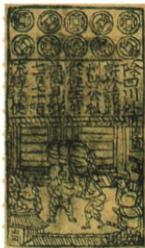

## 讲解

### 是什么

交子为北宋前期四川出现的早期纸币，原书称世界最早；南宋会子等纸币与铜钱并行，元纸币全国作主币。其出现反映商品流通需求，轻便支付又便利交换，但北宋未全国普及且非唯一货币。

### 怎么来的

商业扩大需要更多支付，金属币可用却重不利远距携带，纸币降低携运不便，为交易提供替代方式，这解释原题为何从使用纸币答商品经济繁荣。商业需求推动货币改进、货币便利促进交易是两个方向，不把纸币作为一切繁荣唯一原因或从一张纸推出所有领域GDP。

接受纸币需发行与使用的社会安排，价值不等纸的材料价，不能印更多纸就等社会实物财富必更多。原课不提供发行准备、兑换或通胀数值，这里解释一般条件而不编金融计算。北宋交子局部、南宋钱纸并行、元全国主币是阶段变化，首次与全国流通不同；主币也不等本课已证明任何其他支付物绝无使用。图为铜版拓片，不能当原纸币本体或仅看图拟读不清面额。

### 什么时候能用

用于交子时间地点名称、原意义题和并行范围。核查国博钱币研究支持早期纸币发展，图按原书题名保留，不凭图片虚构文物出土身份。

## 例题

**原题背景（B12-S08）：**北宋前期，四川地区出现了世界上最早的纸币“交子”（见图）。

**原题：**交子的使用体现了什么？

**原答案：**商品经济繁荣。

**原原因发展作用及辨析（B12-S09、S11，非独立题）：**交易量增而金属币携带不便，北宋前期四川交子出现，南宋会子纸币与铜钱并行，元纸币全国作为主币发行；纸币又利商业。北宋纸币未全国流通、非唯一货币。

**完整解析补写：**交易扩大提高支付需求，金属币重不便，纸币更利携带结算，商品繁荣促货币改进，货币便利又可促交易。不是仅看纸材质就证明每一时代的经济总量，题中以已知北宋商品流通背景作判断。图是原书提供的铜版拓片示意材料，不说它就是一张完整实物纸币、更不从不清字读面额；发行、使用与稳定购买力另有条件，不能印得越多必越繁荣。北宋交子、南宋会子及元全国主币分阶段，不把元范围套回北宋。

## 易错

- 北宋交子全国唯一货币。
- 交子会子互换时段。
- 印钱越多自动越富、铜版拓片当纸币本体。

### 来源定位

- B12-S08：full.md（历史扫描分册51-100），L3018–L3027，纸币铜版拓片与交子意义原问原答；a8d85606-ccac-4ba9-89c2-44c981a45642_origin.pdf，实际PDF第47页。
- B12-S09：full.md（历史扫描分册51-100），L3029–L3031，交子会子流通范围及并行原辨析；a8d85606-ccac-4ba9-89c2-44c981a45642_origin.pdf，实际PDF第48页。
- B12-S11：full.md（历史扫描分册51-100），L3052–L3062，城乡市场、辽夏金商业商税及纸币原因发展作用；a8d85606-ccac-4ba9-89c2-44c981a45642_origin.pdf，实际PDF第48页。
