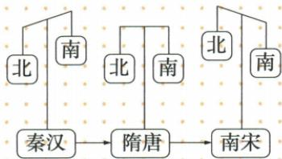

## 讲解

### 是什么

元为南粮北运开会通、通惠河连原运河，杭州至大都粮运贯通，另有海运航线一度为主。运输联系不同地区供给需求，政治中心在北不表示经济重心必在北。

### 怎么来的

粮食产区与大量需求的政治中心相距，供给不仅要种出来，还需能运到；接通原河与新河使运输更连续，减少中间断接，解释国家为何投资交通。元工程利用已有基础，不能抹隋唐运河史或把所有河都忽必烈第一次开。海運开辟第二渠道，原书一度以海为主说明主次随条件变化，不把海和河互斥成只能存在一种。

南粮支持北方首都，把经济产出与政治统治中心联系，方向正反映江南粮食重要，不是货物运北便所有生产也转北。海运规模空前为原教学概括，这里无吨位时长，不数值排名；航线行使受航道、船只和管理条件影响，不能写既有海线就一年四季绝无风险。交通促进交流，还需可运输产品和需求，不能单开河就断所有商业农业自动繁盛。

### 什么时候能用

用于河名人物目的、南北方向与海河主次。本课无独立运河题，用原表材料；与隋工程功能可比但时代河段不替换。

## 例题

**原水运表（B12-S03，非独立题）：**为南粮北运，忽必烈开会通河、通惠河，连原运河，使杭州粮船直通大都；另开规模空前海运航线，粮食运输一度以海运为主。

**分析补写：**粮主要产区与政治中心不在一地，需要较大运输量；贯通河道减少阻断、连接供给与需求，海运又提供另一渠道。元新河连原河不是开凿所有旧运河从未有，隋运河与元改通段须分时代。海运一度为主保留时段，不改元全时期全粮只海运；粮向北也不是经济重心又回北。

**原资料（B12-S12、S13，非独立题）：**五原因是江南自然条件、北战乱南相对稳、北人南迁劳力技术工具、各族劳动、政治中心南移加速开发；三国两晋南北朝初开发、为南移奠基，南宋完成。南宋江南农工商业领先、南方人口总量与增速超过北、社会经济长期稳、政府财粮依江南。

**完整分析补写：**比较图秦汉北方示意较大、隋唐变化、南宋南方较大，是重心趋势示意，无纵轴比例尺数值，不能量图块面积得GDP百分比。南方发展要多领域和全国供给作用，不能只凭一件新农具宣告重心已完成；北方仍生产发展，重心南移非北方零经济。政治中心南迁可加速开发，但元大都在北而南粮供北，政治中心与经济重心不必同地。南宋是完成阶段概括，不写某一年所有地区同步完成迁厂人口。

## 易错

- 会通通惠都写隋炀帝开。
- 粮北运当重心重回北。
- 一度为主当全元所有粮只海运。

### 来源定位

- B12-S03：full.md（历史扫描分册51-100），L2962–L2968，南粮北运、会通通惠河与海运完整原表；a8d85606-ccac-4ba9-89c2-44c981a45642_origin.pdf，实际PDF第47页。
- B12-S12：full.md（历史扫描分册51-100），L3064–L3064，南宋经济重心完成的农工商人口财粮依据；a8d85606-ccac-4ba9-89c2-44c981a45642_origin.pdf，实际PDF第48页。
