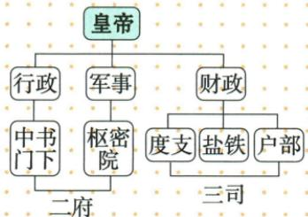

## 讲解

### 是什么

北宋原图二府为管行政的中书门下和管军务的枢密院，三司为度支盐铁户部财政部门。分化事权是将原可集中于一人的多种职权分置，使官职互相制约、皇帝较易控制。

### 怎么来的

若宰相同时掌行政军务财源，能调动的力量较多；将军务和财政分开，由不同机构处理，能削弱个人集多权的条件。皇帝居图最上，分工后需要他协调和决定，说明分相权是加强君权的一种途径，不是皇帝权力随部门增多而自动减少。

图有三层信息：皇帝与下属关系、行政军事财政职能对应、二府三司类别汇总。括线汇总不构成新增机关，不能把自动Mermaid的误接箭头当真实机构上下级。唐三省分起草审核执行，宋图主要按行政军务财政分，名字里的三不等同一制度；两制都可服务君权，却要具体解释不同分工。分权能制约独揽，也可能增加协调、推诿和开支，措施效果需结合实践，不把制度目标避免权大当永远零风险定律。

### 什么时候能用

用于原图层级、职责、类属与作用。依本课概览解释，后续机构变化资料未给不补年表；原图为非独立题，不添真假判断题。

## 例题

**原图（B8-S02，非独立题）：**皇帝下分行政、军事、财政；中书门下管行政，枢密院管军事，二者并称二府；度支、盐铁、户部管财政，并称三司。

**完整分析补写：**图中括线是类别汇总，不是另设一个二府统治三司的上下行政节点；自动提取把中书接二府、枢密接三司，已对照原图弃用。军政财分别归机构，可削弱一位宰相独揽多权，皇帝居上协调控制。它与唐三省各担起草审议执行不是同一分工，不能只因三司有三就换成三省；财政户部在这里的图层级也不能直接照抄唐六部图。

**原常考设问（B8-S10）：**宋朝政治的特点与影响。

**原答案表完整保留：**

|特点|影响|
|---|---|
|崇文抑武，文人治国|有效巩固了统一，但导致军队战斗力下降|
|分化事权，内外相制|避免了任何一个官职或官员的权力过大|
|强干弱枝，守内虚外|有利于加强中央集权，并有效镇压地方和农民反抗，但边防空虚，导致北宋在与少数民族政权的斗争中屡次失败；分割地方权力，有利于巩固统一，但也导致地方办事效率低下|

**完整解析补写：**文臣取代部分武将治理、控制军队，限制军将独立势力；拆分事权形成互相牵制，使个人较难集多权；收地方军政财强化中央、使地方难割据。这些说明政权稳定的机制。代价是兵将联系弱、协调监督环节增加，可能削弱军事指挥和行政效率，加大官俸等负担。原表巩固统一结合原辨析仅指已统辖的中原南方格局，不能推出统一全国。避免任何一官权大是制度目标与概括，不是逐年逐职零风险的统计证明。

## 易错

- 二府只指中书，三司却指枢密：自动图误接。
- 宋三司写唐三省，或照抄唐六部户部隶属。
- 分相权当地方获得军政财独立。

### 来源定位

- B8-S02：full.md（历史扫描分册51-100），L2529–L2551，北宋中央行政二府三司原图；a8d85606-ccac-4ba9-89c2-44c981a45642_origin.pdf，实际PDF第40页。
- B8-S05：full.md（历史扫描分册51-100），L2577–L2583，集权背景和军政财文化措施完整表；a8d85606-ccac-4ba9-89c2-44c981a45642_origin.pdf，实际PDF第40页。
- B8-S10：full.md（历史扫描分册51-100），L2610–L2612，宋政治特点影响常考设问与完整原表；a8d85606-ccac-4ba9-89c2-44c981a45642_origin.pdf，实际PDF第41页。
