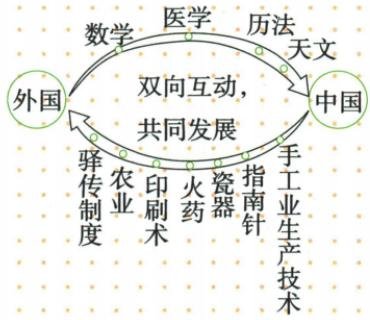

## 讲解

### 是什么

宋元中外交流有外来医学天文数学等传入，也有中国技术商品制度传播海外，是双向互动。双向指两个方向均有联系，不表示数量领域或方式全相等。

### 怎么来的

陆海交通使人、书籍器物可流动，商贸带商品也让工匠学者接触，官方任用和翻译把外来知识纳入当地工作。这说明传入不只是货物买卖，元用波斯天文人和译医书是机构与文本吸收经验，不能所有交流都当一次外交仪式。输出技术制度和瓷丝商品又影响他处生产生活，西亚北非仿瓷显示技能审美联系，商品和知识两类可相伴不必一一对应。

原图上方向外国到中国、下方向中国到外国，周边并列学科为交流内容，不能取自动长链作学科产生顺序。互相学习不等双方起点或所有成就完全相同，也不等全部文化一方取代。原资料医疗方书可作历史知识交流证据，不提供现代临床用法，不能转为学生按古方自行治骨折的操作教程；具体传播人物、年代和路线未给不补虚构细节。

### 什么时候能用

用于输入输出分类、双向与交通作用。原影响标题及原答完整，图按原弧方向核；知识补写解释机制，不编新文化题。

## 例题

**原资料（B13-S05、S08、S09，非独立题）：**交通使物质科技文化交流更密。传入有西方医学天文历法数学建筑音乐宗教；元任波斯人管天文历法、收译阿拉伯医书，《回回药方》记治骨折。输出有发明驿传、天文历法农业手工技术，瓷丝商品，西亚北非工匠仿瓷具中国风格。原图上弧外国向中国传数医历天，下弧中国向外国传技术发明制度，中心“双向互动，共同发展”。

**原设题标题与原答（B13-S08）：**“宋元时期海路交通发达的影响”：宋元时期发达的中外交通，促进中外经济、文化和科技的交流发展。

**完整分析补写：**航路让人货文本能传递，商品贸易也携技能知识，双方吸收有用经验，故不只单向输出。原图并列项目是不同传播内容，不是数学先导致医学再导致历法的因果链；自动长链已弃用。双向不等每个领域交换量相等，也不证明所有传入知识未经调整直接全采用。《回回药方》只作史料说明，本书没配具体骨折原方，不拿古医疗介绍给学生作治疗方法。

## 易错

- 自动学科长链当发明因果顺序。
- 只中国输出不曾吸收。
- 双向等每一领域传入传出数量完全相同。

### 来源定位

- B13-S05：full.md（历史扫描分册51-100），L3116–L3121，交流背景、宋海路原因续答政策与地理知识；a8d85606-ccac-4ba9-89c2-44c981a45642_origin.pdf，实际PDF第49页。
- B13-S08：full.md（历史扫描分册51-100），L3149–L3179，原中外双向交往图、海路影响原设题与原答；a8d85606-ccac-4ba9-89c2-44c981a45642_origin.pdf，实际PDF第49页。
- B13-S09：full.md（历史扫描分册51-100），L3181–L3181，传入输出续表、回回药方和瓷器仿制；a8d85606-ccac-4ba9-89c2-44c981a45642_origin.pdf，实际PDF第50页。
