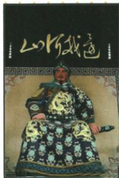

## 讲解

### 是什么

岳飞是南宋抗金将领，岳家军北伐、郾城击败金军。原书以抵御进攻、保护人民生命财产解释受尊敬，同时记高宗秦桧令班师并以莫须有杀害；战果、政治政策与人物结局应分层。

### 怎么来的

金南下带来战争威胁，抵抗能够阻止部分军事进攻、收复失地，直接关联民众生命财产，因而原题正义评价有具体利益依据，不只给英雄称号。雕塑可体现后人纪念，识别题注与历史行动后解释纪念原因，但雕塑表情服饰不是战役胜利或人物确切思想的现场证据。

北伐战果并不自动让朝廷选择继续推进。原书将高宗秦桧班师求和与统治利益联系，军事成果被政治选择限制，说明个人努力还处制度决策中。莫须有为原叙述中无实证的罪名，不能写岳飞已确证有罪；也不能据班师就删先前战果。保护人民与前课将战争置多民族国家内部历史框架可同时表达：历史关系的总分类不取消具体行动的正当性判断。免受战苦的原答是保护作用，非整个南宋全体人永无战事的断言。

### 什么时候能用

用于原塑像人物题、尊敬原因和军事政治分层。原资料无独立郾城年份问，也无完整现场图，不自编战争细节作证据。

## 例题

**原题（B10-S05）：**图为岳飞塑像，他为何赢得人民的尊敬？

**原答案完整保留：**岳飞抗金，使南方人民免受战争之苦，保卫了人民的生命财产，符合广大人民的利益，是正义的。因此，岳飞赢得了人民的尊敬。

**完整解析补写：**原题已标人物岳飞，图是纪念塑像，不是战争现场照片。依据抗金抵御进攻、保卫生命财产，说明人民为何尊敬，按行动→人民利益→评价的链条答；郾城战绩可说明行动，但只背人名或胜利年不能完成原因解释。原答案免受战苦是保护作用的概括，不解成所有南方人整个时期绝无战事。正义依据保护人民，不以民族名字决定一切战争性质；前课内部斗争框架与具体行动可按利益评价并不冲突。

**原资料（B10-S03、S07，非独立题）：**金军数度南下，南宋军民抵抗；岳飞等北伐收失地，岳家军郾城大败金军、乘胜追击，迫使后撤。原书解释高宗、秦桧恐抗金力量危及统治，命班师，后以莫须有杀岳飞。

**分析补写：**军事抵抗取得战果，不等全部国土已收复或政权统治者一定支持继续北伐。军事效果、朝廷政策、人物遭遇属于不同层面，需依原书政治选择解释北伐未持续；莫须有不能写成确证罪行。本课未给杀害的公历年月，不根据故事印象补具体日，更不自编十二金牌为原题条件。

## 易错

- 塑像当战争现场照片。
- 正义只据族属而无人民利益依据。
- 班师等没有过战果，莫须有当已证犯罪。

### 来源定位

- B10-S03：full.md（历史扫描分册51-100），L2710–L2719，南宋建立、抗金背景及岳家军北伐郾城；a8d85606-ccac-4ba9-89c2-44c981a45642_origin.pdf，实际PDF第43页。
- B10-S05：full.md（历史扫描分册51-100），L2737–L2751，岳飞塑像与尊敬原因原问完整原答；a8d85606-ccac-4ba9-89c2-44c981a45642_origin.pdf，实际PDF第43页。
- B10-S07：full.md（历史扫描分册51-100），L2758–L2764，班师、莫须有、1141和议与南宋偏安；a8d85606-ccac-4ba9-89c2-44c981a45642_origin.pdf，实际PDF第44页。
