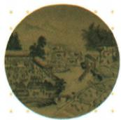
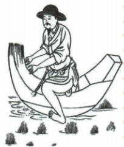

## 讲解

### 判据

农业图题先读题注和可见动作，分耕作灌溉收获加工；题问信息与题问谚语不同，不能只按图外形联想，也不能画中数人推全国统计。

### 流程

1. 耕获题注明宋，动作犁地插秧、收割打场舂米入仓和翻车灌溉，分别生产环节；舂米非春米作物。
2. 多环节并画为展示生产链，概括农业繁忙，不说同块田同日播种收获，艺术安排不同实况时间记录。
3. 秧马原题明拔秧工具，依据用途解释减负效率，弃自动划船误描述；不要从船形猜成水运。
4. 原问须写谚语，选苏湖或苏常任一，解释区域供粮重要；信息题则答动作与生产情况，题问不同不互替。
5. 图无产量统计、比例尺，不能量亩产、全国人口；工具改善为某环节，南移完成还需农工商财粮综合材料。把观察、作用、宏观结论逐层核可避免由一物包所有发展。

### 方法依据与边界

图像阅读要把看见的动作与题注提供的信息分开。画里可以辨生产环节，宋代归属来自题注；秧马用途来自原说明，不能仅因外形像船就推航运。多种环节合在一幅图，是对生产过程的展示，不必同田同日发生。问生产情况，答繁忙与环节；问谚语，答苏湖或苏常供粮意义，两类任务不可互替。工具便利的是特定动作，农业重心还需地区产出及国家供给等材料，不能由一件工具推全国南移完成，也不据画中人数计算劳动力规模。

## 例题

**原题（B12-S01）：**根据图片我们可以得到什么信息？

**原答案完整保留（舂字对照原页恢复）：**《耕获图》描绘了宋代农民从耕作到收获的情景。画中有的人在犁地、插秧，有的人在收割、打场、舂米和入仓，还有人在用翻车浇地，展现了这一时期农业生产的繁忙景象。

**完整解析补写：**按可见动作与工具将画面联系生产环节，耕植、灌溉、收获加工入仓构成农业活动链，再概括繁忙生产。画在同一幅中展示不同环节，不证明同一块田同一天同时播种与收割；舂米是加工，不能把OCR春米当作物。图可说明活动，不给统计年产量、全国亩产或劳动力数，不能数画中几人算全国劳动人口。翻车原资料判据为浇地，本图不凭模糊细节断全部使用哪种动力。

**原题（B12-S06）：**图片展示的是宋代使用的一种拔秧工具，既可减轻人们拔秧辛苦，又能提高劳动效率，体现了宋代农业的发展。请写出一句体现当时农业发展的谚语。

**原答案完整保留：**“苏湖熟,天下足”或者“苏常熟,天下足”。

**完整解析补写：**题注已限定拔秧和宋农业，不以工具外形似船就写划船。原题问谚语，答两者之一即可；苏湖苏常为江南重要稻作地域，熟指丰收，天下足强调其粮食地位，不作所有天下人只吃两地粮的精确供给比例。工具改善劳动条件是一条作用，谚语说明区域粮食作用，二者不能替成图上已测出稻田产量。

## 易错

- 自动图描述取代原题注。
- 数画中人数推全国劳力或产量。
- 谚语问只背器具名。

### 来源定位

- B12-S01：full.md（历史扫描分册51-100），L2942–L2949，耕获原图、信息原问及完整原答；a8d85606-ccac-4ba9-89c2-44c981a45642_origin.pdf，实际PDF第46页。
- B12-S06：full.md（历史扫描分册51-100），L2990–L3004，秧马原图原题及两谚完整原答；a8d85606-ccac-4ba9-89c2-44c981a45642_origin.pdf，实际PDF第47页。
- B12-S12：full.md（历史扫描分册51-100），L3064–L3064，南宋经济重心完成的农工商人口财粮依据；a8d85606-ccac-4ba9-89c2-44c981a45642_origin.pdf，实际PDF第48页。
