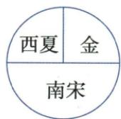

## 讲解

### 判据

题问并立须区分曾并立、某年并立、全过程始终并立。用政权存在时段求交集，再对关键事件先后；名单是跨时段汇总，不是某一时点全部并存的合照。

### 流程

1. 先看题问北宋或南宋、某年或全阶段，明确时间集合；不同题问不能抄同一整串名单。
2. 北宋960—1127与辽916—1125、夏1038—1227、金1115—1234均有交集，所以名单均可列，不能说金灭辽后才第一次出现在世界。
3. 南宋1127开始，辽已1125结束，无交集；与夏金、后来的蒙古元分段有交集，不代表元1271建立时辽夏金仍全部存在。
4. 同年内建立灭亡若要精确同时须事件顺序；按年度概览可判断大段，但不能仅端点相同断一整年共存。
5. 原表南宋1276为临安陷落界，1279最终结束；蒙古1271为接元国号分段、都城表非完整迁都史。先解释原口径，不把表中横杠当绝没有政治中心。表可读出交集，不能仅时间关系推出谁必然灭谁或谁统治某地。

### 方法依据与边界

并立是在同一时间各自存在，故名单与年份都要对。曾并立只要求有一段交集，始终并立则要求整个所问期间都有交集，后一条件更强。读示意图还要增加地域核验：同一时段存在的政权若位置放错，仍不是正确图。西晋东晋的名称容易诱导东西并存，但国号不能代替实际前后关系和区域。圆图中分区只是表示大致方向，既不保证面积相等，也不能量实际领土；用它判断格局，应停在名称、时段、方向这些图能表达的层次。

## 例题

**原辨析与原表（B10-S06、S08，非独立题）：**与北宋曾并立辽、西夏、金；与南宋曾并立西夏、金、蒙古、元。这是各时期出现过的名单，不是全部始终同时存在。

|政权|原表存在时间|建立者|原表都城|原表结果|
|---|---|---|---|---|
|辽|916—1125|耶律阿保机（契丹）|上京（今内蒙古巴林左旗）|被金灭亡|
|北宋|960—1127|赵匡胤（汉族）|东京（今河南开封）|被金灭亡|
|西夏|1038—1227|元昊（党项）|兴庆府（今宁夏银川）|被蒙古灭亡|
|金|1115—1234|阿骨打（女真）|会宁府（在今黑龙江哈尔滨）|被蒙古灭亡|
|南宋|1127—1276|宋高宗赵构（汉族）|临安（今浙江杭州）|被元灭亡|
|蒙古|1206—1271|铁木真／成吉思汗（蒙古）|—|—|
|元|1271—1368|忽必烈（蒙古）|大都（北京）|被明灭亡|

**原表边界与核查补写：**南宋1276对应临安陷落、宋恭帝朝廷投降；后仍有抗元力量，1279崖山败后南宋最终结束，不能把原表1276当全过程终点。[台州市地方志大事记以1127—1279列南宋，并记1276临安陷落与继续抗元](https://tzsz.zjtz.gov.cn/art/2013/6/19/art_1229142738_54435190.html)。蒙古1271一栏是本表接元国号的分段，不等所有蒙古汗国在该年一概灭亡。表的都城为概括，不是完整迁都清单；如金本课又明确后来燕京中都。题若要求指定年份并立，须取有时间交集者，而非照抄所有名单；同一终年内事件先后，须具体时间，不据年份边界自动断整年同时。

### 第11课对1276与1279的直接分段证据

**原资料（B11-S04、S05，非独立题）：**1260忽必烈继汗位、采汉儒仁政汉法不嗜杀建议、开言路整吏治农桑；1271定大元，次年都大都。1276攻入临安，原书说南宋灭亡，随后又明记陆秀夫文天祥等继续抗元；1279攻灭南宋残部、完成全国统一，结束长时期多政权并立。

**完整分析补写：**1260为汗位、1271为国号、1272为都城、1276为临安朝廷结束、1279为后续抵抗结束和全国统一，各年份动词不同。原书1276灭亡与1279残部相接是分阶段口径，不把前句扩成1276已无任何抗元力量。忽必烈是成吉思汗孙子、元世祖，不能写元太祖建立元国号。

**原疆域概括及边界：**原书“北逾阴山，西极流沙，东尽辽左，南越海表”，并称版图最大、超越汉唐，将台湾南海诸岛等列统治范围。按本书历史疆域教学概括保留，实际治理仍须看具体机构、时段和地区；这里无面积、同口径地图与比较表，不将最大改成现代精确面积排行，也不把蒙古西征所到一律算元常设行省辖地。

### 单元原题3：时段与地域同时核对

**单元原题3（SY-U3；原书标注2022湖南常德中考，未另核真题身份）：**某同学在学习中绘制了四幅中国古代史上政权并立局面示意图，其中绘制正确的是（）。

A：

B：

C：

D：

**原答案：D。原解题思路完整保留：**金建立前，北宋与辽、西夏并立。1125年金灭辽后，北宋与金、西夏并立。1127年靖康之变后北宋灭亡，同年南宋建立，南宋、金与西夏并立。

**逐项解析补写：**A错误，上部为北魏、下部为汉（蜀）与吴；北魏晚于三国两国灭亡，三者不在同一并立时段。B错误，上部西夏、辽，下部南宋；辽1125年灭亡，南宋1127年建立，没有辽与南宋同时存在的时段。C错误，图把西晋放左、东晋放右，含东西并立关系；两者主要为前后承续，东晋也不能据国号“东”理解为与西晋横向瓜分全国的东部政权。D正确，西夏在西北、金在北方、南宋在南方，名称、时段和大致地域都相合，取三者均存在的南宋早期时段即可。

**判断链：**每幅先核是否同时存在，再核位置。A、B被时段排除；C的前后关系与图示位置都错；D满足两条件。圆形分区是格局示意，无比例尺，不代表各国疆域面积相等；不把三者并立扩成南宋整个时期一直如此。

## 易错

- 全阶段曾出现名单写成所有始终共存。
- 金灭辽便认为二者从未重叠。
- 表格横杠当不存在都城概念。

### 来源定位

- B10-S06：full.md（历史扫描分册51-100），L2753–L2756，两宋并立政权原辨析；a8d85606-ccac-4ba9-89c2-44c981a45642_origin.pdf，实际PDF第43页。
- B10-S08：full.md（历史扫描分册51-100），L2768–L2772，两宋时期七政权原始年表；a8d85606-ccac-4ba9-89c2-44c981a45642_origin.pdf，实际PDF第44页。
- B11-S05：full.md（历史扫描分册51-100），L2837–L2846，1276临安陷落与续抗元、1279全国统一、疆域原概括；a8d85606-ccac-4ba9-89c2-44c981a45642_origin.pdf，实际PDF第45页。
- SY-U3：full.md（历史扫描分册101-150），L148–L188，并立原四图第3题与原详解；6484926a-d709-4079-96ba-4a8c4b0a1b00_origin.pdf，实际PDF第4页。
