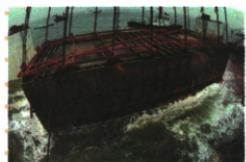

## 讲解

### 判据

原图是打捞现场、题注提供宋船货物背景，须区分照片直接可见和文字说明；图像不能一眼证明宋代船全貌、全球排名或全部贸易量。

### 流程

1. 据原题注定现代打捞现场，弃自动扬旗商船航行描述；画面中的现代工程船不能直接当古船体。
2. 南宋初、木船、外运瓷器来自原文字，明说文字依据，不假称现场照片已看出全部瓷器。
3. 船货可联系海路贸易与技术，单案例证明有具体活动，不证所有船相同货品或航次。
4. 沉船与打捞日期不同，原书无拍照年不补；形制尺寸须测量记录，不无比例量图。
5. 原赞最早最大最完整保留出处及缺比较证据，不能把宣传概括作图可直接验证的精确全球排名。原课无独立题，只示如何读其材料，不自编问法选项。

### 方法依据与边界

一张照片有自身拍摄对象和时间。原图显示的是现代打捞现场，南宋船的年代、用途和货物来自文字题注与考古背景，不能把现代工程船当宋船正在贸易的照片。船货案例可以支持当时存在海运活动，却不能代表所有航次货品或全国贸易总额。最早最大最完整是原书评价，若没有比较范围和测量档案，本图不能独立验证这些排名。读材料时明确哪部分看见、哪部分由文字提供、哪部分还需核查，能防自动图像描述替代真实史料。

## 例题

**原图及原资料（B13-S06，非独立题）：**图题“南海一号”沉船打捞现场。原叙述为南宋初通过海上丝路外运瓷器失事的木沉船，并称“迄今世界上发现的海上沉船中年代最早、船体最大、保存最完整的远洋贸易商船”。

**证据与比较范围补写：**图显示现代打捞现场，不能采用自动描述把它认作南宋商船正在扬旗航行。沉船与所运瓷器等考古材料可研究当时造船、外销与航线，但现场图本身看不见货舱全部器物，外运瓷器依原题注叙述。原最早最大最完整为原书赞誉与比较表述，未给同口径全球沉船对照，本条保留原话，不据图独证世界排名、不补船长吨位。沉船年代与现代打捞年份不同，本课未给打捞年，不自加图年份。

## 易错

- 自动描述压过原打捞题注。
- 现代照片日期等古船年代。
- 个案贸易证据放大成全球统计。

### 来源定位

- B13-S06：full.md（历史扫描分册51-100），L3123–L3134，南海一号打捞现场原图和原题注叙述；a8d85606-ccac-4ba9-89c2-44c981a45642_origin.pdf，实际PDF第49页。
