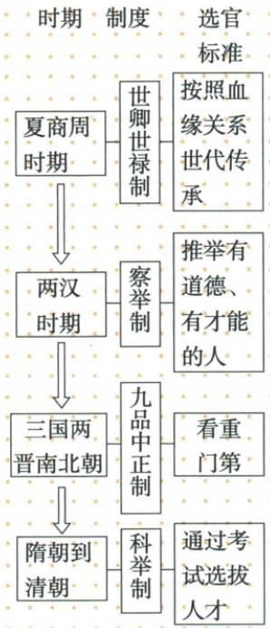

## 错法

考试替代部分门第影响，就说所有人教育资源、资格、机会完全相等。错误是把扩大机会和阶层流动的积极作用扩大成消除全部社会差异。

## 正解

科举加强朝廷选官、较门第世传扩大晋升渠道、提高文化素养，原书用延续完善和逐渐确立，表明还有发展过程。考试条件与社会资源仍有差异，不能用现代制度假设填入隋代；也不能因存在局限否定渠道扩大的作用。

## 例题

**原图（S1-S06，非独立题）：**夏商周世卿世禄制——血缘世代传承；两汉察举制——推举有德有才者；三国两晋南北朝九品中正制——看重门第；隋到清科举制——通过考试选拔人才。

**完整辨析补写：**左侧时代为纵向演变，横向是当期制度与标准，不按自动箭头读成世卿世禄“导致两汉时代”或察举“产生三国”。原图是中学总体概括，不能断言某时期绝无其他选官方法或每次举荐从无偏私。察举重推举，科举重考试；标准变化与选拔权归朝廷联系，但不等现代人人无条件平等任官。

### 来源定位

- S1-S03：full.md（历史扫描分册51-100），L1559–L1561，科举背景过程与三项影响完整表；a8d85606-ccac-4ba9-89c2-44c981a45642_origin.pdf，实际PDF第25页。
- S1-S06：full.md（历史扫描分册51-100），L1576–L1598，古代选官制度演变原图；a8d85606-ccac-4ba9-89c2-44c981a45642_origin.pdf，实际PDF第25页。
