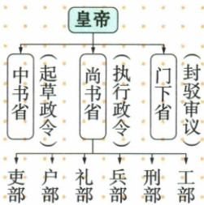

## 讲解

### 是什么

三省六部制是本书所列隋朝创立、唐进一步完善的中央行政制度。中书省起草，门下省封驳审议，尚书省执行；尚书之下六部为吏、户、礼、兵、刑、工。三省是决策执行组织层面的分工，六部是执行部门，不是三省加六部共九个同层机关。

### 怎么来的

一项政令从提出到实施，需要形成文本、检查其适当性，再落实具体事务。分别安排起草、审议、执行，能让不同环节有明确职责，减少一位大臣包办全过程；门下封驳提供审议机会，不能简化成不需审查便直接执行。

原图画三省在皇帝之下、六部在尚书之下，说明分工仍在皇帝领导的体系内。分散部分宰相权力与皇帝掌握最终统治相联系，但不能由图推断所有实际政令绝无个人专断。教学流程起草到审议再执行是职责含义的连贯解释，图左右排列本身不是流程箭头，不能把最左中书与最右门下的空间位置当行政级别高低。六部执行事务须归尚书系统，不因某部门名字接在图识别箭头下就归给中书或门下。

### 什么时候能用

用于机关职责、隶属、创立完善和制度作用。封驳是审议环节，不等门下掌军事执行；三省分工也不等现代三权分立，原图不提供机关人员数量。

## 例题

**原图与原表（S2-S01、S03，非独立题）：**皇帝之下中书省起草政令，尚书省执行政令，门下省封驳审议；尚书省下辖吏、户、礼、兵、刑、工六部。隋朝创立，唐太宗进一步完善。

**完整分析补写：**职责顺序的教学概括为起草、审议、执行，不按图左右位置机械读流程。封驳指对政令审核并提出不当处，执行由尚书及所属六部承担。六部不分别直属另外两省；三省同受皇帝领导，分工不等现代立法司法行政三权或脱离皇权的独立制衡。原图没有细化六部全部事务，不补虚构机关人数和办案题。

## 易错

- 六部直属三省各两部：原图尚书统六部。
- 唐太宗完善说唐首次创立：前有隋。
- 三省等立法行政司法三权：制度时代与职责不同。

### 来源定位

- S2-S01：full.md（历史扫描分册51-100），L1658–L1681，三省六部职责隶属原图；a8d85606-ccac-4ba9-89c2-44c981a45642_origin.pdf，实际PDF第26页。
- S2-S03：full.md（历史扫描分册51-100），L1688–L1696，太宗继位改元、政策完整表和治世表现；a8d85606-ccac-4ba9-89c2-44c981a45642_origin.pdf，实际PDF第26–27页。
