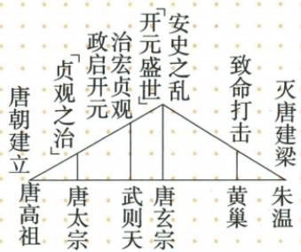

## 讲解

### 是什么

安史之乱是755—763年安禄山、史思明发动的统治集团内部政治叛乱，持续八年，是唐由盛转衰的重要转折。叛乱破坏经济、尤其北方受损，削弱中央权力，之后地方拥兵、藩镇割据发展；转衰不等755年或763年唐朝立即灭亡。

### 怎么来的

玄宗末期腐败奢侈，连年战争加重民众负担，边疆形势和社会矛盾恶化；节度使又集军政财权，中央地方力量失衡，地方不仅有争权动机，也有现实军队和资源。只写皇帝变坏会漏叛乱为何能形成如此大势，须把统治问题与权力结构连接。

叛军从河北南下、占洛阳潼关长安，使中央遭重击；肃宗继位后依将领及援军反击才平乱。平叛结束战争不等经济、人口和中央控制自动恢复，旧将与节度使继续握兵，割据形成。战争破坏生产交通，国力资源减少，地方独立又削弱中央调动资源的能力，使衰变有持续后果。因此本课转折与后来黄巢打击、907唐亡为不同阶段，图曲线概括方向不能作精确统计。

### 什么时候能用

用于性质、原因、路线、755与763及影响。统治集团叛乱与农民起义不同，民众承受灾难不改变叛军社会主体；原书八年不另换事件区间。

## 例题

**原资料性质辨析（S4-S02，非独立题）：**安史之乱是唐朝统治集团内部为争夺权力发生的政治叛乱；黄巢领导的农民起义是农民阶级反抗地主阶级压迫的斗争，性质不同。

**原表原因与过程（S4-S01）：**玄宗末年腐败奢侈、战争负担与矛盾、节度使集军政财权导致外重内轻；755年安禄山史思明叛乱，占洛阳、潼关、长安，玄宗逃成都；肃宗重用郭子仪等，在回纥军援助下反击，763平叛。

**完整分析补写：**双方领导与主要力量来自统治军政体系，争权动机与权力失衡支持政治叛乱性质；战争给百姓造成灾难，不意味着发动者因此变为农民起义。史思明名字和唐太宗时期的政策人物须分别配对。

**原资料（S4-S03、S06，非独立题）：**李渊建唐、太宗贞观、武则天为开元奠基、玄宗开元盛世及安史转衰、黄巢致命打击、朱温灭唐建后梁。

**完整分析补写：**曲线概括阶段变化，没有数字坐标，不能按高低读取国库或人口；安史是转衰而非即刻灭亡，907年朱温建梁才是本书唐亡标志。“致命打击”指统治严重受损，不等黄巢就是建立后梁者。

## 易错

- 安史当农民起义：领导力量与争权性质不同。
- 平叛成功当所有国力当日恢复。
- 盛转衰当王朝正式结束：907另核。

### 来源定位

- S4-S01：full.md（历史扫描分册51-100），L1843–L1857，安史原因过程755–763与转衰影响；a8d85606-ccac-4ba9-89c2-44c981a45642_origin.pdf，实际PDF第29页。
- S4-S02：full.md（历史扫描分册51-100），L1859–L1871，黄巢原因、安史黄巢性质辨析、黄巾黄巢比较表；a8d85606-ccac-4ba9-89c2-44c981a45642_origin.pdf，实际PDF第29页。
- S4-S03：full.md（历史扫描分册51-100），L1873–L1896，唐朝兴亡趋势原图；a8d85606-ccac-4ba9-89c2-44c981a45642_origin.pdf，实际PDF第30页。
