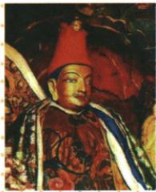
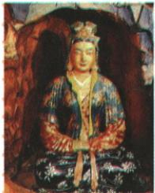

## 讲解

### 判据

题问历史事实先识别人物和事件；再要求与另一事件同主题，就比较两件事的共同作用，不能只列各自年代或把两件事当同一朝代。

### 流程

1. 松赞干布与文成公主题注连到641年唐蕃和亲，事件答文成公主入藏。
2. 入藏带知识物品并有求学工匠往来，提取各族互学联系。
3. 孝文帝改革改变语言服饰制度，也促交融；手段改革与和亲不同，不妨碍共同作用。
4. 上升到民族交往与交融或中华民族多元一体格局，两种原答均保留。
5. 图是纪念形象，不依姿势推婚礼细节；年代与身份根据题注课文核。

### 方法依据与边界

第一问事件识别和第二问主题归纳层级不同：人物配对支持入藏和亲，主题则需比较它与孝文改革共同带来什么变化。和亲借人员物品技术往来加深联系，改革借制度习俗改变推动交融，手段不同却共享交融作用，故主题能包含两事。若只答唐朝繁荣，北魏事件不在唐，范围就不成立；若答都是和亲，又会把改革手段改错。图像可纪念人物，不自动给出准确时间地点，641需依据课文。共同主题也不能证明两事件作用完全一样、发生同时或彼此直接造成。

## 例题

**原题（S5-S07）：**这两位人物塑像反映的历史事实是什么？某一历史兴趣小组将这一历史事实与“北魏孝文帝改革”纳入同一主题学习，这一主题是什么？

**原答案：**文成公主入藏。中华民族多元一体格局(或民族交往与交融)。

**完整解析补写：**先结合题注识别松赞干布和文成公主，联系唐蕃和亲，答文成公主入藏，不能只写两人的名字。第二问要求概括共同主题：入藏带来物品、技术、人员往来；孝文帝改革通过制度和生活习俗变化促进交融。两者手段不同，却都加强各族联系，故上升为民族交往与交融或中华民族多元一体格局。孝文帝是北魏人物，这不是两件唐朝事件。塑像是人物纪念形象，识别依题注和史实，不能由塑像姿态证明婚礼现场或具体年份。

## 易错

- 主题只答唐朝：北魏事件不属唐。
- 同主题等相同措施：和亲与改革不同。
- 塑像直接证明641：年份来自原课文。

### 来源定位

- S5-S01：full.md（历史扫描分册51-100），L1956–L1972，松赞干布塑像、吐蕃改革与求婚背景；a8d85606-ccac-4ba9-89c2-44c981a45642_origin.pdf，实际PDF第30–31页。
- S5-S02：full.md（历史扫描分册51-100），L1974–L1974，文成入藏概况和影响、①641年原页恢复；a8d85606-ccac-4ba9-89c2-44c981a45642_origin.pdf，实际PDF第31页。
- S5-S07：full.md（历史扫描分册51-100），L2002–L2014，文成公主塑像及两塑像事件主题原问原答；a8d85606-ccac-4ba9-89c2-44c981a45642_origin.pdf，实际PDF第31页。
