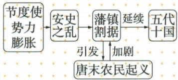

## 讲解

### 判据

图由强盛下降至亡国，需区分转折、加剧和终结。原因从权力和民生机制找，图曲线只是概览，不能直接当定量因果证据。

### 流程

1. 玄宗末腐败战争负担、节度使权力集中，解释安史发生条件。
2. 安史破坏经济与中央，解释为何平叛后仍藩镇独立。
3. 割据和赋役灾荒促反抗，黄巢战争又打击中央，加深失控。
4. 朱温控制朝廷兼并，907建后梁，完成王朝替代。
5. 每阶段写力量到作用到结果，区分755、763、881、907；不能把战争只看一条同向直线，原图还有起义加剧割据的反馈。

### 方法依据与边界

因果链要写作用通道，不只是事件年代排队。地方军政财资源集中，给节度使与中央对抗能力；安史战争破坏生产、削中央，割据又削弱资源调动；赋役灾荒使民众难生活，促反抗，起义战争再加深失控。各环节有主体、能力或负担变化，才解释为何能接下一段。图同时有起义加剧割据的反馈，不是简单单线。转衰、致命打击、907正式替代是不同性质的节点，不能用严重程度词替换终结年份，也不能以玄宗个人享乐覆盖全部政治军事社会条件。

## 例题

**原图（S4-S04，非独立题）：**节度使势力膨胀引向安史之乱，继而藩镇割据；藩镇割据引发唐末农民起义，起义又加剧割据，割据局面延续为五代十国。

**完整分析补写：**政治失控与社会负担可以促成反抗，战争反过来削弱中央、使地方武装更独立，形成相互作用；图是概括关系，不证明每场起义只因藩镇或所有地方同时同样行动。自动图将引发、加剧当独立节点，已对照原图恢复它们为关系词。

**原资料（S4-S03、S06，非独立题）：**李渊建唐、太宗贞观、武则天为开元奠基、玄宗开元盛世及安史转衰、黄巢致命打击、朱温灭唐建后梁。

**完整分析补写：**曲线概括阶段变化，没有数字坐标，不能按高低读取国库或人口；安史是转衰而非即刻灭亡，907年朱温建梁才是本书唐亡标志。“致命打击”指统治严重受损，不等黄巢就是建立后梁者。

## 易错

- 安史开始即灭唐：转折不等终结。
- 唐亡只归灾荒：漏权力结构与战争。
- 趋势线高度算人口GDP：无数值坐标。

### 来源定位

- S4-S01：full.md（历史扫描分册51-100），L1843–L1857，安史原因过程755–763与转衰影响；a8d85606-ccac-4ba9-89c2-44c981a45642_origin.pdf，实际PDF第29页。
- S4-S03：full.md（历史扫描分册51-100），L1873–L1896，唐朝兴亡趋势原图；a8d85606-ccac-4ba9-89c2-44c981a45642_origin.pdf，实际PDF第30页。
- S4-S04：full.md（历史扫描分册51-100），L1898–L1917，藩镇与安史唐末起义五代关系原图；a8d85606-ccac-4ba9-89c2-44c981a45642_origin.pdf，实际PDF第30页。
- S4-S06：full.md（历史扫描分册51-100），L1925–L1930，黄巢续表、朱温与907年唐亡；a8d85606-ccac-4ba9-89c2-44c981a45642_origin.pdf，实际PDF第30页。
