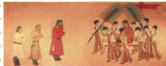

## 讲解

### 判据

场景题要说谁接见谁、来做什么，特点题则从双方行为概括关系。人物名字、事件和特点是三层，不能用笼统友好代替场景。

### 流程

1. 根据画名与求婚背景，识别唐太宗接见吐蕃求婚使者。
2. 松赞干布是派使者的人，不是图中被接见的人；公主入藏是后续关联事件，不是本图现场。
3. 派使、接见显示双方往来，由此答友好、双向交流、关系和睦。
4. 将结论限定为材料呈现的场景，整段历史是否冲突另核其他资料。
5. 不由艺术人物比例算国力、身高，资料没有数量读数。

### 方法依据与边界

身份须把派遣者、使者、接见者分清，图与题注给太宗接见吐蕃求婚使者，松赞干布是派遣方，不因名字在题注出现就认画中人。场景答案是具体行为，特点则从行为提炼：派使与接见相接，才支持双方往来，求婚与后续和亲支持友好联系。一幅画呈一个交流场景，没有展示全部唐蕃历史，故关系和睦不能扩到整个时期绝无战争。画可有构图和人物比例处理，答历史关系应据题注及史实，不能以人物大小判国家强弱；若图名和题注缺失，直接识别所有人也需要更多证据。

## 例题

**原题（S5-S08）：**这幅图描绘了什么场景？根据图片分析唐朝民族交往的特点。

**原答案：**描绘了唐太宗接见松赞干布派来的求婚使者的场景。民族友好往来；双向交流；民族关系和睦。

**完整解析补写：**题注《步辇图》与课文求婚背景相互对应，画中被接见者是吐蕃使者，接见者为唐太宗，不能写松赞干布本人朝见或文成公主入藏现场。吐蕃派人请婚，唐廷接见并发展和亲，反映双方有往来，支持友好、双向交流这一概括；“关系和睦”对应本图所呈现的交往，不能扩大成整个唐代唐蕃从无战争。图画有艺术构图，不是现场照片，也不提供人物身高或双方军力的比例数据。

## 易错

- 派遣者等于使者本人。
- 接见画变成入藏婚礼画。
- 一幅友好画便推出所有时期都无战争。

### 来源定位

- S5-S02：full.md（历史扫描分册51-100），L1974–L1974，文成入藏概况和影响、①641年原页恢复；a8d85606-ccac-4ba9-89c2-44c981a45642_origin.pdf，实际PDF第31页。
- S5-S08：full.md（历史扫描分册51-100），L2018–L2023，步辇图场景与交往特点原问原答；a8d85606-ccac-4ba9-89c2-44c981a45642_origin.pdf，实际PDF第31页。
