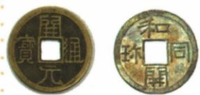
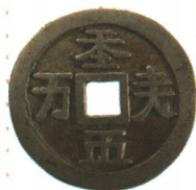
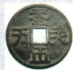
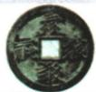
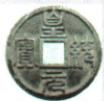

## 讲解

### 判据

题直接给日本仿唐铸币，先用仿铸文字确立联系，再用图形制辅助判断影响方向；单纯相像不能独自证明传播路线。

### 流程

1. 左币唐开元通宝、右币日本和同开珎，依据题注识别。
2. 708与仿唐是题干条件，说明日本有意借鉴唐制。
3. 圆形方孔与布局支持形制联系，转为两国文明交流频繁、日本受唐文化影响。
4. 答影响而非政治隶属，资料未给统辖证据。
5. 名称开元不当玄宗年号起点，708也不是双方文化交流唯一一年。

### 方法依据与边界

先用文字证据，是因为不同社会也可能各自做出相似物品，单纯相像还不能确定谁影响谁。题干明确仿唐，才使比较有传播方向；币形和文字布局是辅助，而不是取代题干。把观察转成历史现象时，结论对象也要一致：题中证明的是文化借鉴，行政归属需要机构、官员、统辖等另一类材料。若换成只有两张无题注图片，就应停在可见相似特征，不能照搬本题日本受唐影响的结论。708是具体日本仿币时间，也不决定全部中日交流只发生在这一年。

### 没有明示仿铸时怎样控制结论

契丹题只给货币形制并要求结合当时历史，应先读出相似，再用已知经济文化交往支持联系。可答文化交流，不直接推出某人在某年照某枚币仿铸。日本题明示仿唐，所以能说明借鉴方向；契丹题未给同等直接条件，结论就相应收窄。若只有相似图片而无题注和背景，联系更应作为待核的可能，不能把形状相似当充分证明。两题同用器物比较，证据强弱不同，方法不是每张相似图都套一条定论。

## 例题

**原题（S6-S06，珎字依原页校正OCR）：**和同开珎是日本在708年仿唐朝开元通宝而铸的。这反映了什么历史现象？

**原答案：**反映出当时两国文明交流频繁，日本文化深受唐朝影响。

**完整解析补写：**原题直接给日本仿唐铸造，图中两币圆形方孔与文字布局可作形制参照，故从物品形式联系到文明交流与影响。708年是日本这枚币的铸造背景，不是唐开元盛世起始年，也不因唐币名开元通宝就推它在玄宗开元年间才首次铸造。相似形制须结合仿铸这一文字证据，不能只凭两物相像就断言来源；文化借鉴更不能变成日本政治上属于唐朝的证明。题中币面无比例尺，不能量实物直径或价值。

### 契丹货币：结合历史背景判断文化联系

**原题（B9-S02）：**观察图中货币样式，结合这一时期的历史，可以得出什么结论？

**原答案完整保留：**契丹货币与中原王朝货币的样式十分相近,都是圆形方孔。因此,图片货币样式体现了契丹与中原文化的交流与联系。

**完整解析补写：**可见圆形方孔这一形制相近，再结合本课契丹与中原经济文化交往、汉人北迁带技术的背景，答文化交流与联系。原题要求结合历史，不能删去背景只凭相像便证明具体哪年由谁仿造。与上例日本题不同，这里没有给708仿唐的明确文字，不能照搬日本题的年份、铸币国或特定传播路线。文化联系也不证明辽是宋的行政属地；图无比例尺不量实物直径，币面未清楚辨出的字不凭印象补铭文。

### 单元原题10：货币证据能说明到哪一层

**新考法原题（SY-U10；原书标注2022内蒙古呼和浩特中考，未另核真题身份）：**下图是博物馆展出的契丹族、党项、女真族的货币。通过货币的款式和内容，我们可以获得的史料信息是（）。

A.契丹族、党项、女真族高超的工艺水平

B.当时北方商路畅通，边界贸易频繁

C.两宋与辽、西夏、金的岁币议和关系

D.少数民族与汉族经济文化的联系

**原答案：D。原解题思路完整保留：**根据图片可知，契丹、西夏、金的货币与中原王朝的货币相似。从钱币这个小切口可以看出契丹族、党项、女真族吸收了汉族先进的经济、文化制度，体现了少数民族与汉族经济文化的联系。

**逐项解析补写：**A不合，实物能呈现制作特征，但题图未给工艺比较标准，不足断“高超”水平，更不是原题款式相似的核心信息。B不合，货币存在不直接证明所有北方商路畅通或边贸频繁，需路线、交易等资料。C不合，币形文字不能直接读出和约时间、付款方向或岁币数量。D正确，圆形方孔与文字布局等形制联系，结合本课契丹、党项、女真吸收中原制度文化的背景，支持经济文化联系。

**判断链及边界：**辨题注所属→比较形制内容→结合交往背景→取联系结论。图中文字不清的部分不补猜铭文、面额，三图无统一比例尺不比实际币径；原题没有明确哪年仿哪枚币，不照搬日本708仿唐的时点。文化联系也不证明三个政权均隶属于宋。

## 易错

- 只说两币相似，不写题干仿铸依据。
- 文化影响变日本属于唐。
- 无比例尺量尺寸或面值：图片不支持。

### 来源定位

- S6-S01：full.md（历史扫描分册51-100），L2077–L2083，晁衡相关链接与遣隋遣唐使概况影响；a8d85606-ccac-4ba9-89c2-44c981a45642_origin.pdf，实际PDF第32页。
- S6-S06：full.md（历史扫描分册51-100），L2111–L2129，两国硬币原图与仿唐铸币原问原答；a8d85606-ccac-4ba9-89c2-44c981a45642_origin.pdf，实际PDF第33页。
- B9-S01：full.md（历史扫描分册51-100），L2626–L2628，契丹生产发展、916建国、阿保机措施；a8d85606-ccac-4ba9-89c2-44c981a45642_origin.pdf，实际PDF第41页。
- B9-S02：full.md（历史扫描分册51-100），L2630–L2646，契丹货币原图、题目及续页完整答案；a8d85606-ccac-4ba9-89c2-44c981a45642_origin.pdf，实际PDF第41–42页。
- SY-U10：full.md（历史扫描分册101-150），L281–L299，三族钱币新考法图四选项与完整原详解；6484926a-d709-4079-96ba-4a8c4b0a1b00_origin.pdf，实际PDF第5页。
