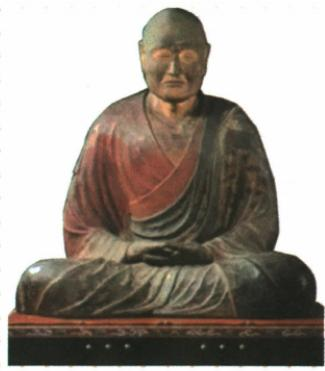
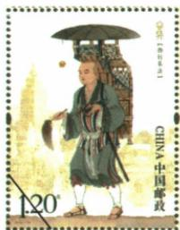

## 讲解

### 判据

要求两图共同观点，要先各自说清人物行动，再找双方都支持的抽象作用；观点不能只涵盖一个人，也不能把不同目的合为一事。

### 流程

1. 鉴真塑像与玄奘邮票题注分别识别，不能看都是僧人便互换。
2. 鉴真日本传授、玄奘天竺学习及返国译经，按地点方向目的核。
3. 两人都沟通文化并促进传播，答杰出人物对中外交流的贡献。
4. 若从文化作用概括，答优秀文化对世界文明发展积极影响，并用传授译经说明。
5. 两原观点为可选表述，不排斥；原题只拟观点，解析补充支撑使学生能看懂依据。

### 方法依据与边界

共同观点要比单一事实抽象，但仍需两边都能支持。只写鉴真到日本属于事件，不能涵盖玄奘；说人物沟通文化，则可用赴日传授与西行学习返国译介分别支撑。文化影响观点还要指出知识传播和被学习的作用，不只宣称古代文化伟大。两原观点是可成立的不同归纳，不是两项只有一项正确。若所问变成人物主目的，就回到传播唐文化与学习佛教差别；共同贡献不能代替该差别。塑像与邮票帮助指向人物，贡献的证据仍在事迹，不由纪念载体的图案推全部历史过程。

## 例题

**原题（S6-S07）：**根据这两张图片拟定一个观点。

**原答案：**观点1：我国古代杰出人物对中外文化交流作出重大贡献。观点2：我国古代优秀文化对世界文明发展产生积极影响。

**完整解析补写：**先据题注识别鉴真与玄奘，再联系事迹。鉴真东渡日本，传授佛法及医药、文学、建筑等；玄奘西行天竺求法，返国译经并留下有关西域和天竺的知识。两者都通过个人行动沟通文化，支持观点1；传授、译介使知识传播和社会发展受益，支持观点2。拟观点要覆盖两人，不能只写鉴真东渡日本；两种原答均成立，无须误当互相排斥的选项。人物纪念像、现代邮票不是唐代拍摄的现场影像，邮票面值不能用于计算玄奘旅费。

**原资料比较表（S6-S08，非独立题）：**

|事件|原书在位皇帝|主要目的|共同贡献|
|---|---|---|---|
|鉴真东渡日本|唐玄宗|传播唐朝文化|对唐与邻国文化交流作贡献|
|玄奘西行天竺|唐太宗|学习佛教文化|对唐与邻国文化交流作贡献|

**完整分析补写：**先按人物、方向、对象、主目的配对，再归共同作用。东渡与西行不是同一目的，传播与学习又可形成互通：玄奘学习后译经传播，鉴真接受邀请赴日传授。表列主要目的不是每一行动只有一种作用，也不能因两人都是僧人就互换时代、地点。

### 单元原题5：鉴真东渡时序

**单元原题5（SL-U5；原书标注2024山东临沂中考，未另核真题身份）：**唐朝时，很多中国人为中日两国人民的交流作出了贡献。他们当中，最突出的是高僧鉴真。742年，他应日本僧人邀请，先后6次东渡，历尽千辛万苦，终于在754年到达日本。下列相关论述，正确的是（）。

A.鉴真东渡日本时玄奘正在西行　B.鉴真受到日本人的邀请和尊敬

C.鉴真东渡时风平浪静顺利成功　D.鉴真东渡期间发生了安史之乱

**原答案：B。原完整解题思路（SL-A5）：**根据材料“他应日本僧人邀请”可知，鉴真东渡受到日本僧人的邀请和尊敬，B项正确；鉴真东渡发生在唐玄宗时期，玄奘西行是在唐太宗时期，A项错误；鉴真东渡历尽千辛万苦，第6次才到达日本，C项错误；鉴真于754年到达日本，755年爆发安史之乱，D项错误。

**逐项解析补写：**A错误，人物时代阶段不同，玄奘太宗时期的西行不与742—754这段鉴真东渡旅程同时进行。B正确，受僧人邀请直接支持交流需求与欢迎，原答的尊敬据邀请背景理解，不另外编造原文没有的欢迎仪式。C错误，六次与千辛万苦直接排除风平浪静、顺利成功的全程描述。D错误，题干的东渡至754，安史755开始，发生在抵日以后；时间比较是关键，不能仅因同为玄宗在位便判同时。

**判断链：**邀请→B有直接依据；次数困难→排C；人物时代→排A；754早于755→排D。数字和原详解完整保留，不能把同一皇帝在位当事件时间相等。

## 易错

- 共同观点只写鉴真赴日。
- 学习与传播目的同义：阶段不同，作用可互通。
- 现代邮票当古代现场史料：载体年代分开。

### 来源定位

- S6-S02：full.md（历史扫描分册51-100），L2085–L2087，鉴真五次未成、第六次成功与文化贡献；a8d85606-ccac-4ba9-89c2-44c981a45642_origin.pdf，实际PDF第33页。
- S6-S04：full.md（历史扫描分册51-100），L2097–L2099，玄奘西行、译经与大唐西域记；a8d85606-ccac-4ba9-89c2-44c981a45642_origin.pdf，实际PDF第33页。
- S6-S07：full.md（历史扫描分册51-100），L2131–L2160，鉴真塑像、玄奘邮票与拟观点原问两原答；a8d85606-ccac-4ba9-89c2-44c981a45642_origin.pdf，实际PDF第33页。
- S6-S08：full.md（历史扫描分册51-100），L2162–L2176，交往原因、人物比较表与启示；a8d85606-ccac-4ba9-89c2-44c981a45642_origin.pdf，实际PDF第34页。
- SL-U5：full.md（历史扫描分册51-100），L2331–L2338，鉴真742至754第5原题；a8d85606-ccac-4ba9-89c2-44c981a45642_origin.pdf，实际PDF第37页。
- SL-A5：full.md（历史扫描分册51-100），L2384–L2386，第5完整逐项原详解与答案；a8d85606-ccac-4ba9-89c2-44c981a45642_origin.pdf，实际PDF第37页。
