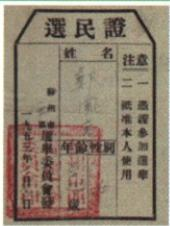
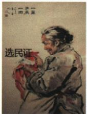
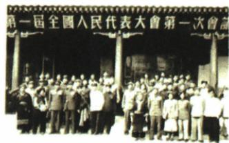

## 错法

1954宪法是社会主义类型，就把三改基本完成提前到1954；或从选民证国画直接说图上已经有整部宪法规定。错把发展方向当所有经济结果，把有限图证当完整文字法源。

## 正解

原宪法论人民意愿、代表机关制度及社会主义方向，国家仍在过渡建设中。1956基本完成经济改造是另一对象和节点。三图提供参与和会议线索，制度内容结合所学，方向作系统解释，不能伪装图片直接显示全条文。

## 例题

### 原例题：三图说明1954宪法的类型

原图1：女性选民的选民证。

原图2：国画《一辈子第一回》。

原图3：第一届全国人民代表大会第一次会议。

**原问。** 根据三幅图片并结合所学，谈谈为什么1954年《中华人民共和国宪法》是一部社会主义类型的宪法。

**原答案，完整两点。**

1. 从制定过程看，宪法由第一届全国人大通过，充分体现人民意愿，是我国有史以来真正反映人民利益的宪法。
2. 从内容看，一切权力属于人民，行使权力机关是全国人大和地方各级人大，以根本法形式确立人大制度，为社会主义发展指明方向。

**完整解析与证据边界。** 第一图是参与选举的证件，第二图是选举主题的国画，第三图提供全国人大会议的图像线索，三图共同帮助理解人民参与和代表机关制定的过程。但国画是艺术表达，图像不是宪法条文全文，不能只凭一张证件直接证明所有制度内容。第二点须结合本课所学宪法规定，权力属于人民通过代表机关制度化，而非只喊“人民当家作主”。为什么是社会主义类型还须与其为社会主义发展指明方向联系：人大网相关宪法史说明其序言载明逐步工业化和社会主义改造的过渡任务，这是系统补讲依据，不能伪称原图片直接显示。1954文件指明社会主义方向不等1954所有经济改造已完成，原课另记1956经济制度建立。

### 原资料：人大、宪法与制度保证

第一届全国人大第一次会议于1954年9月在北京举行：通过宪法，选举毛泽东为国家主席、朱德为副主席、刘少奇为人大常委会委员长，决定周恩来为国务院总理。原意义：标志社会主义政治制度确立；政协不再代行人大职权，但作为人民民主统一战线组织继续存在。

1954宪法原表：国家是工人阶级领导、工农联盟为基础的人民民主国家，一切权力属于人民，人民通过全国人大和地方各级人大行使权力；以根本法确立人大制度。原制度保证：人大制度是根本政治制度，多党合作政治协商与民族区域自治是两项基本政治制度。原链接还说明共同纲领停止临时宪法职能。

原记1956社会主义制度建立，是广泛深刻社会变革，使一穷二白人口众多的东方大国迈进社会主义社会，为进步发展奠定基础。**层次区别：** 1954讲政治制度及根本法，1956讲生产资料改造基本完成与社会主义经济制度，领域不同不应强改同一年；社会发展有基础也不表示所有经济文化目标同时实现。国家主席、党内职务、人大委员长和总理分别对应不同机构，选举与决定原动作也应保留。

### 来源定位

- X3-Q03：full.md（历史扫描分册151-200），L2474–L2537，三图与1954社会主义类型宪法原两点答；7315c71c-e0f3-499f-a65f-f5d33fed3468_origin.pdf，实际PDF第44页。
- X3-S09：full.md（历史扫描分册151-200），L2421–L2432，一届人大时间地点内容意义；7315c71c-e0f3-499f-a65f-f5d33fed3468_origin.pdf，实际PDF第42、43页。
- X3-S10：full.md（历史扫描分册151-200），L2434–L2443，1954宪法内容制度保证与1956制度建立；7315c71c-e0f3-499f-a65f-f5d33fed3468_origin.pdf，实际PDF第43页。
- X3-S12：full.md（历史扫描分册151-200），L2470–L2472，共同纲领停止临时宪法职能链接；7315c71c-e0f3-499f-a65f-f5d33fed3468_origin.pdf，实际PDF第43页。
