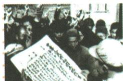
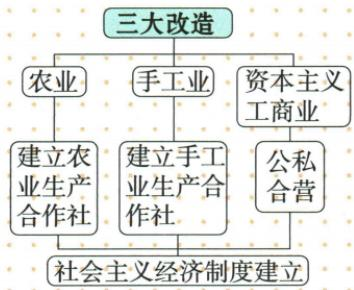
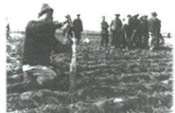
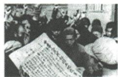

## 错法

分地后农民成为主人，就写土地已集体公有；原说消灭地主阶级，就写所有地主都被肉体消灭。前者混淆所有者改变和公私性质，后者把经济社会关系误当每个人的身体。

## 正解

原表明确地主所有转农民所有，后者仍是私有，农业合作化才是后来走集体化的阶段。原措施还给地主一份让其自耕，消除的是靠封建土地占有剥削的阶级关系。1952结果须保民族地区例外和大陆基本，不扩每处全完成。

## 例题

### 原例题：按法律内容识别《土地改革法》

原图注：《中华人民共和国土地改革法》受到广大农民的热烈拥护。

**原问。** “废除地主阶级封建剥削的土地所有制，实行农民的土地所有制”这一决策出自哪一法律？

**原答。** 《中华人民共和国土地改革法》。

**完整解析。** 题干提供两个对应动作：废除地主封建剥削的土地所有制，以及实行农民土地所有制。原本课法律表将这两项列为1950年土地改革法的主要内容，因此应填该法律全名。判断依据是法律内容与本课时段相合，图注也提供佐证；不能仅因出现分田就改为解放战争的《中国土地法大纲》，更不能把后来的农业合作化写成该法内容。农民拥护可由获得土地和劳动收益关系改变来解释，不能凭小图编造现场人名、地点或日期。

### 原资料：新中国成立初期土地改革

|项目|原内容|
|---|---|
|法律及颁布|《中华人民共和国土地改革法》，1950年。|
|根本原因|封建土地制度严重阻碍农村经济和中国社会发展。|
|直接原因|成立时占全国人口一多半的新解放区尚未完成土改，广大农民迫切要求获得土地。|
|内容|废除地主阶级封建剥削的土地所有制，实行农民土地所有制。|
|开始|1950年冬，新解放区分批进行。|
|措施|没收地主土地，分给无地少地农民；也给地主一份，让他们自己耕种。|
|结果|1952年底，除部分民族地区外，全国大陆基本完成。|

原四项意义：①彻底摧毁存在2000多年的封建土地制度，消灭地主阶级；②农民翻身得到土地，成为土地主人；③人民政权更巩固，大大解放农村生产力；④农业迅速恢复发展，为国家工业化准备条件。

原对照表：封建土地所有制下，土地所有者为地主，地主占有绝大部分劳动成果；农民土地所有制下，土地所有者为农民，农民自己占有劳动成果。

**解析。** 所有者和劳动成果归属改变，农民生产收益与自己劳动的联系增强，生产积极性得以提高；农业发展能提供粮食和部分工业原料等建设条件，获得土地的农民也更支持人民政权。这里的“消灭地主阶级”是消除以封建土地占有剥削为基础的阶级关系，不能理解为肉体消灭所有地主；原措施明确也给地主一份自耕。地主私有转农民私有，改变占有与剥削关系，没有在这一阶段改为集体公有。原“基本”“大陆”“除部分民族地区”都是范围条件，不得删去。

### 第3课原所有制易错证据

### 原资料：农业手工业合作化与三改图

原图三支：农业→农业生产合作社；手工业→手工业生产合作社；资本主义工商业→公私合营；共同连接社会主义经济制度建立。原图是途径归纳，不表示三项每一步都同日完成。

|项目|农业原内容|手工业原内容|
|---|---|---|
|背景|农业发展满足不了工业化需要。|原表未列，不能把空栏补成原文。|
|方式|组织分散个体农民参加农业生产合作社，走集体化与共同富裕道路。|由低级到高级，循序渐进。|
|结果|1955下半年高潮，1956基本完成。|1956年6月，90%以上个体手工业者参加生产合作社。|

原易错：成立初期土改是封建土地所有制转农民土地所有制，仍私有；农业合作化转社会主义公有，由私有转集体所有。原旁注：农业、手工业生产资料归合作社，属集体所有；资本主义工商业生产资料归国家。

**解析。** 农民个人取得土地解决旧剥削关系，合作化进一步改变分散个体生产和所有制关系，是不同任务。集体所有属公有，但不等每个农民的全部生活用品都归国家。原手工业90%以上是比例，不能改为全部100%。旁注在OCR中插在人大时间后，实际原页位于三改结果旁，应归经济所有制说明，不作人大新决议条文。

### 第一单元原题第3题完整原答与逐项依据

**单元原第3题，原标“2023福建中考”。** 中国共产党历来重视农民、农业和农村问题。下面两幅图片体现的事件共同之处是（ ）。

原图1：解放战争时期解放区农民在分到的土地上插界标。

原图2：《中华人民共和国土地改革法》受到广大农民热烈拥护。OCR把它移到第5题之后，已对实际原页归回本题。

A.保障了解放战争的胜利；B.解放了农村生产力；C.实现了社会主义工业化；D.确立了土地公有制。

**原答案B。完整原解。** 1947《中国土地法大纲》激发农民革命生产积极性、解放农村生产力；1950土地改革法后分批土改，完成后摧毁2000多年封建土地制度，也解放农村生产力。

**完整推理补写。** 先用图注分别识解放战争土改和新中国初期土改，不把两张图同一时期。两者均改土地剥削关系，使农民获地、劳动收益联系增强，生产积极性和农村生产条件得到释放，故共同作用B。共同性质应同时适用于两个时期；1950后事件不能倒作此前解放战争获胜的原因。两者均农民私有，不把新主人农民等同集体公有。

**四项逐项解析补写。**

- A（错）：解放战争土改能提供战争保障，新中国初期土改发生在成立后，不能作为两事件共同的此前战争胜因。

- B（对）：两时期改革都使农民获地、改剥削关系，激发生产积极性并解放农村生产力，符合两图共同要求。

- C（错）：土改为工业化提供条件，不等工业化已实现，两图均未证明完整工业化成果。

- D（错）：地主私有转农民私有，没有在这两次分地中建立集体公有；公有是后来合作化改造的不同任务。

原题年份地区及中考、改编标签按原书保留，未另行核定真题身份；解析中教学推理为补写，原答原解单列。

### 八下第9课承包使用权与四次关系区别

### 原例题 X9-Q01：凤阳花鼓图反映的信息

**原图注：**凤阳农民打花鼓庆丰收。**原问：**上图反映了什么历史信息？

**完整原答：**1978年安徽凤阳小岗村农民实行包干到户、自负盈亏；1979年秋粮食产量比上年大幅增加。说明家庭联产承包责任制激发劳动热情、带来农村生产力大解放，农业生产水平和农民收入有很大提高。

**完整解析。**先据图注和本课原背景定位凤阳、小岗和家庭承包，照片本身不能读出1978年政策全文或产量倍数。改革让农户有生产自主权，使履行约定任务后的经营收益更直接联系自家劳动效果，因而更愿投入、安排生产。原1979较上年增加提供成果例证，再把成果接激发劳动热情和农业发展。不能从丰收照片单独推出土地所有权变私有，也不编原未给的亩产、增幅或农户人数。

**原知识完整补接：**1978年全国还有2.5亿人口未解决温饱，农村突出；改革目的为调动积极性、发展农村经济。1978小岗包干到户自负盈亏，到1983包产到户、包干到户为主要形式在全国普遍实行。原影响三层：农业生产和收入提高；专业化商品化社会化发展、乡镇企业兴起，为致富现代化开新路；全国政社分开、建乡政府作为基层政权，20多年人民公社制度不复存在，为农村经济政治体制重大改革。开始、推广与政社分开不全改同一天，原未给政社分开单一完成日不编。

**原易错：**农民拥有土地使用权而非所有权。历史教学说明：集体所有下改变经营方式和收益联系，与1950土改地主私有转农民私有、1956农业合作化转集体公有不同。

### 原资料：农村四次生产关系变革或调整

|原节点|原变化与作用|
|---|---|
|土地改革，1952基本完成|摧毁2000多年封建土地制度，消灭地主阶级；农民得地、成土地主人，政权巩固、农村生产力解放，农业恢复发展，为工业化准备条件。|
|农业合作社，1956基本完成|分散个体农民组织成农业生产合作社，集体化共同富裕道路；1955下半年合作化高潮，次年基本完成。|
|人民公社化，1958开始|提高公有化程度，损害生产者积极性，不利农业生产。|
|家庭联产承包，1978开始|包产到户、包干到户主要形式，激发劳动热情、农业生产收入提高，为致富现代化开路。|

**逐行完整比较。**土改是地主私有转农民私有，合作化是私有转集体公有；公社化急于扩大规模和提高公有化程度等脱离当时条件，不能只以公有程度高便判断更有利生产；家庭承包在集体所有下改经营方式和劳动收益联系，给家庭自主权，不是退回地主制度或再将地所有权私有化。先固定生产资料归谁，再看谁怎样组织生产、收益怎样联系劳动，才能解释四次不同性质与影响。消灭地主阶级指土地剥削阶级关系消失，不是消灭全部个人。原选四次重要变化不称所有时期全部政策；基本完成、开始不能互换。此原图为比较陈述，无独立题，不增加题数。

### 来源定位

- X2-S01：full.md（历史扫描分册151-200），L2199–L2201，封建与农民土地所有制完整对照表；7315c71c-e0f3-499f-a65f-f5d33fed3468_origin.pdf，实际PDF第38页。
- X2-S02：full.md（历史扫描分册151-200），L2203–L2215，土地改革法原因内容及开始措施结果；7315c71c-e0f3-499f-a65f-f5d33fed3468_origin.pdf，实际PDF第38、39页。
- X2-S03：full.md（历史扫描分册151-200），L2217–L2222，土地改革四项意义；7315c71c-e0f3-499f-a65f-f5d33fed3468_origin.pdf，实际PDF第39页。
- X2-Q01：full.md（历史扫描分册151-200），L2234–L2246，土地改革法图片与法律原问答；7315c71c-e0f3-499f-a65f-f5d33fed3468_origin.pdf，实际PDF第39页。
- X3-S03：full.md（历史扫描分册151-200），L2370–L2372，土改私有与合作化公有原易错；7315c71c-e0f3-499f-a65f-f5d33fed3468_origin.pdf，实际PDF第42页。
- X3-S06：full.md（历史扫描分册151-200），L2399–L2403，农业手工业背景方式结果完整原表；7315c71c-e0f3-499f-a65f-f5d33fed3468_origin.pdf，实际PDF第42页。
- X3-S08：full.md（历史扫描分册151-200），L2415–L2425，1956改造结果与跨栏集体国家所有说明；7315c71c-e0f3-499f-a65f-f5d33fed3468_origin.pdf，实际PDF第42页。
- XU1-Q03：full.md（历史扫描分册151-200），L2613–L2615，两时期土改原B完整两阶段详解；7315c71c-e0f3-499f-a65f-f5d33fed3468_origin.pdf，实际PDF第46页。
- XU1-Q03-T：full.md（历史扫描分册151-200），L2654–L2674，两图土改题干图1及四项；7315c71c-e0f3-499f-a65f-f5d33fed3468_origin.pdf，实际PDF第46页。
- XU1-Q03-I：full.md（历史扫描分册151-200），L2689–L2697，错位土改图2及图注原属第3题；7315c71c-e0f3-499f-a65f-f5d33fed3468_origin.pdf，实际PDF第46页。
- X9-Q01：full.md（历史扫描分册201-250），L525–L539，凤阳花鼓原图问完整原答；5cc603b4-3c7a-4bc5-b935-8c05069de690_origin.pdf，实际PDF第9页。
- X9-S01：full.md（历史扫描分册201-250），L502–L515，家庭承包背景内容推广及三层影响；5cc603b4-3c7a-4bc5-b935-8c05069de690_origin.pdf，实际PDF第9页。
- X9-S02：full.md（历史扫描分册201-250），L519–L521，土地使用非所有原易错；5cc603b4-3c7a-4bc5-b935-8c05069de690_origin.pdf，实际PDF第9页。
- X9-S07：full.md（历史扫描分册201-250），L588–L612，农村四次关系调整原图全部文字节点；5cc603b4-3c7a-4bc5-b935-8c05069de690_origin.pdf，实际PDF第11页。
