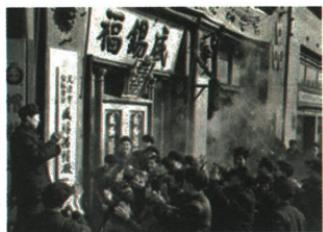

## 错法

帽厂图中牌子写合营就只答合营，不读创造性举措；或把赎买理解国家大量买帽子。错在将图像线索当全部答案，混组织形式与处理资本家资产政策。

## 正解

图注先定位工商业改造，原问题的创造性政策答赎买，以资本家生产资料资产发定息实现和平过渡。若问组织形式才用公私合营。帽子是产品，原政策处理生产资料，不是消费购买；原没有定息数值，不能猜图来算。

## 例题

### 原资料：资本主义工商业改造阶段与赎买

|原阶段|原形式|
|---|---|
|1953年底以前|以加工订货等为主要形式。|
|1954年|逐步转入重点发展公私合营。|
|1956年1月|改造出现高潮。|

原政策：国家对资本家占有的生产资料实行赎买，按全行业公私合营时资本家的资产发给定息；原意义为实现和平过渡，是社会主义改造创举。原总体结果：1956年基本完成对生产资料所有制的社会主义改造，实现生产资料公有制，建立社会主义经济制度。

### 原例题：盛锡福帽厂改造的创造性举措

原图注：天津盛锡福帽厂挂上公私合营后的新厂牌。

**原问。** 指出国家在对天津盛锡福帽厂改造的过程中采取的创造性举措。

**原答。** 赎买政策。

**解析。** 图注“公私合营”定位资本主义工商业的改造，题问创造性举措，再回原政策找以定息处理资本家资产的赎买，故不是农业合作社，也不是简单无偿没收一切私产。公私合营是组织形式，赎买是处理原资本家生产资料的政策，二者相关但问法不同。照片不能单凭厂牌读出定息数值、期限和所有人的协议，原未给这些就不编造。

### 来源定位

- X3-Q02：full.md（历史扫描分册151-200），L2456–L2468，盛锡福帽厂原图赎买问答；7315c71c-e0f3-499f-a65f-f5d33fed3468_origin.pdf，实际PDF第43页。
- X3-S07：full.md（历史扫描分册151-200），L2405–L2413，工商业三阶段与赎买原表；7315c71c-e0f3-499f-a65f-f5d33fed3468_origin.pdf，实际PDF第42页。
