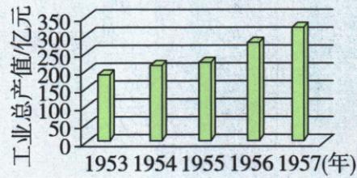

## 讲解

### 是什么

三大改造是对农业、手工业和资本主义工商业的社会主义改造，核心是生产资料所有制的改变。农业、手工业用生产合作社，工商业用公私合营并实行赎买；1956年基本完成，建立社会主义经济制度。三改不是三场战争，也不是三个工业工程，工业化是过渡总路线中的另一任务。

### 怎么来的

1950年代初，土改已使广大农民个人取得土地，生产资料关系却仍有个体私有、私营工商业等形式。合作社把分散的农民或手工业者组织起来，改变个体所有和经营关系；工商业通过加工订货等逐步转合营，以定息赎买处理原资本家资产，推动和平过渡。三项对应不同生产对象，方式不必一样，但共同方向是生产资料由私有转公有。公有包含集体所有与国家所有，原农业手工业归合作社，工商业归国家，所以不能将共同方向写成所有部门一律同种组织。经济制度建立为以后社会主义建设提供基础，并不意味工业化、共同富裕和所有社会目标都已在1956年实现。

### 什么时候能用

材料同时出现农户或手工业者个体转集体、私营工业公私合营时，应从三个对象归纳三改；只给一种合作社时可识该部分，不能声称材料直接列齐全部三项。结果题保1956基本完成与经济制度建立，不能拿1957报告年替完成年，不能拿1954政治制度年替经济节点。原总路线的一化与三改互相配合但对象不同，范围始终是生产资料，不扩全部个人生活用品。

## 例题

**单元新考法综合原题，加工编号7，原无数字题号，原标“2024山东东营中考改编”。** 新中国成立后，党团结带领人民建立社会主义制度。阅读材料回答问题。

**原第（1）问。** 观察图，这一时期中国工业总产值增长因为什么？这一计划哪年完成，有何意义？

原图横轴1953—1957年，纵轴工业总产值（亿元），柱高整体逐年增长。柱顶无精确数字标注，自动识别表中的200、230、240、300、340仅是识别推估，不能当原题精确数据；本题不要求计算增长率，不新增精确算题。

**完整原第（1）答。** 原因：一五计划实施。时间：1957年。意义：开始改变工业落后面貌、初步奠定社会主义工业化基础。

**第（1）问推理。** 图给1953—1957，先和本课一五时段对应，再由计划集中发展重工业与配合建设解释工业生产扩大；图上升本身不逐字写原因，原因须结合所学。完成年用计划1957年底，不能取图第一年1953。意义保开始和初步，不写已经全面工业化。

**原材料。** “一亿二千万农户和五百多万个手工业者的个体经济已经变为集体经济。七万户的私营工业企业已经变为公私合营企业……这是把几千年来的生产资料私有制变为公有制的社会主义大革命。由于各种条件的成熟，由于共产党和人民政府的正确领导，由于全国人民的努力……我们在这个大革命取得基本胜利的第一年，就在各方面取得了巨大的成绩。”——《政府工作报告》（1957年6月），原书署名。

**原第（2）问。** 结合所学指出社会主义大革命是哪一重大事件，有何历史意义？

**完整原第（2）答。** 三大改造。实现生产资料公有制，建立社会主义经济制度。

**第（2）问推理。** 农户和手工业个体转集体分别对应农业手工业合作化，私营工业转公私合营对应工商业改造；三个对象共同出现，故为三大改造，不是只一次分地。材料明确私有转公有，再连经济制度建立。报告1957六月是材料发表时间，“基本胜利第一年”回指1956改造基本完成，不能把报告年月当改造完成年月。原大数量照保，一亿二千万、五百多万、七万涉及不同统计对象，不能当精确同类人数相加。

原题年份地区及中考、改编标签按原书保留，未另行核定真题身份；解析中教学推理为补写，原答原解单列。

## 易错

农民分地是地主私有转农民私有，不能因此提前认定三改公有结果；合作社集体公有不等全都直接国有。赎买不是买成品或一律无偿没收。报告的农户、手工业者和企业数量单位不同，不能相加作同类人数。

### 来源定位

- X3-S03：full.md（历史扫描分册151-200），L2370–L2372，土改私有与合作化公有原易错；7315c71c-e0f3-499f-a65f-f5d33fed3468_origin.pdf，实际PDF第42页。
- X3-S04：full.md（历史扫描分册151-200），L2374–L2395，三大改造原图及自动对应；7315c71c-e0f3-499f-a65f-f5d33fed3468_origin.pdf，实际PDF第42页。
- X3-S06：full.md（历史扫描分册151-200），L2399–L2403，农业手工业背景方式结果完整原表；7315c71c-e0f3-499f-a65f-f5d33fed3468_origin.pdf，实际PDF第42页。
- X3-S07：full.md（历史扫描分册151-200），L2405–L2413，工商业三阶段与赎买原表；7315c71c-e0f3-499f-a65f-f5d33fed3468_origin.pdf，实际PDF第42页。
- X3-S08：full.md（历史扫描分册151-200），L2415–L2425，1956改造结果与跨栏集体国家所有说明；7315c71c-e0f3-499f-a65f-f5d33fed3468_origin.pdf，实际PDF第42页。
- XU1-Q07：full.md（历史扫描分册151-200），L2725–L2751，未原数字编号综合工业图与三改材料两问完整原答；7315c71c-e0f3-499f-a65f-f5d33fed3468_origin.pdf，实际PDF第47页。
