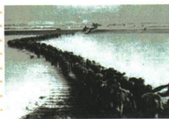

## 讲解

### 是什么

本课称中国人民志愿军为“最可爱的人”，以黄继光和邱少云的具体行动说明为国为民、英勇牺牲和忠诚集体任务，并概述五种抗美援朝精神。人物事迹是判断依据，精神名称是从行动目的和困难中的选择概括出的意义。

### 怎么来的

黄继光面对敌火力阻挡，为战友开路而牺牲；邱少云面对烈火仍守潜伏纪律，保护部队任务。两者行动不同，共同把祖国人民与集体利益置于个人安危之上，这才说明爱国和英雄主义、忠诚精神的依据。革命乐观主义着重困难中的高昂士气，国际主义着重援助与和平正义事业；原整套精神不能仅凭一张过江照片逐一当视觉结论。

### 什么时候能用

识事件图先靠图注与本课背景，英雄姓名结合战争所属及原事迹。题给个人动作时按动作分黄与邱，不能互换；精神题联系行为解释后保原五项，不把“最可爱”当姓名或正式部队番号。

## 例题

### 原例题：跨过鸭绿江识事件、英雄和精神

原图注：中国人民志愿军跨过鸭绿江。

**原问。** 图片与哪一事件相关？写出这场战争中的两位战斗英雄。他们身上具有怎样的精神？

**原答。** 抗美援朝。黄继光、邱少云。爱国主义精神、革命英雄主义精神、革命乐观主义精神、革命忠诚精神、国际主义精神等。

**三问逐步解析。** 第一问用原图注“志愿军”“鸭绿江”与本课赴朝联系，判抗美援朝，不是1949渡长江。第二问是这场战争中的人物，不是照片中可辨的人物，依本课写黄继光和邱少云。第三问联系堵射口开辟道路、严守纪律维护部队安全解释为国为民、英勇牺牲与忠诚集体任务，再按原答保留五种精神。原答列的是整套抗美援朝精神，照片本身不能逐项独立证明所有人格品质；不编照片中每人的身份来凑证明。

### 原资料：志愿军称号、精神与两位英雄

原称号：“最可爱的人”。原精神完整五项：祖国人民利益高于一切、为尊严奋不顾身的爱国主义；英勇顽强、舍生忘死的革命英雄主义；不畏艰难、始终高昂士气的革命乐观主义；为祖国人民使命奉献一切的革命忠诚；为人类和平正义奋斗的国际主义。

黄继光：上甘岭战役中用胸膛堵住敌机枪射口，为战友开辟前进道路，英勇牺牲。邱少云：为保证部队安全和战斗胜利，严守潜伏纪律，直至被大火吞噬，壮烈牺牲。

**辨析。** 黄继光的关键动作是以牺牲压制火力、为战友打开道路；邱少云的关键是极端危险下遵守潜伏纪律、维护集体安全。两人都体现牺牲精神，但具体事迹不能互换。原图仅表现军队过江，不能从图中认出这两人本人；答英雄姓名应结合本课原事迹，答精神应联系行动和祖国、集体任务，不把五个名称当脱离事实的套话。

## 易错

过江图不能识别黄邱本人，不编他们均在图中。英雄典型说明精神，不表示全战争只有两人作出贡献；原写邱潜伏纪律不自行增加所属战役条件。

### 来源定位

- X2-Q02：full.md（历史扫描分册151-200），L2252–L2266，跨鸭绿江图片事件英雄精神三问原答；7315c71c-e0f3-499f-a65f-f5d33fed3468_origin.pdf，实际PDF第39页。
- X2-S07：full.md（历史扫描分册151-200），L2280–L2293，抗美援朝三点完整意义与志愿军称号精神英雄；7315c71c-e0f3-499f-a65f-f5d33fed3468_origin.pdf，实际PDF第40页。
