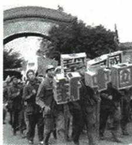
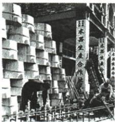
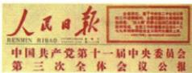
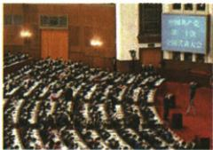

## 讲解

### 判据

材料每空有图注、时段和功能词，先确定缺事件还是制度，再用该阶段任务核；政治前提、所有制变化、改革开端和体制目标不能互相替代。

### 流程

1. 奠基图开国大典、句根本政治前提相接中华人民共和国成立，说明独立人民政权提供建设条件。

2. 合作社图和三改完成相接所有制变化，②制度基本建立；不将一五生产能力变化当同一对象。

3. 公报与开启新时期指1978十一届三中全会；十四大主语建立目标指市场经济体制，③事件④目标分别答。

4. 第二问从原本国具体实际提关键，解释道路须合条件；再分国内成果和国外借鉴两层影响。

5. 原分期是该展览组织方式，不能据成熟标签说2012已全部现代化；目标与成果、范例与照搬分开，原四图只按标题图注核。

## 例题

**单元原第5题，原标“2024江苏镇江中考节选”，未另核真题身份。**历史学习小组策划“中国式现代化”主题展览。

**篇章一：中国式现代化探索历程。**

|历史阶段|图说历史|文解历史|
|---|---|---|
|奠基时期（1921—1949年）| 开国大典|①为中国式现代化建设奠定根本政治前提|
|探索时期（1949—1978年）| 木器生产合作社|第一个五年计划开始改变工业落后面貌；三大改造完成②|
|崛起时期（1978—2012年）| 会议公报|③开启改革开放与社会主义现代化建设新时期；十四大明确提出建立④|
|成熟时期（2012至今）| 中共二十大会场|中国完成脱贫攻坚、全面建成小康社会历史任务|

**篇章二：评说中国式现代化探索。**通过何种方式实现现代化，各国有不同道路，但无论选什么道路，前提必须同本国具体实际相结合，这是成功关键。中国式现代化道路有效破解现代化等同西方化的迷思，不仅推动现代化建设取得成就，也给更多发展中国家道路以借鉴参考，拓宽人类现代化途径。原署以上均摘编自李乐《中国式现代化道路的历史演进、核心要义及价值意蕴》，本文仅使用提供摘录，未另核全文版本。

（1）据篇章一并结合所学，按序号填表。（2）据篇章二概括成功推进关键因素及深远影响。

**完整原答。**（1）①新中国成立；②建立起社会主义经济制度；③中共十一届三中全会；④社会主义市场经济体制。（2）关键：结合国情（本国具体实际）。影响：推动中国现代化建设取得巨大成就；给发展中国家借鉴参考，拓宽现代化途径。

**第（1）问四空逐一推理。**①开国大典图注和根本政治前提指中华人民共和国成立，国家独立人民政权为自主建设提供条件，不写1956制度才建国。②合作社图和三大改造完成说明生产资料所有制变化，基本建立社会主义经济制度，不只答生产技术提高；一五工业能力与三改所有制须分别看。③公报标题与1978新时期指十一届三中全会，思想和任务转折开启改革开放，不写十四大才首次开始。④句子主语十四大且问明确提出“建立”什么，答市场经济体制，不把1992目标写当日全国完成。

**第（2）问逐层推理。**关键来自“本国具体实际相结合”，说一般现代化目标须按现实条件选择道路，不能照搬某国现成过程。影响分国内与国外：国内建设成果；对更多发展中国家提供选择经验，拓宽人类途径。借鉴不是要求各国复制中国每一项措施，也不是所有国家已照此完成。原阶段名称是本题展览分期，非唯一通行学术标准；成熟时期不等2012即全部现代化完成，表列二十大会场也不等所有成果都发生于大会当天。

## 易错

每空看句法与作用对象，不只背年份。改革开端不等社会主义制度首次建立，现代化不机械等同西方化，国外参考不等复制全部措施。

### 来源定位

- XU4-Q05：full.md（历史扫描分册201-250），L1255–L1279，现代化原第5题四图表和材料两问原全部答案；5cc603b4-3c7a-4bc5-b935-8c05069de690_origin.pdf，实际PDF第22、23页。
