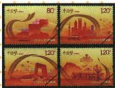

## 讲解

### 是什么

中国梦在本课指实现中华民族伟大复兴，本质为国家富强、民族振兴、人民幸福；两个一百年为建党100年全面建成小康、建国100年建成社会主义现代化国家的阶段目标。梦想表达共同追求，阶段目标把长期追求具体化，均不同于提出当年成果已完成。

### 怎么来的

近代侵略与国家发展困境使独立和振兴成为历史任务，新中国建立提供政治发展前提，后续建设和改革继续积累条件。国家能力提供生活发展和维护权益条件，民族振兴关系整体发展地位，人民幸福限定成果落到人，三层相连，才不把梦想缩成只增产值或少数人获益。两个百年把长期复兴接到阶段建设任务，使目标有时间方向，但目标仍须持续行动。个人成长依托社会条件，个人学习劳动也能贡献建设，因而个人与国家相互联系；共同愿景不表示所有人职业、收入和生活选择必须完全相同。

### 什么时候能用

问本质三项完整，问重大意义由三层到共同目标团结行动、个人与国家联系。原十二届人大为2013阐述节点，2012参观讲话已谈中国梦；首次提出与进一步阐述分开。原历史旁注是阶段重心概括，不将1949前复兴愿望抹掉。

## 例题

**原知识表与常考图片。**十八大2012北京举行，提出沿中国特色社会主义道路前进、为全面建成小康而奋斗；原两个一百年目标为建党100年全面建成小康，新中国成立100年建成社会主义现代化国家。原中国梦“提出”栏写习近平主席在十二届全国人大一次会议上提出，本质为国家富强、民族振兴、人民幸福；从十八大开始进入新时代，总任务为社会主义现代化与民族复兴。

**提出与阐述的核注。**2012年11月29日在国家博物馆参观复兴之路时已阐述实现民族复兴的中国梦；2013年3月17日十二届全国人大一次会议讲话进一步阐述国家、民族和人民三层目标。原表全国人大节点保留，不能用它断言2013才首次提出，亦不能把两场讲话说成同日同会。依据：[2012讲话同期原报道](https://www.xinhuanet.com/politics/2012-11/30/c_124026690.htm)、[2013讲话官方刊载](https://www.moe.gov.cn/jyb_xwfb/xw_zt/moe_357/s7093/s7193/s7236/201303/t20130322_149159.html)。

**原邮票说明与读图。**腾飞金丝带贯穿画面，从政治文明、经济发展、文化繁荣、民族团结四方面展現改革开放成果繁荣和幸福和谐愿景。邮票是主题表达与象征，四领域画面不能替所有成果的统计证据，也不等整个历史只存在四类建设任务。原鸦片战争后民族独立、1949后民族复兴的旁注概括阶段重心，不推1949以前完全无复兴理想或独立以后所有任务已结束。

**原重难设问：结合中国梦本质，谈提出这一梦想的重大意义。完整原答两点。**

1. 把国家追求、民族向往、人民期盼融为一体，体现整体利益和共同愿景，成为激励中华儿女团结奋进、开辟未来的精神旗帜。
2. 中国梦也是每个中国人的梦，个人发展同祖国命运相连，应把个人梦想同祖国梦想联系；原说“国家富强才能使个人幸福”。青年肩负历史使命、坚定信心，立大志、明大德、成大才、担大任，成为堪当民族复兴重任的时代新人，让青春在投身党和人民奋斗中绽放。

**完整本质到意义推理。**国家富强强调国家发展能力，民族振兴强调民族整体地位与发展，人民幸福把目标落实为人的生活；三者相连，才有共同目标与团结奋斗的取向。个人学习工作需要社会和平、教育机会和发展条件，个人劳动贡献也推动国家发展，因此联系是相互支持，原富强说总体发展条件，不能当每个人所有幸福愿望必然自动满足。青年四项要求接志向、品德、能力和承担责任，是行动取向而非只许所有人同一职业。愿景和精神作用能激励行动，不等目标提出后实际成果已全部完成。

## 易错

两个一百年是建党与建国两种基点，非任意两次百年或两个当年完成动作。富强提供总体条件，不推每人自动同等幸福。

### 来源定位

- X18-S01：full.md（历史扫描分册201-250），L1807–L1815，十八大两个一百年中国梦表与历史梦想旁注；5cc603b4-3c7a-4bc5-b935-8c05069de690_origin.pdf，实际PDF第32页。
- X18-S05：full.md（历史扫描分册201-250），L1783–L1787，中国梦民族振兴邮票原图与四领域说明；5cc603b4-3c7a-4bc5-b935-8c05069de690_origin.pdf，实际PDF第32页。
- X18-Q01：full.md（历史扫描分册201-250），L1840–L1845，中国梦本质与重大意义重难原问两点原答；5cc603b4-3c7a-4bc5-b935-8c05069de690_origin.pdf，实际PDF第33页。
