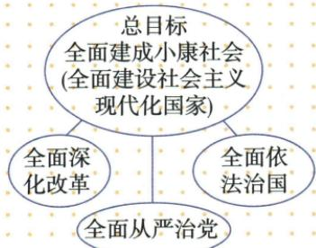

## 讲解

### 判据

图给上层总目标及改革法治党建时，先认目标和支撑功能，再看第一项随阶段更新。图形上下位置不能代年代，自动箭头不能改变原说明的根本保证关系。

### 流程

1. 原小康阶段首项全面建成，任务完成后首项变全面建设现代化国家，先定版本。

2. 改革回应体制障碍，法治接规范执行，党建接领导组织和行动保证，分别说为何支持目标。

3. 三措施同时与目标联系并相互支持，不仅排成四词即可。

4. 原图上目标、侧改革法治、底党建按图注支持关系读，不改成两侧导致党建才发生。

5. 五位一体是领域而非本目标举措名单，更新也不是当日新目标已完成。

## 例题

**原知识材料与原结构图，未配独立例题。**原四项为全面建成小康、全面深化改革、全面依法治国、全面从严治党。原关系：全面建成小康居引领地位，另外三大战略举措为其重要保障。小康任务完成后，第一项演化为全面建设社会主义现代化国家，其他三项保留。

**完整图文关系。**上层为总目标，两侧改革、依法治国及底部从严治党构成支持关系；原底部说各项工作和目标顺利推进的根本保证，不能按自动箭头写成改革与法治单向导致才出现从严治党。改革回应体制障碍，法治以规范和实施保障秩序，党的建设关系领导组织与执行，它们共同服务目标并相互联系，不是完成一项便无需其他。

**内涵变化与范围。**第一项随阶段任务变化，不等完成小康后不再改善民生、不再改革法治或党的建设，也不等新的现代化目标当天已经实现。总体布局列五类建设领域，战略布局给阶段目标和重要举措，两种划分角度不同，不能逐项一一替换。原“根本保证”关系按图文功能解释，不能靠图中上下位置计算事件发生先后。

## 易错

第一项变不等其余三项消失；图与文字要一起解释，图上高低不是历史先后。

### 来源定位

- X18-S03：full.md（历史扫描分册201-250），L1789–L1805，四个全面原图目标与保障关系；5cc603b4-3c7a-4bc5-b935-8c05069de690_origin.pdf，实际PDF第32页。
- X18-S04：full.md（历史扫描分册201-250），L1825–L1836，四个全面内容关系及内涵变化跨页；5cc603b4-3c7a-4bc5-b935-8c05069de690_origin.pdf，实际PDF第32–33页。
