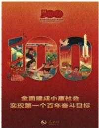

## 讲解

### 判据

原图有100和第一个百年目标，先定建党基点及2021成果，再解释生活国家世界和下一目标的意义，不能由数字100推建国已经百年。

### 流程

1. 原图注明确建党100周年，1921到2021对应，1949建国是另一基点。

2. 先区分第一个目标已实现与第二个现代化强国仍迈进，宣传词不使未来自动完成。

3. 人民生活改善接受益，持续建设和稳定接国家发展条件，减贫人数变化接世界贡献，保原三点完整。

4. 较好物质生活基础支持下一建设阶段，成就是起点提升而非不再努力。

5. 图表达主题不能提供收入和完成率具体数据，借鉴中国经验也非各国一律照搬。

## 例题

**原宣传图与解读，非独立问。**

原图“100”指建党100周年，全面建成小康2021实现，是中国梦第一个阶段目标如期实现；不是1949建国已100年。原相关链接：人民辛勤劳动实现小康，提高改善丰富物质生活，为现代化和第二个百年目标打坚实基础。

**原重大意义完整三点。**创造经济快速发展和社会长期稳定两大奇迹，彰显制度生命力优越性，复兴进入不可逆转历史进程；发展与人民生活跃新台阶，履行人民承诺、千年夙愿实现，缩小世界贫困人口版图，为发展中国家减贫现代化提供智慧方案；进入全面建设现代化国家、向第二个百年目标进军阶段，迎来站起来富起来强起来伟大飞跃。

**完整依据与边界。**生活与贫困改善体现受益，持续奋斗与政策实施体现组织建设，较好的物质发展条件支持下一阶段，因此成果同时联系人民、国家与未来基础。我国贫困人口减少也影响世界贫困总量，实践可供其他国家借鉴，但不等所有国家只能照搬。宣传图是纪念和成果主题表达，不能单靠金色100算出收入总额或各项达成率；综合成果仍须资料事实支持。原不可逆转与伟大飞跃是历史方向评价，不改成今后无风险、每人收入相同或现代化強国已完成。

**原知识材料，未配独立例题。**庆祝建党100周年大会宣告经过全党全国各族人民持续奋斗，实现第一个百年奋斗目标，全面建成小康，向全面建成社会主义现代化强国第二个百年目标迈进。原单元时空图明确2021年7月大会；2021年11月十九届六中全会通过党百年奋斗重大成就和历史经验决议。

**原决议材料完整内容。**全面总结1921—1949新民主主义革命、1949—1978社会主义革命建设、1978—2012改革开放与现代化建设新时期、2012至今新时代成就经验，重点总结新时代历史性成就变革与新鲜经验。决议指出确立习近平同志党中央核心、全党核心地位，确立习近平新时代中国特色社会主义思想指导地位，反映共同心愿，对事业发展和民族复兴具有决定性意义。

**完整区别。**7月宣告阶段任务实现，11月总结成就与经验，不是两次同一会议。原历史时期边界为阶段划分，不能因1949或1978两段都出现就把某日同时机械计为两种不相容结果。总结经验是从已有实践提取认识以指导后续，既保成就也看如何形成；第二个目标在迈进，不因第一个已实现就变已全部实现。两个确立分别是领导核心地位与思想指导地位，不能数成两个百年目标，也不把2021总结说成2017十九大写入党章此前未发生。

## 易错

原宣传解读不是另编独立图题；不可逆转为方向评价，不推以后无风险或每人同样收入。

### 来源定位

- X22-S04：full.md（历史扫描分册201-250），L2283–L2299，百年小康宣传图图注和生活基础相关链接；5cc603b4-3c7a-4bc5-b935-8c05069de690_origin.pdf，实际PDF第42页。
- X22-S03：full.md（历史扫描分册201-250），L2333–L2338，小康重大意义三点跨页；5cc603b4-3c7a-4bc5-b935-8c05069de690_origin.pdf，实际PDF第42–43页。
- X22-S01：full.md（历史扫描分册201-250），L2305–L2321，建党百年宣告六中决议时期与两个确立；5cc603b4-3c7a-4bc5-b935-8c05069de690_origin.pdf，实际PDF第42页。
