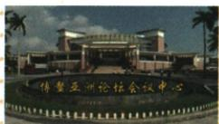

## 错法

非官方便说官员不能参会，非营利便说论坛不得谈企业经济。错误将组织性质转成全部参加者身份和全部议题禁令，超出原答对象。

## 正解

非政府说组织形式，参与者可来自政府企业学界；非营利说宗旨而非议题不得含经济。通过共同问题对话提供交流渠道，建议和合作条件不等强制法令，国际性会议组织首个总部限定保全。

## 例题

**原图题。**原图注“博鳌亚洲论坛会址”。原问：博鳌亚洲论坛的地位是什么？完整原答：它是非官方、非营利、定期、定址的国际组织，是第一个总部设在中国的国际性会议组织。

**完整判断解释。**先依据图注识别对象，会址照片只能说明所标地点，不能自行读成政府机关、军事同盟总部。非官方说非政府组织性质，不等政府人员不能参加；非营利说组织宗旨不是把盈利作为目的，不等讨论内容不能涉及经济企业。定期定址说有定期会议及固定总部会址安排，不推每种活动只能在一地举行、每年从不调整。原“第一个”限定总部设在中国的国际性会议组织，不能扩大成中国第一家任何类别的国际组织。会议提供跨方对话平台，作用由交流和合作机制体现，不因会址在中国便独属于某一国政府。

组织性质核查依据：[外交部2013年博鳌专题中的介绍](https://www.fmprc.gov.cn/ziliao_674904/zt_674979/ywzt_675099/2013nzt_675233/boao_675283/)。原答没有四个选项，不编新选择题。

### 来源定位

- X14-Q01：full.md（历史扫描分册201-250），L1120–L1127，博鳌会址原图地位问与完整原答；5cc603b4-3c7a-4bc5-b935-8c05069de690_origin.pdf，实际PDF第20页。
