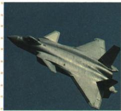

## 错法

看到自主研制歼20就推2017已建成世界一流军队，又把强军三项只剩能打胜仗，并将五战区叫五军种。把装备、目标和组织分类混为同一指标，省掉原时间与条件。

## 正解

原图题只据歼20说明现代化重大成就，2013目标完整三项涉及方向能力作风，2017报告的世纪中叶目标仍须组织人员装备等协同建设。战区按区域、军兵种按类型，名单含2024调整不能倒推全部2013存在。单项进步没有全军及各国比较数据，不能推出全面排名或目标完成。

## 例题

**原知识材料。**全面推进政治建军、改革强军、科技强军、人才强军、依法治军。2013年强军目标为听党指挥、能打胜仗、作风优良；2014年福建古田全军政治工作会议强调政治保证；2017年十九大提出到21世纪中叶建成世界一流军队，是目标而非2017已完成。

五大战区为东部、南部、西部、北部、中部；原军种列陆军、海军、空军、火箭军，兵种列军事航天、网络空间、信息支援、联勤保障。战区按区域任务组织，军兵种按力量类型分，分类角度不同，不能将五战区对应为五个军种。名单含2024年调整后布局，依据[国防部2024年4月19日专题发布](https://www.mod.gov.cn/gfbw/qwfb/16302072.html)，不能整段倒推2013已有全部这些名称。

原装备成果列国产航母、新型潜艇、歼20、运20、新型战略导弹等，提升现代化水平和实战能力。装备、组织、人才、政治与依法治军提供不同条件，先进装备要由人员按任务协同使用，不能一架飞机推出全部建设已完成。

**原图题：上图是我国自主研制的歼20战斗机，这反映了什么？原答：我国国防和军队现代化建设取得重大成就。完整解析。**型号和自主研制来自原题图注，不能仅凭照片猜研发单位或技术参数；自主研制及列装成果说明装备建设进步，再联系原答现代化成就。图题没有比较各国全部能力的数据，不能改成已全面世界第一，也不能仅凭一张照片判断所有军队任务都能完成。

### 来源定位

- X20-Q02：full.md（历史扫描分册201-250），L1978–L1990，歼20原图问题与原答；5cc603b4-3c7a-4bc5-b935-8c05069de690_origin.pdf，实际PDF第36页。
- X20-S02：full.md（历史扫描分册201-250），L2003–L2014，强军目标古田会议战略任务组织装备；5cc603b4-3c7a-4bc5-b935-8c05069de690_origin.pdf，实际PDF第36页。
