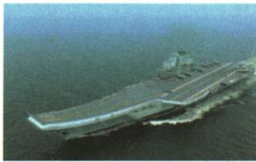

## 讲解

### 是什么

2004完善军事战略方针，准备基点为打赢信息化条件下局部战争。落实同时涉及训练、科技装备、后勤和编制，是人员、技术、组织和保障的协同建设；2003至2005裁减20万为适应任务的调整，不能只凭总人数判能力。

### 怎么来的

信息传递与指挥协同要求人员懂技术、单位能配合，训练改革使新装备和新组织能实际执行任务，装备创新提供技术能力，现代后勤保证任务持续，编制调整减少不适应环节并支持联合多能。若只减员却不改训练装备保障，不能自动推出能力提升；反过来人数增加也不足以证明协同更强。原抢险救灾和建设任务反映在不同环境组织行动的能力，军事交往则提供沟通交流并展示形象，不能把150多交往国家叫结盟国家。与90年代方针有延续，2004为充实完善节点，不说此年才有国防或此前完全没信息技术。

### 什么时候能用

按材料任务与动作回答：问战略基点说信息化条件局部战争，问措施列训练装备后勤组织，问精简意义接精干联合多能高效。20万保2003至2005这轮范围，与1985百万裁军分阶段，不能把各轮年份人数互换。

## 例题

**原知识材料，未配独立例题。**信息化在战争作用日益突出，2004中央军委充实完善军事战略方针，军事斗争准备基点放在打赢信息化条件下局部战争。落实包括训练改革创新、深化准备，加强国防科技和装备自主创新、构建现代装备体系、现代后勤、调整体制编制；完成抢险救灾、支援国家建设等任务，同150多个国家军事交往。

**原旁注与完整解释。**2003至2005裁减员额20万，重点精简陆军，推进新型作战能力，力量编成向精干、联合、多能、高效发展。信息化需要发现传递使用信息与指挥协同，训练让人员能配合新任务，科技装备提供能力，后勤保障持续行动，编制调整使组织适应任务；少人不是独立的强弱判据。150多个为原时期交往范围，不是军事联盟数，也不代当前数量。原条末尾重复的时代潮流旁注按原页单独理解，不能当军事交往证明所有国家结盟。

**原常考图片及相关链接，未配独立小问。**

图注“辽宁舰”；原串联南宋初期南海一号沉船、郑和下西洋宝船、北洋舰队定远号铁甲舰、我国第一艘航空母舰辽宁舰，说明海洋成为活动舞台，这些船见证不同时期历史。

**完整分类理解。**南海一号沉船是海贸考古材料，郑和宝船接明代远洋交往，定远号接近代海防与甲午背景，辽宁舰接现代国防装备。时代、用途和证据载体均不同，不能因都是船就说全属同一海军、同一次出海。沉船遗物支持特定海贸活动，航行记载支持交往，军舰支持海防与军事任务；同为“活动舞台”不等所有航行目的和历史作用相同。原辽宁第一限定我国航空母舰，不是第一艘任何军舰，也不是世界第一艘航母；照片不能给未标的舰载机数量、排水量、实时位置或日期。

### 第五单元原第3题及完整解析

**单元原第3题。**历史兴趣小组收集2003至2005人民解放军裁减员额20万资料，其中解读正确的一项是（ ）。

陆军部队共减少编制员额13万余人；军区机关和直属单位、省军区系统裁减6万余人。通过调整，海军、空军和第二炮兵占全军总员额的比例提高了3.8%，陆军部队的比例下降了1.5%。

A.重点压缩了陆军规模；B.优化军兵种内部编成；C.精减了机关直属单位；D.深化了联勤保障体制。

**原答案A。完整原解。**材料显示陆军减少编制员额，陆军占全军总员额比例下降，突出说明重点压缩陆军规模。

**原题歧义与逐项判断。**A有两条直接依据：陆军减员13万余人及其占比下降，原旁注也说明陆军为精简重点。C同样有直接依据：“军区机关和直属单位、省军区系统，裁减6万余人”，因此不能讲C没有发生或不符合材料。原题只问“解读正确的一项”，未限定“最突出重点”，按字面不能由材料唯一排除C；保原答A，注明单选条件不足，原解释主要是在选陆军重点，不能擅改题干为已写“重点”。

B需看军兵种内部单位编组、层级或结构优化，原给军种间比例变化，能说明结构调整，但不足单独详证各军兵种内部编成怎样优化。D需联合后勤保障组织改革证据，减员与军种占比未直接给这类机制。数量“余”保近似范围，13万余和6万余不当精确总数直接加成全部20万；比例变化也不换成具体增加的人数。原3.8%、1.5%未给前后占比和计算口径，保原措辞，不据此自行复原全部编制或将占比升等同人数必增。

## 易错

裁减不是取消国防，信息化不是只添电脑；军队交往非全为同盟，辽宁第一是我国航母类别。

### 来源定位

- X17-S01：full.md（历史扫描分册201-250），L1544–L1551，2004军事战略方针训练科技后勤编制及重大任务；5cc603b4-3c7a-4bc5-b935-8c05069de690_origin.pdf，实际PDF第28页。
- X17-S02：full.md（历史扫描分册201-250），L1540–L1542，2003至2005裁员20万重点与作战力量方向旁注；5cc603b4-3c7a-4bc5-b935-8c05069de690_origin.pdf，实际PDF第28页。
- X17-S05：full.md（历史扫描分册201-250），L1526–L1538，辽宁舰原图及四船跨时期比较链接；5cc603b4-3c7a-4bc5-b935-8c05069de690_origin.pdf，实际PDF第28页。
- XU5-Q03：full.md（历史扫描分册201-250），L1603–L1631，裁减数值原3题四项原A详解；5cc603b4-3c7a-4bc5-b935-8c05069de690_origin.pdf，实际PDF第29页。
