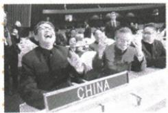
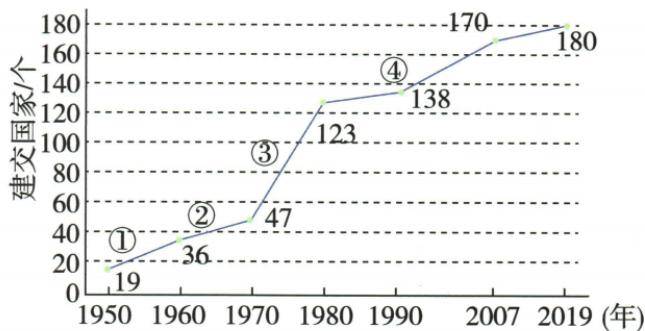

## 讲解

### 是什么

1971年10月第26届联大恢复中华人民共和国在联合国的合法权利，解决代表中国的席位问题。中国原是联合国创始会员国，中华人民共和国政府成立于1949，国家会员身份与政府代表权不同，所以本事件须称恢复合法席位。

### 怎么来的

新中国政府作为代表中国的合法政府，却长期被排斥不能行使相应权利；中国争取与更多国家支持形成决议通过的条件。恢复后能够在联合国行使权利、参与工作，才进一步为和平发展和国际交往创造条件。这里是代表权变化，不是中国先前完全不存在于联合国，也不表示1971所有双边建交和台湾问题已经完成。

### 什么时候能用

遇1971十月、26届联大、乔的笑或恢复合法权利，先按国家身份与代表问题定位；新加入、1945中华人民共和国已成立都不成立。图片中的笑和席牌结合原题背景可辅助认事件，但不能单凭表情推出完整决议内容。

## 例题

### 原例题 X7-Q03：“乔的笑”

**原问：**乔冠华仰天大笑的原因是什么？

**原答：**中国恢复在联合国的合法席位。

**完整解析。** 原图注给人物与“乔的笑”主题，席牌和会场提供参加国际会议的图像信息；结合本课联合国史实，答恢复中国合法席位这一外交胜利。单凭笑的表情和CHINA文字不能推出决议日期与全部条文，需题目背景与所学共同支持；不能把原因换成1972尼克松访华或中日恢复邦交。若补意义，解释取得依法参与国际舞台的条件，不能用新加入联合国表述。原未要求场次精确日，不从画面编拍摄日。

### 原资料：恢复联合国合法席位

原背景：中国是联合国创始会员国和安理会五常之一；中华人民共和国成立后作为代表中国的唯一合法政府应享席位，但长期被排斥，由台湾当局“代表”占据；中国政府长期争取并得到越来越多国家支持。

原过程：1971年10月，第26届联合国大会通过决议，恢复中华人民共和国在联合国的一切合法权利，立即驱逐台湾当局“代表”出联合国及所属机构。原意义：外交重大胜利，为坚持一个中国原则格局以及促进世界和平发展创造条件。原易错：恢复，不是加入。

**完整解释。** 中国作为创始会员与中华人民共和国政府后来不能行使中国席位，是国家会员身份与代表权两层问题。1971恢复合法权利是纠正代表中国的席位问题，不是这时新申请才成为会员，更不能说中华人民共和国政府1945已经成立。长期外交争取和支持增多形成通过决议的条件，恢复后能够参与联合国工作，才接到国际舞台作用。决议恢复席位不等所有双边关系同时建交，亦不等原书所列台湾问题在1971已经全部解决。[外交部相关历史回顾](https://www.mfa.gov.cn/web/ziliao_674904/wjs_674919/2159_674923/200012/t20001220_7950084.shtml)核该过程。

### 八下第二单元原题Q03

**单元原第3题，原标“2024山东泰安中考改编”，未另核真题身份。**下图为我国与各国建立外交关系情况示意图。其中③（1970—1980年）处取得的外交成就是（ ）。

A.和平共处五项原则的提出；B.提出“求同存异”方针；C.中国恢复在联合国的合法席位；D.中苏建交。

**原答案C。完整原解。**1953年底周恩来首次提出和平共处五项原则；1955年万隆会议周恩来提出“求同存异”；1949年10月3日中国正式与苏联建交；1971年中国恢复在联合国的合法席位。

**完整图题推理。**先读横轴年份，题干已把③限定1970—1980；再看纵轴为建交国家数量，不能把③当年份或国家数。原图各标注点为1950年19、1960年36、1970年47、1980年123、1990年138、2007年170、2019年180，与OCR表一致。这些是各标注时点数量，不是当年新增数，也不能把图到2019的数量当今天实时值。本题不要求计算，选项先逐一按事件时点筛：1971落在区间，1953、1955和1949均在区间外，选C。

图中数量增加与外交环境改善可相联系，但本图不能单独证明全部增加由联合国事件一个因素造成；联合国席位也不是与一个国家双边建交。C依据原事件时点选出，不能反将其他三项讲成从未发生。③不是中美1972已经正式建交的证据。

**逐项核验。**

- A（不选）：首次提出为1953年底，早于③1970—1980范围，事件真实但时点不合。

- B（不选）：1955万隆会议提出，属于此前时段，不因同为外交成果就挪到③。

- C（对）：1971恢复合法席位在1970—1980区间内，原问时间条件与事件相符。

- D（不选）：原解1949年10月3日中苏建交，不在③区间；双边建交与联合国代表权也不同。

### 九下中国与联合国三关系

# 相关链接 中国与联合国的关系

1. 中国是联合国创始会员国之一和5个安理会常任理事国之一。  
2.由于美国等国家的阻挠,直至1971年10月,在第26届联合国大会上,中华人民共和国才恢复了在联合国的合法席位。  
3.中国在联合国发挥了重要作用,积极参加联合国的维和行动。

**完整区别。**中国是创始会员国和五常之一，1971年10月第26届联大恢复的是中华人民共和国代表中国的合法席位，不是中国当年才成为联合国新会员。国家会员身份与代表权不同，维和参与是履行国际合作的一面，也不能据此说每项国际争端都已解决。

## 易错

恢复不同首次加入；联大通过决议不能错写安理会26届，五常数与大会届数不是同一统计对象。外交胜利为后续创造条件，不是所有国际问题已解决。

### 来源定位

- X7-Q03：full.md（历史扫描分册201-250），L242–L256，乔冠华笑原图问与原答；5cc603b4-3c7a-4bc5-b935-8c05069de690_origin.pdf，实际PDF第5页。
- X7-S03：full.md（历史扫描分册201-250），L206–L215，联合国背景过程意义跨页完整；5cc603b4-3c7a-4bc5-b935-8c05069de690_origin.pdf，实际PDF第4、5页。
- X7-S05：full.md（历史扫描分册201-250），L238–L240，联合国恢复非加入原易错；5cc603b4-3c7a-4bc5-b935-8c05069de690_origin.pdf，实际PDF第5页。
- XU2-Q03：full.md（历史扫描分册201-250），L282–L327，建交图原第3题全部四项及原C详解；5cc603b4-3c7a-4bc5-b935-8c05069de690_origin.pdf，实际PDF第6页。
- WW20-S02：full.md（历史扫描分册301-345），L2684–L2688，中国创始会员1971合法席位维和；bd22a802-356b-4b67-b51c-daf820cc3300_origin.pdf，实际PDF第40页。
