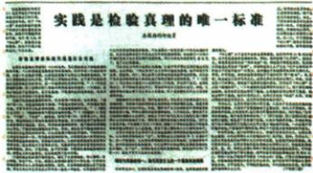

## 错法

看到伟大转折就不读时间，1935和1978都填同一会议；只记转折一词删掉军事危机和建设方向背景，导致意义评价答错对象。

## 正解

遵义对应1935长征途中纠正军事组织错误、挽救危急中的党红军革命；1978对应文革后纠错、重点转现代化、改革开放新时期。原分别限定党史生死攸关与新中国成立以来深远转折。先按时间与所解决问题定位，再用相应评价，不凭转折共词互换。

## 例题

### 原例题 X8-Q01：思想运动与政治转折的联系

**完整原问：**报纸上这一文章的发表开始了哪一场深刻的思想解放运动？它与中共十一届三中全会所反映的历史事件有何联系？

**完整原答：**真理标准问题大讨论。它成为正本清源、拨乱反正和改革开放的思想先导。

**完整解析。**先结合图题《实践是检验真理的唯一标准》与1978年5月，定位讨论的主题，不能只答后来全会。第一问问运动名称，答真理标准问题大讨论；第二问问与全会的联系，需说明为何提供思想准备：如果把过去领导人的每个决策都当不可更改，已有错误就难纠正，新措施也可能被旧话限制；用实践检验认识，才允许依据实际效果总结正误、调整做法。大讨论有助冲破思想束缚，随后全会作重点转移和改革开放决策，故是思想先导。讨论不是全会本身，也不直接等于所有改革措施已经实施。

**图像核验边界。**原图可辨文章标题，原书图注指《光明日报》。小图正文不能全部清晰辨认，本题依据文章标题与原书图注判断，不逐字引用未能辨清的内容。

### 原例题 X8-Q02：为何1978年全会是伟大转折

**完整原问：**为什么说中共十一届三中全会实现了新中国成立以来党的历史上具有深远意义的伟大转折？

**完整原答三层：**①指导方针：冲破长期“左”错误束缚，否定“两个凡是”，高度评价真理标准讨论。②工作重点：结束“以阶级斗争为纲”，决定转社会主义现代化建设、实行改革开放。③发展模式：以改革开放取代关起门来搞建设。

**逐层完整推理。**“转折”要说明此前与此后判断、任务和做法怎样改变，不能只写1978北京或一句意义。指导方针由照搬旧决策转实事求是，使纠错和尝试有认识依据；工作重点由不适用的阶级斗争为纲转现代化，让力量围绕发展生产、改善生活组织；发展方式通过体制改革增加活力、对外开放吸收资金技术和加强交往，为实现任务改变条件。由思想准备到实际决策，再到发展路径，三层共同说明深远改变。

**原概括边界。**“关起门来搞建设”保原答，指以改革开放改变原发展方式的概括，不等1949—1978完全没有外交、贸易或国外技术合作，前课苏联援建和外交突破即说明不能这样绝对化。结束“以阶级斗争为纲”也不等更换社会主义制度或任何现实矛盾从此全消失。

### 来源定位

- X8-S01：full.md（历史扫描分册201-250），L452–L454，遵义与1978转折原易错；5cc603b4-3c7a-4bc5-b935-8c05069de690_origin.pdf，实际PDF第8页。
- X8-Q01：full.md（历史扫描分册201-250），L431–L450，报纸图思想运动及与全会联系原问原答；5cc603b4-3c7a-4bc5-b935-8c05069de690_origin.pdf，实际PDF第8页。
- X8-Q02：full.md（历史扫描分册201-250），L484–L486，为何1978为伟大转折原问及三层原答；5cc603b4-3c7a-4bc5-b935-8c05069de690_origin.pdf，实际PDF第9页。
