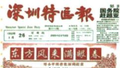

## 讲解

### 是什么

1992南方谈话针对国际形势变化及一些人的思想困惑，强调基本路线和发展，区分经济手段与制度本质，推动改革开放现代化进入新阶段。思想疑问的澄清与行动方向的支持相连，原又一个宣言书说明原进程继续发展。

### 怎么来的

苏联解体东欧剧变等变化使部分人对社会主义前途和改革方法产生疑虑，可能把使用市场当离开社会主义。谈话说明计划市场为经济手段，判断制度本质不能只凭手段名称，同时强调解放发展生产力、共同富裕等目标与基本路线。这样既澄清能用何方法的疑问，又保持发展方向，鼓励抓机遇建设，为继续改革提供思想指引。不能只因为谈话先发生就自动说它是后来全部成果唯一原因。

### 什么时候能用

见1992深圳报题名和原背景，答南方谈话；问影响解释理论解疑、思想解放、推动新阶段。1978开端与1992推进不同，谈话也不等当天全部市场经济体制完成。报图仅有标题和原图注，不恢复未给全文或全部行程。

## 例题

### 原例题 X11-Q01：南方谈话的影响

**原图注：**1992《深圳特区报》发表《东方风来满眼春——邓小平同志在深圳纪实》。**原问：**上图代表的事件有什么影响？

**完整原答：**南方谈话犹如强劲东风，从理论上深刻回答长期困扰和束缚思想的许多重大问题，驱散思想迷雾；是推动改革开放和现代化建设又一个解放思想、实事求是宣言书，引领改革开放迎来又一明媚春天。

**完整原背景与内容：**80年代末90年代初苏联解体东欧剧变、世界走向多极化和全球化加快，既有严峻挑战也有新机遇；一些人困惑、对社会主义前途缺信心。谈话强调坚持一个中心两个基本点、抓机遇发展、发展才是硬道理；计划市场不是社会主义资本主义本质区别，两者为经济手段；社会主义本质为解放发展生产力、消灭剥削、消除两极分化、最终共同富裕。原意义为推改革开放现代化新阶段、影响深远。

**完整推理。**先据1992深圳报图注定位南方谈话，不能只凭报纸地点答1980特区建立。原困惑涉及能否继续改革、使用市场是否改变社会主义性质；谈话把经济手段同制度本质区分，说明可以以实际发展效果判断改革方法，使一些争论不再把手段名称等同制度判断。同时坚持基本路线和发展方向，鼓励抓住机遇继续建设，思想认识的澄清因而为进一步实践提供指引。“又一个”联系1978后思想解放和建设进程，不说改革开放1992才第一次出现；思想作用也不等当天全部市场体制已建立。

图名和原背景可定事件，原小图未给全文、谈话所有行程，不从小字编逐篇报文或旅行名单。

## 易错

计划市场手段判断与制度本质不是同一层；又一个不等第一回，春风春天原比喻指改革推进，不用于编新自然景象题。

### 来源定位

- X11-Q01：full.md（历史扫描分册201-250），L774–L782，1992报纸图南方谈话影响原问原答完整跨页；5cc603b4-3c7a-4bc5-b935-8c05069de690_origin.pdf，实际PDF第13、14页。
- X11-S05：full.md（历史扫描分册201-250），L758–L764，南方谈话背景两点；5cc603b4-3c7a-4bc5-b935-8c05069de690_origin.pdf，实际PDF第13页。
- X11-S06：full.md（历史扫描分册201-250），L784–L789，南方谈话内容意义完整；5cc603b4-3c7a-4bc5-b935-8c05069de690_origin.pdf，实际PDF第14页。
