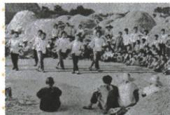

## 讲解

### 是什么

家庭联产承包责任制在土地集体所有基础上，以家庭承包经营、劳动成果与收益相联系，扩大农户生产自主权。原以包产到户、包干到户为主要形式，1978小岗起步、1983全国普遍实行；家庭使用经营与土地所有权不同。

### 怎么来的

农村温饱和生产积极性问题需要调整经营方式。让家庭自主安排生产，使履行约定任务后所得更联系自身劳动和经营效果，能增强投入生产、改善经营的动力。原小岗1979丰收是改革作用例证，农业和收入改善又为乡镇企业和多样经济活动创造条件。集体所有并不必然要求所有生产都以同一集体方式组织，因此改家庭经营不等土地私有化；积极性提升仍需土地、技术和劳动等实际条件，不是换名即自动丰收。

### 什么时候能用

见包产包干家庭经营与自主权，先辨经营方式改变，再保集体土地归属；与1950土改分地或1956合作化不能只凭农民土地词语合一。开始、普遍实行、政社分开不同过程，原未给全部完成日不编。丰收图结合图注原答认事件，不能从表情读具体增幅。

## 例题

### 原例题 X9-Q01：凤阳花鼓图反映的信息

**原图注：**凤阳农民打花鼓庆丰收。**原问：**上图反映了什么历史信息？

**完整原答：**1978年安徽凤阳小岗村农民实行包干到户、自负盈亏；1979年秋粮食产量比上年大幅增加。说明家庭联产承包责任制激发劳动热情、带来农村生产力大解放，农业生产水平和农民收入有很大提高。

**完整解析。**先据图注和本课原背景定位凤阳、小岗和家庭承包，照片本身不能读出1978年政策全文或产量倍数。改革让农户有生产自主权，使履行约定任务后的经营收益更直接联系自家劳动效果，因而更愿投入、安排生产。原1979较上年增加提供成果例证，再把成果接激发劳动热情和农业发展。不能从丰收照片单独推出土地所有权变私有，也不编原未给的亩产、增幅或农户人数。

**原知识完整补接：**1978年全国还有2.5亿人口未解决温饱，农村突出；改革目的为调动积极性、发展农村经济。1978小岗包干到户自负盈亏，到1983包产到户、包干到户为主要形式在全国普遍实行。原影响三层：农业生产和收入提高；专业化商品化社会化发展、乡镇企业兴起，为致富现代化开新路；全国政社分开、建乡政府作为基层政权，20多年人民公社制度不复存在，为农村经济政治体制重大改革。开始、推广与政社分开不全改同一天，原未给政社分开单一完成日不编。

**原易错：**农民拥有土地使用权而非所有权。历史教学说明：集体所有下改变经营方式和收益联系，与1950土改地主私有转农民私有、1956农业合作化转集体公有不同。

### 八下第三单元原题Q02

**单元原第2题，原标“2024青海西宁中考”，未另核真题身份。**土地改革、农业合作化运动和家庭联产承包责任制，是新中国成立以来农村土地政策的三次调整。与“三次调整”的共同作用无关的是（ ）。

A.解放了农村生产力；B.调动了农民的积极性；C.农业生产得到发展；D.促进乡镇企业的崛起。

**原答案D。完整原解。**土地改革、农业合作化运动和家庭联产承包责任制都属于农业领域的改革，家庭联产承包责任制在一定意义上促进了乡镇企业的崛起，但土地改革、农业合作化运动与乡镇企业无关。

**完整推理与原概括边界。**关键条件是三次调整的“共同作用”，不能只问其中一次是否产生此作用。土地改革使农民取得土地，改变地主占有的关系；农业合作化组织共同经营、集体所有；家庭承包在集体所有前提下将经营与劳动收益更直接相联系。三者制度动作不同，但在本题概括层面都以调整不适应生产的关系，调动积极性、促进农业生产为作用，A、B、C可共同归纳。不能由共同作用反推三次都让土地归个人，也不能由总体作用推每次实施的所有速度与方式都没有问题。

乡镇企业崛起是改革开放后农村变化的一个结果，原解将家庭承包与它联系；这不构成前两次改革的共同直接成果，故D。原解“无关”的范围限定为本题不能列作三次改革共同直接作用，不宜扩大成前期土地关系、生产积累同后来农村工业绝无任何历史联系。题目只列三次，不自行把人民公社添进原条件。

**逐项核验。**

- A（不选）：调整生产关系以适应生产，在本题总体作用层面三次都可概括解放农村生产力。

- B（不选）：三次通过各自不同关系调整调动积极性，不等实施中全部具体措施都始终有同一效果。

- C（不选）：促进农业生产是三次的共同总体作用，不能据此混同土地所有权与经营方式。

- D（应选）：家庭承包与改革后乡镇企业发展可相联系，但不是三次调整共同直接作用；此为逆向题所求。

## 易错

使用权不是所有权，家庭经营不等退回地主土地制度；1978小岗试行不等当天全国同步，1983普遍实行也不改成1978改革首次出现。

### 来源定位

- X9-S01：full.md（历史扫描分册201-250），L502–L515，家庭承包背景内容推广及三层影响；5cc603b4-3c7a-4bc5-b935-8c05069de690_origin.pdf，实际PDF第9页。
- X9-S02：full.md（历史扫描分册201-250），L519–L521，土地使用非所有原易错；5cc603b4-3c7a-4bc5-b935-8c05069de690_origin.pdf，实际PDF第9页。
- X9-Q01：full.md（历史扫描分册201-250），L525–L539，凤阳花鼓原图问完整原答；5cc603b4-3c7a-4bc5-b935-8c05069de690_origin.pdf，实际PDF第9页。
- XU3-Q02：full.md（历史扫描分册201-250），L799–L823，三次农村调整原第2题四项及原D完整详解；5cc603b4-3c7a-4bc5-b935-8c05069de690_origin.pdf，实际PDF第14页。
