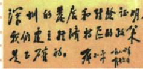

## 讲解

### 是什么

经济特区以特殊经济政策和管理体制扩大投资与对外交往，1980中央决定首批深圳、珠海、汕头、厦门四特区。特殊性在经济政策，本页深圳变化和1984题词是评价实践的例证；区域试验与全国全部改革结果不同。

### 怎么来的

先在部分地区给予经济政策和管理探索空间，能吸引投资、尝试经营和交流办法，积累实践经验。将发展效果同政策相比较，形成继续推进与借鉴的依据；深圳题词肯定的是原实践所显示的效果，支持扩大开放和其他地区发展。敢闯敢试、敢为人先鼓励探索，埋头苦干强调把措施真正落实，不是脱离现实条件追速度。外资与政策只是条件，仍需本地劳动组织和建设，不能从一个成功典型推任何地区照搬都必成功。

### 什么时候能用

问首批按1980四地，问特点答经济政策管理优惠，问精神答原三项，问题词答肯定与后续作用。原结果边陲小镇为深圳典型概括，不推四城城市基础完全一样。原1984短短5年未给基期，不能据其改1980兴办节点。

## 例题

### 原例题 X9-Q03：1984深圳题词的意义

**原图可辨文字：**“深圳的发展和经验证明，我们建立经济特区的政策是正确的。”署邓小平。

**完整原题：**上图是邓小平1984年视察深圳、珠海、厦门期间给深圳经济特区写的题词。短短5年的发展，深圳面貌发生巨大变化。题词显示出什么？

**完整原答：**显示国家领导人肯定建立经济特区，也体现对外开放政策正确；对进一步扩大开放、推动其他地区发展有很好作用，有助世界了解我国改革开放政策。

**完整解析。**题词直接以深圳发展和经验评价政策，把实践效果同政策判断相连，第一层是肯定特区与开放方向。明确支持增强继续试验和扩大开放的信心，其他地区可学习经验，为进一步发展提供参照；对外表达改革开放态度也增进了解。不能只写经济发展速度，漏肯定和后续作用，也不能由一地典型证明所有地方任何形式开放都自动成功。

**时间边界。**原保“短短5年”的发展概括和1984题词；1980为本课中央决定四特区节点，不能简单由两数相减就另编原书统计基期，也不能因这句强改正式兴办为1979。原未署五年所取起点，登记基期未明，不造精确年数结论。

### 原资料：对外开放的定义与特区全表

原对外开放定义：在维护国家主权前提下，本着平等互惠原则，打开国门、加强与世界各国经济交往；根本目的发展社会主义经济、提高综合国力。原形式包括吸引利用各种外资，兴办中外合资、中外合作企业和经济特区。

|特区原方面|原内容|
|---|---|
|兴办|1980中央决定深圳、珠海、汕头、厦门4个经济特区。|
|特点|特殊经济政策、经济管理体制；允许外国企业个人及华侨港澳同胞投资，进出口减免税等优惠。|
|结果|原表“昔日落后的边陲小镇建设成生机勃勃的现代化城市”。|
|特区精神|敢闯敢试、敢为人先、埋头苦干。|
|意义|推进改革开放和社会主义现代化建设的伟大创举，对外开放重大突破。|

**解析与范围。**“特”在经济政策和管理，吸引资金技术、扩大经营交往，目标仍为本国社会主义发展；维护主权和平等互惠是前提，不与旧列强控制通商同义。本页题词与变化典型为深圳；原结果用边陲小镇作概括，不推四城原先都同一城市规模、地理和产业。敢闯敢试说明探索，埋头苦干说明落实，不能把精神当脱离条件任意冒进。本段原表没有独立课内选择题，不另编题。

### 八下第10课全面展开的后续节点

### 原资料：十二大路线、目标与全面展开

原1982邓小平在十二大开幕词提出：现代化从中国实际出发，把马克思主义普遍真理同本国具体实际结合，走自己道路、建设有中国特色的社会主义；大会制定到20世纪末实现小康的奋斗目标。原意义是回答新时期走什么道路，指引改革开放现代化建设。

原后续四项：①1984城市经济体制改革全面铺开，中心环节增强企业活力。②1984开放14沿海港口城市。③1985长三角、珠三角和闽南厦漳泉三角划沿海经济开放区。④城乡出现经济大发展新局面。

**原易错与完整解析。**1978十一届三中全会后大幕拉开，十二大以后全面展开；前者决策开端、后者推进扩展，不互相否定。中国实际要求政策同生产和社会条件相适应，不能照搬别国模式；目标使方向落实为阶段建设任务。1984城市全面与1979企业试点不同动作，十四城市与1980四特区是不同开放层次，数量不能交换。1985各三角区域与1984港口城市又有区别，不能只见沿海便当一次设立。小康是比温饱改善的生活发展目标，本课为大会制定目标，不证明小康一词首次在1982使用，也不等于后来全面建成小康社会。原段为知识及辨析，无匹配独立课内题，不另编题。

### 八下第11课海南和浦东的后续开放节点

原1988适当扩大沿海经济开放区，同年海南设省并建海南经济特区；1990中央决定开发开放上海浦东。地区、时点、动作分别保。原海南发展机遇旁注指向1988海南经济特区建立。海南是后来新增特区，不塞进1980首批四地；浦东开发开放不改海南地名，也不把两地区不同建设全部当同一开放措施。

## 易错

深圳是四特区之一，不把其他三地漏掉或将1984题词当建立日；特区优惠不等所有经济活动免管理，也不从特殊经济政策推出主权改变。

### 来源定位

- X9-Q03：full.md（历史扫描分册201-250），L549–L557，1984深圳题词原图问原答；5cc603b4-3c7a-4bc5-b935-8c05069de690_origin.pdf，实际PDF第10页。
- X9-S05：full.md（历史扫描分册201-250），L567–L575，对外开放与四经济特区五层原表；5cc603b4-3c7a-4bc5-b935-8c05069de690_origin.pdf，实际PDF第10页。
- X10-S01：full.md（历史扫描分册201-250），L625–L642，十二大道路小康目标与1984至1985全面展开；5cc603b4-3c7a-4bc5-b935-8c05069de690_origin.pdf，实际PDF第11页。
- X10-S02：full.md（历史扫描分册201-250），L644–L646，1978大幕开启与十二大后全面展开原易错；5cc603b4-3c7a-4bc5-b935-8c05069de690_origin.pdf，实际PDF第11页。
- X11-S03：full.md（历史扫描分册201-250），L754–L756，企业两权分离私营经济地位及海南浦东原表；5cc603b4-3c7a-4bc5-b935-8c05069de690_origin.pdf，实际PDF第13页。
