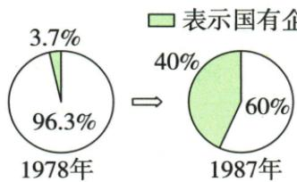

## 讲解

### 判据

问特点是从过程概括方法和变化，不只是列年份；原答五点分别由试点、扩展、激励所有制内容及成效提供依据。

### 流程

1. 看城市对象多关系复杂，说明为何需逐步试验，不直接一刀切所有企业。

2. 原1979八家扩权到80年代试点扩大，概括先试点后推广。

3. 分经营自主权、经济责任利益联系、所有制多样化三层，解释各改什么。

4. 市场意识与较长体制转型接原渐转市场，不能说试点当年全国体制完成。

5. 用原积极性和多种经济活动发展说明一定成效，公有主体和仍需发展范围都保留。

## 例题

### 原例题 X9-Q02：城市改革的特点

**原问：**据所学指出城市经济体制改革的特点。

**完整原答：**面临情况复杂；先试点后逐步推广；由计划经济体制向市场经济体制逐渐转变；企业经营自主权和所有制结构等逐步改革；取得一定成效。

**原过程作用全表：**

|过程|作用|
|---|---|
|1979首都钢铁公司等8家大型企业扩大企业自主权试点|增强自主经营意识和市场意识。|
|20世纪80年代初，试点扩大，转经济责任制，将企业利益、职工收入与经营成果联系|克服长期吃大锅饭弊病，调动企业职工积极性。|
|1979为缓解就业压力，开始公有制为主体、多种经济形式并存的所有制结构改革|集体、个体经济新发展，出现全民、集体、个体联营共同发展形式。|

**五点完整解析。**城市企业涉及生产、管理、利益分配、就业和所有制等关系，相互影响，故情况复杂，要先试验再总结推广。扩自主权让企业更能根据实际安排经营，经济责任制把成果与利益相联系，使改进经营和努力工作有收益激励，所有制多样化为就业和经济活动增加形式。原“渐转市场”是较长改革进程的特点，不能写1979八家试点当天已建立后来全国市场经济体制。一定成效也不是一切问题一次解决；公有为主体保留，不改成全部企业私有。

### 八下第10课全面展开的后续节点

### 原资料：十二大路线、目标与全面展开

原1982邓小平在十二大开幕词提出：现代化从中国实际出发，把马克思主义普遍真理同本国具体实际结合，走自己道路、建设有中国特色的社会主义；大会制定到20世纪末实现小康的奋斗目标。原意义是回答新时期走什么道路，指引改革开放现代化建设。

原后续四项：①1984城市经济体制改革全面铺开，中心环节增强企业活力。②1984开放14沿海港口城市。③1985长三角、珠三角和闽南厦漳泉三角划沿海经济开放区。④城乡出现经济大发展新局面。

**原易错与完整解析。**1978十一届三中全会后大幕拉开，十二大以后全面展开；前者决策开端、后者推进扩展，不互相否定。中国实际要求政策同生产和社会条件相适应，不能照搬别国模式；目标使方向落实为阶段建设任务。1984城市全面与1979企业试点不同动作，十四城市与1980四特区是不同开放层次，数量不能交换。1985各三角区域与1984港口城市又有区别，不能只见沿海便当一次设立。小康是比温饱改善的生活发展目标，本课为大会制定目标，不证明小康一词首次在1982使用，也不等于后来全面建成小康社会。原段为知识及辨析，无匹配独立课内题，不另编题。

### 八下第11课企业两权分离与私营补充地位

原十三大后全民所有制工业企业按所有权经营权分离，以承包经营合同明确国家企业责权利。国家所有与企业负责经营可分，合同使经营责任、决定空间和收益联系更明确，不等把国家财产出售给个人。原七届全国人大一次会议宪法修正确认私营经济作为公有制经济补充的法律地位，是1988当时口径；不能由非公有补充发展推公有经济全部取消。原表无独立课内题，不另编合同数值。

### 八下第三单元原题Q03

**单元原第3题，原标“2024江西中考”，未另核真题身份。**下图是1978年和1987年的国有企业留利（政府留给国有企业的利润）占比变化示意图。这一变化有利于（ ）。

A.增强国有企业的活力；B.完善平均分配方式；C.确立社会主义公有制；D.建立计划经济体制。

**原答案A。完整原解。**20世纪80年代初，改革开始转向经济责任制方面，将企业的经济利益、职工的经济收入与企业经营成果联系起来，调动了企业和职工的积极性，增强企业活力。

**完整读图推理。**先读图例，绿色扇区表示企业留利，而非国有企业在整个经济中的比重。1978年绿色为3.7%，另一部分96.3%；1987年绿色为40%，另一部分60%。两年比较的是企业可留的利润占比提高，不能把白色扇区或另一年的数值当企业留利。企业可支配收益更直接同经营成果联系，有利它改进经营、提高效率与承担责任；职工收入联系经营成果则有利劳动积极性，从这条机制推出A。

比例增加不直接证明利润总金额增加，因为图没有给两年利润总额；也不直接表示职工收入占比为40%。B所说平均分配忽略成果与责任差别，不能概括此改革的激励方向。C把已基本确立的公有制度说成此时才建立，留利分配改变不等所有制首次确立；D把改革旧管理办法误读为建立计划体制。材料表达“有利于”，不是据此一图断言所有企业都已改善。

**逐项核验。**

- A（对）：留利与成果联系增强企业改进经营的动力，配责任制使企业职工积极性与活力提高。

- B（错）：将利益收入同成果联系不等完善平均分配，平均分配不能表达此激励机制。

- C（错）：1956社会主义基本制度已建立，利润留存分配的变化不等1978—1987才确立公有制。

- D（错）：材料是国企经营管理激励改革，不能用留利占比变化证明此时新建计划经济体制。

### 八下第三单元原题Q05

**单元原第5题，原标“2024山西中考改编”，未另核真题身份。**1988年，七届全国人大一次会议通过宪法修正案，明确了私营经济是社会主义公有制经济的补充。同年，海南省设立，海南经济特区建立。这说明（ ）。

A.特区的建立为改革提供了示范；B.改革开放呈现“点线面体”的格局；C.对内改革和对外开放同步进行；D.社会主义市场经济体制在全国建立。

**原答案C。完整原解。**经济体制改革深化同年，我国适当扩大沿海经济开放区，建立海南经济特区，说明在对外开放的同时，国内的改革也在同步进行。

**完整双材料推理。**第一事调整国内经济活动的制度规则，确认私营经济当时法律地位，是对内改革深化；第二事在海南建立特区，是扩大对外开放。同年给出两方面并行的直接证据，C概括同时包含两事。同步在这里指所列时期二者共同推进，不能扩大成每项政策都同一天公布、各地区同速度完成。A可概括特区的一般作用，却没有解释前一项法律变化，且材料没给海南示范结果；B需要更多地域层次、阶段演进信息，本题只有海南一项，不能由此证明完整格局；D把改革过程写成全国体制已建立，1988这两事不足以支持如此完成结论。私营“补充”保1988当时措辞，不用后来版本倒改原材料。

**逐项核验。**

- A（不选）：只涉及特区一般示范作用，漏了同年国内法律改革，材料也未提供海南示范成效。

- B（不选）：一项海南开放节点不足以证明全部点线面体层次，不能以熟悉术语替材料范围。

- C（对）：同年国内经济法律改革与海南特区开放并列，直接说明对内改革与对外开放共同推进。

- D（错）：材料只是1988两项深化举措，不证明全国社会主义市场经济体制在此时已经建立。

## 易错

城市情况复杂是说明改革方法依据，不是说无法改革；三路径不能全压成私有化，也不将一定成效绝对为所有问题解决。

### 来源定位

- X9-Q02：full.md（历史扫描分册201-250），L541–L543，城市改革特点原问与五点原答；5cc603b4-3c7a-4bc5-b935-8c05069de690_origin.pdf，实际PDF第10页。
- X9-S04：full.md（历史扫描分册201-250），L559–L565，城市改革三路径时间作用原表；5cc603b4-3c7a-4bc5-b935-8c05069de690_origin.pdf，实际PDF第10页。
- X10-S01：full.md（历史扫描分册201-250），L625–L642，十二大道路小康目标与1984至1985全面展开；5cc603b4-3c7a-4bc5-b935-8c05069de690_origin.pdf，实际PDF第11页。
- X10-S02：full.md（历史扫描分册201-250），L644–L646，1978大幕开启与十二大后全面展开原易错；5cc603b4-3c7a-4bc5-b935-8c05069de690_origin.pdf，实际PDF第11页。
- X11-S03：full.md（历史扫描分册201-250），L754–L756，企业两权分离私营经济地位及海南浦东原表；5cc603b4-3c7a-4bc5-b935-8c05069de690_origin.pdf，实际PDF第13页。
- XU3-Q03：full.md（历史扫描分册201-250），L803–L846，企业留利原第3题原图四项及原A完整详解；5cc603b4-3c7a-4bc5-b935-8c05069de690_origin.pdf，实际PDF第14页。
- XU3-Q05：full.md（历史扫描分册201-250），L859–L874，1988改革开放原第5题四项及原C完整详解；5cc603b4-3c7a-4bc5-b935-8c05069de690_origin.pdf，实际PDF第15页。
