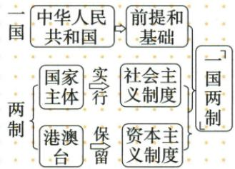
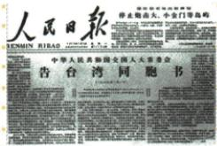
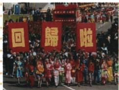

## 讲解

### 是什么

一国两制是在一个中国前提下，国家主体坚持社会主义制度，香港澳门台湾保持原有资本主义制度长期不变的科学构想。一国为中华人民共和国和统一主权的前提，两制为内部制度安排，不是两个独立国家。邓小平提出，最早考虑台湾问题，首先在港澳回归运用成功。

### 怎么来的

统一需要坚持国家主权整体，也面对港澳等历史形成的不同社会制度和实际生活。一个国家前提保证统一原则，不同制度安排考虑这些历史现实，减少统一实施与既有制度差异的冲突，为和平推进提供新途径。两制依托一国，不能先承认分立国家再把关系叫一国；制度差异也不必逻辑上阻断统一。原告台湾同胞书宣示和平统一方向，构想提供更具体制度办法，后来实际回归检验运用，三个环节不能互当已完成事实。

### 什么时候能用

问核心先国家前提再主体与港澳台各制度，问提出与实践先为台湾后先用港澳分。原单元导图1997香港1999澳门为实践年份，不写台湾已经运用完成。经济特区只讲经济政策和管理，一国两制讲统一及社会制度安排，特殊两字不足证明相同。

## 例题

### 原资料与原例题 X10-Q02：和平统一方针与一国两制

**原图结构。**“一国”为中华人民共和国，是前提和基础；“两制”为国家主体实行社会主义制度，港澳台保留资本主义制度。自动识别箭头没有接全主语、实行和保留对象，按原图恢复文字层次。

原六方面：①解决港澳台历史遗留问题、实现统一是共同愿望，最早为台湾问题提出。②邓小平进入改革开放现代化新时期后，从国家民族根本利益出发提出一个国家两种制度，开辟和平统一新途径。③一个中国前提，国家主体社会主义，香港澳门台湾原有资本主义制度长期不变。④和平统一、一国两制为统一大业基本方针。⑤首先运用于香港澳门回归并成功。⑥维护统一主权原则性与考虑港澳历史现实相结合，是和平统一创造性方针、产生国际影响。

**原问：**《告台湾同胞书》的发表有何意义？

**完整原答：**1979年1月1日，全国人大常委会发表《告台湾同胞书》，郑重宣示争取祖国和平统一的大政方针。

**完整解析。**先据图名及原背景识人大常委会1979文件，而非同日中美建交公报。文件面向台湾同胞、宣示和平统一方针，使统一的共同目标与和平实现方式相连接，不是宣告当天统一已完成；官方原文也重视尊重现状意见、加强交流等和平推进思路。[告台湾同胞书原文](https://www.12371.cn/2019/01/02/ARTI1546401371309846.shtml)。构想随后把一个国家前提和不同制度安排具体连接，为在尊重历史现实下推进统一提供办法。1979文件与提出完整构想、1997香港1999澳门实践属不同环节；原本单元导图有两回归年份，不把台湾已实施两制或当年全部统一说成原事实。原图报纸旁其他题头误识别不用于判断本题，不编其看不清全文。

### 八下第13课港澳回归原图与实践原因

**原图题，原标出题角度“2024山东”“2024甘肃”，未另核真题身份。**

原书图注“澳门人民欢庆回归祖国”，说常同中英香港交接仪式、中葡澳门交接仪式图片一同出现。原问：中国政府提出的哪一科学构想使香港、澳门得以顺利回归？原答：“一国两制”。

**完整图题解析。**先据图注与欢庆回归文字定位澳门回归，不把人群庆祝场面任意认成某次建国或经济特区设立。问题问科学构想，答一国两制；一个中国保国家归属，两种制度安排使港澳原有制度生活方式保持，为和平解决历史遗留问题提供方案。经济开放特殊政策不是这类制度方案，民族区域自治也不能替代。原只有本张澳门图，其余两张只在说明中提及，不编它们的人物站位和图像读数。

**原回归过程材料。**宪法规定为基本法提供依据，香港澳门基本法奠定依法治港治澳法律基石。香港交接1997年6月30日午夜至7月1日凌晨，中国恢复行使主权、香港特别行政区正式成立；澳门交接1999年12月19日午夜至12月20日凌晨，中国恢复行使主权、澳门特别行政区成立。回归日期分别记7月1日与12月20日，不能只看仪式前夜把日期提前一天。原意义为洗雪百年耻辱、完成完全统一的重要一步，港澳作为直辖中央特别行政区重新纳入国家治理体系；重要一步不是整个统一任务全部完成。

**原重难设问：香港、澳门顺利回归祖国的原因和现实意义。完整原答原因五项。**

1. 改革开放后，中国综合国力日益增强，国际地位不断提高。
2. 邓小平创造性提出“一国两制”科学构想。
3. 中英、中葡联合声明签署以及相关法律颁布。
4. 港澳同胞渴望回到祖国怀抱，实现祖国统一是中华儿女共同愿望。
5. 党和政府高度重视。

**完整原答现实意义三项。**在完成祖国统一大业道路上迈出重要一步；为解决台湾问题提供成功范例；为国际社会以和平方式解决国家历史遗留问题提供借鉴。

**逐层因果解析。**国力和地位增强提供维护主权、谈判和实施安排的实力条件；一国两制提供统一前提下保留局部制度的方案，回应历史与现实条件；声明和法律把谈判成果转为明确时序和制度规则，给落实以依据；共同愿望形成支持，政府重视体现持续组织谈判实施。因此不能把任一项变成唯一原因。意义则从事件后的结果回答：恢复行使主权推进统一，制度实践展示方案可实施，和平谈判和法律安排可供处理相似历史问题借鉴。

范例与借鉴不等台湾问题和所有国际问题已解决，也不等照搬港澳每一细节都适用。港澳、台湾的具体历史和现实情况须分别看，原问并没提供普遍解决所有争端的充分条件。

### 第16课港澳支持政策与两岸和平发展的实践层次

**原支持港澳完整表，未配独立例题。**进入21世纪维护促进繁荣稳定发展；开放内地部分城市居民个人赴港澳游，扩大香港人民币业务、推动内地企业在港上市；支持澳门经济适度多元化、世界旅游休闲中心及中国与葡语国家商贸合作服务平台；从2003起内地与香港澳门分别签更紧密经贸关系安排及补充协议。意义：交流合作加强，社会保持稳定，经济更加繁荣，显示一国两制生命力。

**完整机制与边界。**个人游增加旅游消费联系，金融业务和上市拓展经贸融资渠道，经贸安排提供合作规则和便利；澳门多元化使经济联系不只依赖单一活动，与葡语国家平台拓展市场和沟通。合作措施在一个国家及一国两制前提下支持发展，不是另创独立国家或把特别行政区改为社会主义经济特区。“部分城市”不能说所有内地居民在2003同天开放，香港金融措施也不机械搬到澳门。原稳定繁荣为阶段成果，不能据此保证从无任何波动。

**原两岸表及重大意义材料，未配独立例题。**进入新世纪，原述台独分裂活动加剧，中央把反对遏制台独放在更突出位置。2005通过反分裂国家法，体现最大诚意和最大努力争取和平统一，维护国家统一领土完整；2005连战率和平之旅访问大陆，胡锦涛会见，双方重申九二共识、反对台独，国共两党最高领导人会见促进关系发展；2008达成空运直航、海运直航、邮政合作协议并同时举行三通启动仪式。

**原和平统一意义全部保留。**国内：发展生产力、增强综合国力需要安定和平的国内国际环境；和平统一有利台湾稳定繁荣发展。国际：和平发展为时代两主题，和平方式顺应历史潮流、有利世界和平发展。旁注和平交往促进同胞了解、信任及认同。

**完整层次解释。**法律体现原则与立场，政党交流拓展沟通，三通便利实际人货信息往来，三类动作相接而不可互换。和平环境减少冲突对生活生产和合作的冲击，增加联系又有助了解与信任，因而国内发展和国际和平的理由需分别说明；这些是条件及作用判断，不是已经实现统一的事实。1993汪辜受权团体协商同2005国共最高领导人会见不同，2008实际三通也不等台湾已实行一国两制。原没给法律所有条款，不把这一段概括改成法律绝无其他条件的完整全文。

### 新时代依法治理及交流支持港澳原材料

**原知识材料。**中央依照宪法和基本法实施对特别行政区全面管治权，落实爱国者治港、治澳，维护主权安全发展利益。2020年全国人大常委会通过香港特别行政区维护国家安全法，坚持依法治乱，推动香港由乱到治、由治及兴；深化内地港澳合作，建设粤港澳大湾区、港珠澳大桥等，支持经济民生和优势互补。

**原常考设问：香港特别行政区维护国家安全法颁布的意义。完整原答四点。**体现我国坚定支持香港发展繁荣；有利于全面准确推进一国两制、落实爱国者治港；有利于激发香港同胞维护统一、安全和社会稳定的热情；有利于防范遏制外部干预以及分裂颠覆等，维护国家主权、安全和发展利益，保证长治久安繁荣稳定。

**完整因果解析。**依法明确维护安全的制度与责任，为防范和处理危害安全活动提供规则，接主权安全及秩序保障；稳定秩序为经济生活正常运行提供条件，接发展繁荣；在宪法基本法框架下推进实践，接一国两制与相应治理原则；共同维护安全的要求接居民参与意识。四点按制度、社会参与、风险防范及发展条件解释，不是立法一句自动消除所有社会矛盾。法治安全和基础设施合作作用不同，应分别对应所问措施。原表述按书保留；[法律官方全文](https://www.locpg.gov.cn/2022-06/07/c_1211653801.htm)第1条列立法目的，第4条同时要求尊重保障人权，不能把维护安全扩大成不受规则约束的行为。

### 九下原问中的90年代中国三实践

# 常考设问 面对东欧剧变、苏联解体，20世纪90年代中国有哪些成功的实践使社会主义运动展现了光明前景？

1. 建立上海浦东开发区, 后对外开放的地域又向纵深推进, 形成从沿海到沿江、从沿边到内陆, 全方位、多层次、宽领域对外开放新格局。  
2.1992 年, 中共十四大提出, 我国经济体制改革的目标是建立社会主义市场经济体制。  
3.香港和澳门回归祖国。

**三实践的完整解释。**浦东开发和开放地域纵深拓展连接国际资源市场与国内不同地区；1992十四大提出社会主义市场经济体制目标，探索将制度与资源配置方式结合；香港澳门回归为国家统一实践，不能写成经济政策同一维度。三成果分别为开放、体制目标、统一，并保“提出目标”不同“当年全完成”。不能因苏联模式问题就断社会主义只能一个模式，更不能从港澳制度安排推出两国；不同国情道路与国家前提仍需解释。

## 易错

两制不是一个地方任选任意国家主权，国家主体与港澳制度不能反写；保留制度构想不等1979文件一发表祖国全部统一。原图的前提和基础须连一国而非两制。

### 来源定位

- X10-S04：full.md（历史扫描分册201-250），L652–L672，一国两制原结构图背景内容地位实践意义；5cc603b4-3c7a-4bc5-b935-8c05069de690_origin.pdf，实际PDF第12页。
- X10-S05：full.md（历史扫描分册201-250），L706–L718，一国两制六方面完整原文；5cc603b4-3c7a-4bc5-b935-8c05069de690_origin.pdf，实际PDF第12页。
- X10-Q02：full.md（历史扫描分册201-250），L674–L692，告台湾同胞书原报纸图问与完整原答；5cc603b4-3c7a-4bc5-b935-8c05069de690_origin.pdf，实际PDF第12页。
- X8-INTRO：full.md（历史扫描分册201-250），L343–L419，单元体系原图与时空轴；5cc603b4-3c7a-4bc5-b935-8c05069de690_origin.pdf，实际PDF第7页。
- X13-Q01：full.md（历史扫描分册201-250），L1040–L1056，澳门欢庆回归原图问题及原答；5cc603b4-3c7a-4bc5-b935-8c05069de690_origin.pdf，实际PDF第18页。
- X13-S03：full.md（历史扫描分册201-250），L1070–L1078，港澳回归法律前提交接时间影响意义；5cc603b4-3c7a-4bc5-b935-8c05069de690_origin.pdf，实际PDF第19页。
- X13-Q02：full.md（历史扫描分册201-250），L1088–L1102，港澳顺利回归原因五项和现实意义三项跨页原答；5cc603b4-3c7a-4bc5-b935-8c05069de690_origin.pdf，实际PDF第19、20页。
- X16-S06：full.md（历史扫描分册201-250），L1479–L1481，支持港澳五行完整表；5cc603b4-3c7a-4bc5-b935-8c05069de690_origin.pdf，实际PDF第27页。
- X16-S07：full.md（历史扫描分册201-250），L1483–L1489，两岸背景法律政党交流三通及和平交往旁注；5cc603b4-3c7a-4bc5-b935-8c05069de690_origin.pdf，实际PDF第27页。
- X16-S09：full.md（历史扫描分册201-250），L1504–L1510，和平统一方式的国内国际意义重难表；5cc603b4-3c7a-4bc5-b935-8c05069de690_origin.pdf，实际PDF第27–28页。
- X20-S03：full.md（历史扫描分册201-250），L2016–L2020，港澳国安法治理交流合作；5cc603b4-3c7a-4bc5-b935-8c05069de690_origin.pdf，实际PDF第36页。
- X20-Q03：full.md（历史扫描分册201-250），L1992–L1997，香港维护国安法意义原问四点；5cc603b4-3c7a-4bc5-b935-8c05069de690_origin.pdf，实际PDF第36页。
- WV18-Q02：full.md（历史扫描分册301-345），L2280–L2284，1990年代中国三成功实践原问全答；bd22a802-356b-4b67-b51c-daf820cc3300_origin.pdf，实际PDF第34页。
