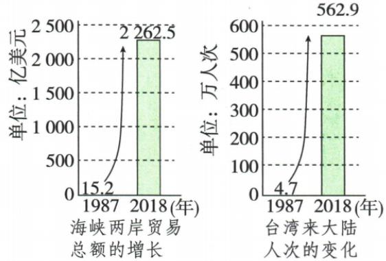

## 讲解

### 是什么

本课从1987探亲交流、1992共识、1993会谈到1995统一主张，说明两岸联系与协商扩大。人员经济文化交流说现实往来，共识说协商政治基础，会谈说沟通处理问题的活动；都不等已经实现统一或台湾已经实行一国两制。

### 怎么来的

长期隔绝限制亲属探望与相互了解，开放探亲和经济文化往来增加联系，交往增多又会产生需协调的实际事务。在原一个中国共同基础上，受权团体协商提供对话渠道，有利以沟通处理分歧、推进合作。共同历史联系、民众愿望及经济互利可形成支持和平发展统一的条件，港澳实践给制度方案以经验。这条联系需将政治基础、实际交流和协商分层，不只把年份排表，也不能说一次会谈使所有分歧自然消失。

### 什么时候能用

问事件对应1987开放、1992共识、1993汪辜会谈、1995八项主张；问趋势依据从历史联系、愿望与现实互利讲。原近40年隔绝为整体概括，不推此前每人绝无任何间接联系。原八主张只列名称与前提，不假造书内细文。

## 例题

**原两岸交流完整表，非独立例题。**1987台湾当局调整“三不”政策，开放赴大陆探亲，并逐步采取经济文化交流措施，近40年隔绝被打破。1992达成“九二共识”，原核心要义为“海峡两岸同属一个中国，共同努力谋求国家统一”；1993汪辜会谈举行，两岸关系发展迈出历史性重要一步。1995江泽民提出八项主张，强调一个中国原则为和平统一基础前提。

**完整层次解释。**探亲和经济文化交流增加人员与社会联系，协商共同政治基础为继续对话创造条件，会谈使交往问题有沟通处理渠道。交流、共识、会谈、统一方针是不同动作，不是同年同一会议；原没有八项细文和所有会谈协议，不编原表已有。官方材料核汪辜会谈由海协会和海基会以受权民间团体名义举行，不能讲成国共两党最高领导人已在1993会面。原阶段关系发展不等所有分歧已消失，更不等台湾已经实行一国两制。

补写核查依据：[纪念汪辜会谈30周年原讲话](https://www.gwytb.gov.cn/m/news/202304/t20230428_12530899.htm)。

**原常考设问：祖国统一是历史发展的必然趋势。完整原答。**

1. 台湾自古以来就是中国的领土，中华民族有强大凝聚力，实现完全统一、民族大团圆早已成为共同心声，也是历史必然走向和必然结果。
2. 两岸交往日益密切，经济上逐步形成相互促进、互补互利局面，再加港澳回归后进一步发展，更使我们坚信祖国统一是历史发展必然趋势。

**完整依据解释与范围。**原第一点从历史联系、民族凝聚和共同愿望说明统一方向，第二点从现实交往、经济共同利益及港澳实践说明有利条件。交往使相互了解与实际联系增加，互利使和平合作有共同需要，港澳范例说明方案有实践经验；三方面须讲因果而不只列一个趋势结论。原必然趋势为本书对历史方向的判断，不等提供了具体完成日期、已经完成事实或无需解决现实问题。趋势、条件与实际完成状态分开，不能由交流扩大一句跳到所有任务已经完成。

### 八下第四单元原题Q03

**单元原第3题。**阅读下图可知（ ）。

A.海峡两岸实现了“三通”；B.海峡两岸交流往来频繁；C.两岸经济有很强互补性；D.“九二共识”得到认同。

**原答案B。完整原解。**本题以数据图考查读图分析，两图分别提示具体内容。结合“海峡两岸贸易总额的增长”和“台湾来大陆人次的变化”以及箭头走势，两图均呈巨大幅度增长，说明两岸交流往来的频繁。

**完整逐图核验与推理。**左图单位亿美元，1987为15.2、2018为2262.5；右图单位万人次，1987为4.7、2018为562.9。原图2018贸易标“2 262.5”，OCR表漏前一位而作262.5，正文按原图恢复，原件保留。两图分别是经贸量与来访活动量，不能把万人次当人数：同一人可多次往来，也不能将两指标相加。两指标同向增长，从经济与人员两方面支持B。

A是通邮通航通商等具体制度渠道变化，贸易与人次增加不能单凭图直接证明何时实现各项；C需商品结构、资源需求或产业配合资料，贸易额多不单独证明很强互补性；D为政治认同判断，活动量不能证明全部参与者态度。排除因材料未直接证明，不能反说三通、互补或共识历史上从未存在。图比较两个时点，不证明1987—2018每一年都连续上升。

**逐项核验。**

- A（不选）：两指标增加不足以直接证明通邮通航通商各项实际制度实现，需渠道过程证据。

- B（对）：经济贸易与来访人次都明显增加，共同支持交流往来更加频繁。

- C（不选）：贸易总额不直接给经济结构互补程度，需产品和需求配合信息。

- D（不选）：来访量与贸易量不能直接代表全部参与者的政治共识认同。

### 第16课2005法律政党交流与2008三通

**原两岸表及重大意义材料，未配独立例题。**进入新世纪，原述台独分裂活动加剧，中央把反对遏制台独放在更突出位置。2005通过反分裂国家法，体现最大诚意和最大努力争取和平统一，维护国家统一领土完整；2005连战率和平之旅访问大陆，胡锦涛会见，双方重申九二共识、反对台独，国共两党最高领导人会见促进关系发展；2008达成空运直航、海运直航、邮政合作协议并同时举行三通启动仪式。

**原和平统一意义全部保留。**国内：发展生产力、增强综合国力需要安定和平的国内国际环境；和平统一有利台湾稳定繁荣发展。国际：和平发展为时代两主题，和平方式顺应历史潮流、有利世界和平发展。旁注和平交往促进同胞了解、信任及认同。

**完整层次解释。**法律体现原则与立场，政党交流拓展沟通，三通便利实际人货信息往来，三类动作相接而不可互换。和平环境减少冲突对生活生产和合作的冲击，增加联系又有助了解与信任，因而国内发展和国际和平的理由需分别说明；这些是条件及作用判断，不是已经实现统一的事实。1993汪辜受权团体协商同2005国共最高领导人会见不同，2008实际三通也不等台湾已实行一国两制。原没给法律所有条款，不把这一段概括改成法律绝无其他条件的完整全文。

### 第五单元原第5题及完整解析

**单元原第5题。**台湾自古以来就是我国领土。以下事件共同主题是（ ）。

1992年，海基会、海协会达成九二共识；2005年3月，第十届全国人大通过反分裂国家法；2008年，两岸同时举行三通启动仪式。

A.民族区域自治；B.外交发展；C.对外开放；D.推动两岸关系和平发展。

**原答案D。完整原解。**九二共识、反分裂国家法、三通仪式都表明两岸关系重大进展，推动和平发展。

**完整共同主题判断。**共识为协商政治基础，法律表立场原则，三通便利人员货物流通邮政，三个动作虽不同，都在一个中国和两岸关系范围内推进沟通联系，D同时覆盖。A需少数民族聚居自治机关与自治权，原未给；B若把两岸事项都讲成两个独立国家外交，换了国家范围；C可与经贸联系有关，却不能覆盖共识和维护统一法律的共同任务。选D不是把每件事都叫经济开放，也不说三通启动等于已经实现统一。1992共识与2005法律2008实际往来分动作，不能倒写一个日期。

### 2015领导人会面与2022白皮书的和平发展条件

**原知识材料及相关讲话。**2015年习近平同马英九在新加坡会面，是1949年以来两岸领导人首次会面，围绕和平发展交换意见。原讲话强调九二共识共同政治基础、和平发展、深化交流合作、增进同胞福祉。继续同认同九二共识、支持和平发展的政党团体县市人士交流，推进经济社会融合；不是仅限一个名称的党派，也不等1993受权民间团体汪辜会谈同此次领导人会面是一事。

原反分裂材料将台独分裂及外部势力干涉列现实威胁，说明反分裂反干涉和演练维护主权领土完整的立场；2022年台湾问题与新时代中国统一事业白皮书阐述大政方针。原写以最大诚意尽最大努力争取和平统一，但不承诺放弃使用武力。两句话分别说明所争取的方式和应对底线，不能只截后一半便说不再争取和平。

**完整边界补释。**[2022白皮书官方全文](https://lt.china-office.gov.cn/chn/sgxw/202208/t20220810_10739960.htm)明确所针对的是外部势力干涉和极少数台独分裂分子及其活动，绝非台湾同胞；非和平方式为不得已情况下的最后选择。不能将官方政策主张改成已完成统一事实或任何时候立即使用武力。原主张维护统一同原历史联系和现实条件相接，未提供实际完成日期。

### 第六单元原第4题与完整原答解析

**单元原综合性新考法，原标签“2024山东临沂中考改编”，未给数字编号，记录作第4题。标签按原书保留，未另核真题身份。阅读材料，回答问题。**

材料一：中华人民共和国与美利坚合众国商定自1979年1月1日起互相承认建立外交关系；美国承认中华人民共和国政府为中国唯一合法政府，在此范围内美国人民同台湾人民保持文化商务及其他非官方关系；美国政府承认中国立场，即只有一个中国，台湾是中国一部分。原摘自中美建交联合公报。

材料二：2015年11月7日下午3时，习近平与马英九握手，会面再次传递：台湾无论哪个党派团体，无论过去主张，只要承认九二共识历史事实、认同核心意涵，都愿同其交往。原摘编人民日报海外版2015年11月8日。

（1）依据材料写一项证明台湾是中国一部分的史实。
（2）愿同其交往的前提？根据所学，对和平发展的最大现实威胁？2022白皮书强调怎样解决台湾问题？
（3）从民族复兴角度，想对台湾同胞说哪些心里话？

**完整原答案。**（1）元朝在澎湖设巡检司；1684清设台湾府隶福建；九二共识。答出一项即可。（2）承认九二共识历史事实、认同核心意涵；台独分裂行径和外部势力干涉；继续以最大诚意尽最大努力争取和平统一，但不承诺放弃使用武力。（3）台湾自古是中国领土；任何党派团体应承认九二共识；和平统一一国两制为最佳方式、对同胞民族最有利；完全统一是历史发展大趋势；统一利于振兴中华和民族复兴；企图依外部势力分裂必失败。

**完整逐问依据和范围。**（1）元澎湖机构和1684设府是所学行政治理证据，原材料未逐字列它们，不能标成直接摘录；九二共识由材料二直接提名称，结合所学补其同属一个中国的核心。原参考答需要材料与所学相接，写一项有说明的史实即可，不把三个例项都要求必答。澎湖属台湾地区，不改成本岛；公报1979生效建立外交关系，是政府承认和关系安排的文件，不是1979才首次有台湾历史联系。

（2）先按“只要”找前提，历史事实与核心意涵两层保全，不缩为曾加入某一党派。再由课内所学找分裂干涉两项现实威胁，两项不省。最后白皮书保和平争取与不承诺放弃武力两句；官方原文针对外部干涉和极少数分裂分子及活动、非台湾同胞，非和平为不得已最后选择，不能改成停止争取和平或立即用武力。前提、威胁、做法是三项不同问题，不用一个统一口号包答。

（3）从历史联系、共同政治基础、和平方式、共同受益和复兴方向组织交流话语，保原六项答案内容，同时将依据接到完整历史表、材料二共识和两岸交流利益。该问表达对未来方向的认识及愿望，原趋势判断不等已经完成统一、已无现实阻碍或每个个人观点相同。港澳实践可提供经验，台湾具体条件仍有不同，不能由最佳方式结论推台湾已实施一国两制。材料一的“承认中国的立场”照原保主体措辞，不擅改成与另一段“承认中华人民共和国政府”完全同一种外交法律表述。

## 易错

政治基础与实际制度安排不同，九二共识不等台湾已经实行两制。受权团体会谈非1993国共领导人会见，趋势也非具体完成日期。

### 来源定位

- X13-S04：full.md（历史扫描分册201-250），L1080–L1082，两岸交流1987至1995原三行表；5cc603b4-3c7a-4bc5-b935-8c05069de690_origin.pdf，实际PDF第19页。
- X13-Q03：full.md（历史扫描分册201-250），L1096–L1100，统一历史趋势原问和完整两项原答；5cc603b4-3c7a-4bc5-b935-8c05069de690_origin.pdf，实际PDF第19页。
- XU4-Q03：full.md（历史扫描分册201-250），L1204–L1241，两岸贸易人次原第3题原图四项及原B详解；5cc603b4-3c7a-4bc5-b935-8c05069de690_origin.pdf，实际PDF第21、22页。
- X16-S07：full.md（历史扫描分册201-250），L1483–L1489，两岸背景法律政党交流三通及和平交往旁注；5cc603b4-3c7a-4bc5-b935-8c05069de690_origin.pdf，实际PDF第27页。
- X16-S09：full.md（历史扫描分册201-250），L1504–L1510，和平统一方式的国内国际意义重难表；5cc603b4-3c7a-4bc5-b935-8c05069de690_origin.pdf，实际PDF第27–28页。
- XU5-Q05：full.md（历史扫描分册201-250），L1639–L1663，两岸主题原5题三事项四项原D详解；5cc603b4-3c7a-4bc5-b935-8c05069de690_origin.pdf，实际PDF第30页。
- X20-S04：full.md（历史扫描分册201-250），L2022–L2040，两岸2015会面交流反分裂及2022白皮书；5cc603b4-3c7a-4bc5-b935-8c05069de690_origin.pdf，实际PDF第36–37页。
- X20-S08：full.md（历史扫描分册201-250），L1999–L2001，2015会面相关讲话九二共识和平发展；5cc603b4-3c7a-4bc5-b935-8c05069de690_origin.pdf，实际PDF第36页。
- XU6-Q04：full.md（历史扫描分册201-250），L2186–L2208，建交公报2015会面综合原题三问原完整答案；5cc603b4-3c7a-4bc5-b935-8c05069de690_origin.pdf，实际PDF第40页。
