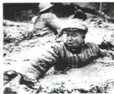
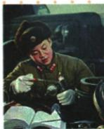
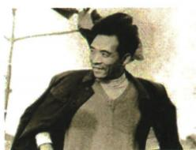

## 讲解

### 是什么

建设精神是从实际选择与行动中体现的价值和工作方法。本课科学家、大庆工人、林县人民、焦裕禄、雷锋都有奋斗奉献，同时各有具体任务、代表和精神名称。共同点不能取消各自特点。

### 怎么来的

国家建设需要技术突破、资源生产、治水和基层服务等不同工作。研究协同、长年建设、亲民治理、平凡岗位敬业分别让责任落实为行动，才形成精神所指的实际内容。科学求实要求掌握情况和有效方法，不是只凭意志不顾规律；大力协同与群众参与说明成绩依赖集体，不能把代表人物当全部参与者。

### 什么时候能用

问分别精神时先配图注人物与具体事迹，再写原对应名称；问共同精神才提奉献奋斗等共性。本课所列科学家回国经历限所举代表，不能断所有两弹一星参与者都留学回国。原三图自动描述不可靠，身份按原图注与正文配。

## 例题

### 原例题 X6-Q05：三位模范对应精神

原图注：王进喜（1923—1970）。

原图注：雷锋（1940—1962）。

原图注：焦裕禄（1922—1964）。

**原问：**以这三位模范人物为代表，分别形成了什么精神？

**原答按原图顺序：**大庆精神（铁人精神）；雷锋精神；焦裕禄精神。

**逐项完整解析。** 第一图与图注王进喜配大庆生产建设，故答大庆或铁人精神；第二图雷锋配平凡岗位服务敬业，故答雷锋精神；第三图焦裕禄配兰考治理、亲民求实，故答焦裕禄精神。题目问分别，三名与三精神需一一对应，不能只写共同艰苦奋斗。第一图自动图片描述误说成士兵，不采用；依据原图注及原表，不由服饰姿态推职业，更不凭单张照片推出全部事迹。

### 原资料：五组模范、事迹与精神

|原模范|原事迹|原精神，完整保留|
|---|---|---|
|钱学森、邓稼先、郭永怀等科学家代表|放弃国外优厚条件回国，个人理想志向与国家民族相连|两弹一星：热爱祖国、无私奉献、自力更生、艰苦奋斗、大力协同、勇于攀登。|
|王进喜为代表的大庆工人|3年多建成大庆石油基地|大庆（铁人）：爱国、创业、求实、奉献。|
|河南林县人民|10年在太行山建成人工天河红旗渠|自力更生、艰苦创业、团结协作、无私奉献。|
|兰考县委书记焦裕禄|患重病仍带群众封沙、治水、改地，改变贫困面貌|亲民爱民、艰苦奋斗、科学求实、迎难而上、无私奉献。|
|解放军战士雷锋|平凡岗位甘当螺丝钉，全心全意服务人民，成为社会风尚标志|爱党爱国爱社会主义的理想信念；服务人民助人为乐；干一行爱一行、专一行精一行；锐意进取自强不息；艰苦奋斗勤俭节约。|

**形成依据。** 精神由具体选择与行动体现：回国奉献说明国家责任，科研和生产协作说明团队作用，长年治水建设说明坚持与协同，调查治理困难说明求实和服务群众，平凡岗位认真负责说明敬业。共同有奉献奋斗，但各名称与代表不能互换；不是只背泛称爱国便覆盖原各项。科学家表是所举回国代表，不可扩大所有参与者都有留学回国经历；成绩也不能归给一人排除工人群众和团队。原资料不提供具体每年工程量，保3年多与10年，不编精确起止日期。

## 易错

王进喜对应大庆工人，焦裕禄对应兰考治理，雷锋对应岗位服务，不按同样爱国随意换名。原3年多、10年有精度边界，不补精确起止日。

### 来源定位

- X6-S08：full.md（历史扫描分册201-250），L118–L120，五组建设模范事迹精神完整原表；5cc603b4-3c7a-4bc5-b935-8c05069de690_origin.pdf，实际PDF第3页。
- X6-Q05：full.md（历史扫描分册201-250），L122–L146，王雷焦三原图与三精神完整原问原答；5cc603b4-3c7a-4bc5-b935-8c05069de690_origin.pdf，实际PDF第3页。
