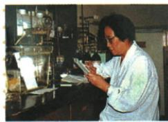
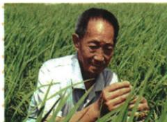

## 错法

只记三项都是科技进步，便把1965青蒿素、1972水稻、1973牛胰岛素串错，或把人工合成写成第一次发现。这会同时改掉对象、动作和时间。

## 正解

牛胰岛素对应1965人工合成结晶，青蒿素对应本表1972抗疟成果，杂交水稻对应1973研究突破；各自用关键词绑定对象再记节点。提取与合成不同，抗疟用途与粮食供给不同。原表只列这三项，未让所有成就都归同一人，人物图题按原对应答。

## 例题

此处原资料只列知识表或陈述，没有另设匹配的独立课内题；保留原内容并解析，不自编题。本课图像与史料设问另有明确题号，单元题另计。

### 原资料：人工合成结晶牛胰岛素

原表：1965年，我国完成人工合成结晶牛胰岛素，在世界上居领先地位。

**解释补写。** 人工合成是研究者通过实验制造相应物质，区别于仅从动物中提取现成物质；牛胰岛素是该项研究对象，不能省为我国第一次发现所有胰岛素。中国科学院研究机构的成果历程记录多单位协作，证实全合成与天然对象相同结构、具有生物活性，说明意义在合成和生命物质研究能力取得突破。此处只解释历史成果，不展开高中化学结构或治疗方案。[核查依据：中国科学院成果历程](https://cemcs.cas.cn/zt_197708/nydsucg60zn/zylc/202508/t20250826_7915251.html)。

原未另设独立题或指定某位人物贡献，不能将这项成果随意配屠呦呦、袁隆平或邓稼先。也不能把牛胰岛素写成青蒿素，前者是合成蛋白质研究，后者是抗疟药物研究。

### 原例题 X6-Q01：屠呦呦研究成果

**原问：**指出图中人物的研究成果。

**完整原答：**屠呦呦领导科研团队成功提取有效抵抗疟疾的青蒿素；2015年获得诺贝尔生理学或医学奖。原科技表按1972年列成果，说明青蒿素类药物挽救世界数百万患者生命。

**完整解析。** 原图注已给人物，先用图注确定对象，再按所学答成果名称及用途；实验室外观不能单独证明药名、年份或奖项。成果是抗疟青蒿素，用途是抗疟，获奖是后来对贡献的认可，三层不能互换。原答写领导团队，保留集体研究；不能把团队合作删成个人独力完成。数百万是原概括量，未给精确统计年份和数目，不编新数字。

**时点补核。** 中国中医科学院刊载研究回顾区分1971有效提取物与1972分离有效单体，支持原表1972成果节点，不能把1971、1972与2015当同一动作，也不将2015写成首次研究成功。[核查依据](https://www.cacms.ac.cn/media_doctor/detail/1689.html)。此处是历史成果解释，不添加药物制取或使用方法。

### 原例题 X6-Q02：袁隆平研究成果

原图注：袁隆平（1930—2021）。**原问：**指出图中人物的研究成果。

**完整原答：**研究杂交水稻，创建领先世界的超级杂交稻技术体系，为我国粮食安全和世界粮食供给作巨大贡献。原表另列1973年杂交水稻研究实现历史性突破。

**完整解析。** 图注确定人物，成果回答杂交水稻研究，进一步技术体系与粮食贡献是原答展开。改进水稻品种与生产技术可以提高粮食供给能力，因此研究与粮食安全相连；但原未给具体单产数据，不能凭稻株画面算亩产。1973是所列突破节点，后来超级杂交稻体系是继续发展的内容，不能说所有后续成果同年一次完成。个人生卒年份是人物信息，不替代成果年份。

### 来源定位

- X6-S03：full.md（历史扫描分册201-250），L34–L36，三项其他科技成果原表；5cc603b4-3c7a-4bc5-b935-8c05069de690_origin.pdf，实际PDF第1页。
- X6-Q01：full.md（历史扫描分册201-250），L43–L57，屠呦呦原图设问与成果奖项原答；5cc603b4-3c7a-4bc5-b935-8c05069de690_origin.pdf，实际PDF第1页。
- X6-Q02：full.md（历史扫描分册201-250），L59–L73，袁隆平原图设问与研究贡献原答；5cc603b4-3c7a-4bc5-b935-8c05069de690_origin.pdf，实际PDF第1页。
