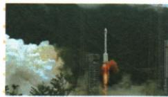
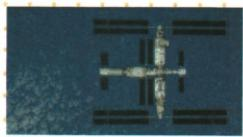
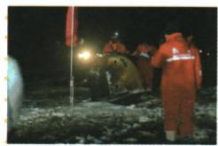

## 讲解

### 是什么

科技自立自强强调形成能够自主解决关键技术问题的能力，原创新材料列基础研究、原始创新、关键技术突破和新兴产业；北斗、空间站、嫦娥五号是不同航天任务的成果证据。自主能力与对外合作可以相容，不能将其解成完全无需任何交流。

### 怎么来的

技术能力需要对原理规律的研究和从问题出发的创新，基础认识支撑后续设计，关键技术突破帮助完成原受限的任务，产业又把能力用于发展。导航组网、空间站和探月返回各有不同任务，需要研究人员、工程组织和实践共同作用，原三图因此支持科技领域取得成果而非仅设备名称记忆。任务照片与图注给对象与动作，完整性能比较另需同口径数据，原领先评价不能被扩大到一切领域。科技支持为工作提供条件，实际任务成功仍须集体实践，不把支持一句当全部技术证明。

### 什么时候能用

原图问先辨三项任务再归共同自主研发成果与支持创新，55为系列编号不是一个系统颗数。神舟16为2023，不能强塞原十年2012—2022，各对象日期用官方记录作核注而不改原题条件。

## 例题

**原三幅常考图片。**

**原问：如何理解这一组图片？完整原答。**三图形象显示新时代我国科技领域成就；原称这些成就在世界处于领先地位，显示自主研发成果和党中央对科技创新大力支持。

**逐图到共同主题的完整推理。**北斗是导航卫星系统，发射为组网阶段；空间站图显示载人航天设施，神舟十六号为拍摄视角所依任务，不能叫北斗卫星或月球探测器；嫦娥五号返回器着陆属于探月采样返回任务，不是载人登月。三种任务都需研发、组织和技术实践，分别给航天领域建设能力的依据，所以共同主题是科技进步、自主研发与支持创新，不能把三张均叫同一发射任务。

**原评价及时间边界。**保原“领先”评价，但原题没有性能和各国同口径比较数据，照片本身不能测定排名，更不推出全部科技领域都世界第一。第55颗为北斗系列编号口径，不是北斗三号单系统有55颗或发射55次。图注只给任务名，日期补核须明示不是原题数字：[研制单位2020年6月23日原发布](https://www.cast.cn/news/6810)核第55颗；[神舟十六号2023年5月30日任务原发布](https://www.cmse.gov.cn/xwzx/202305/t20230530_53647.html)核任务时点；[国家航天局嫦娥五号样品交接原报道](https://www.cnsa.gov.cn/n6758823/n6758844/n6760243/n6760244/c6810939/content.html)核2020年12月17日返回。神舟十六号图片属2023年，三图作为新时代科技材料可并用，但不能把每张均归入2012—2022“十年”统计。

## 易错

嫦娥五号非载人登月，神舟16空间站非导航卫星；照片不能推出所有技术世界第一。

### 来源定位

- X23-S01：full.md（历史扫描分册201-250），L2360–L2370，新时代十年评价里程碑词义与经济创新表；5cc603b4-3c7a-4bc5-b935-8c05069de690_origin.pdf，实际PDF第43页。
- X23-Q01：full.md（历史扫描分册201-250），L2372–L2392，三科技图原图注及共同理解原问原答；5cc603b4-3c7a-4bc5-b935-8c05069de690_origin.pdf，实际PDF第43–44页。
