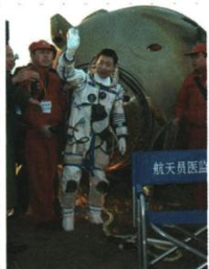

## 讲解

### 是什么

载人航天把人送入太空并保障生命及任务，原1992工程立项、2003年10月杨利伟乘神舟五号成功飞行返回为两个节点。载人同卫星发射的任务和保障要求不同，载人航天精神为团队长期研究与执行任务的精神概括。

### 怎么来的

人在太空生存和完成任务，需要飞船运行、生命保障、训练与返回等相互配合，只有发射成功而无这些条件不能等同完整载人任务成功。工程立项组织持续研制，科学研究解决困难，航天员执行飞行，团队提供保障，原从无到有、从弱到强指这一能力发展。杨利伟任务重要却不等个人独立研制全部设备；四个特别能反映克服艰苦、执行任务、攻科学难题和奉献的联系，也不能以精神代替科学试验和安全能力。

### 什么时候能用

见杨利伟神舟五号配图按图注答2003载人飞行返回，问立项答1992。不能把它说成中国第一次发射任何飞船卫星，不能从图片衣物或背景推未给参数；原材料无小问，按知识材料使用。

## 例题

**原常考图片与完整图注材料，未配独立小问。**

2003年10月，杨利伟乘神舟五号载人飞船升入太空并成功返回。原载人航天工程1992正式立项实施；中国航天人不断攻克科学难题、挑战生理极限，推动从无到有、从弱到强，形成特别能吃苦、特别能战斗、特别能攻关、特别能奉献的载人航天精神。

**完整图像与任务解释。**按图注认人物、飞船和2003飞行返回节点，不靠照片小字猜未提供的轨道读数。载人任务需要运送人并保障生命和返回，因而不仅是发射一个卫星；1992立项为组织实施开始，2003成功飞行返回为具体成果，不能互当同一年动作。杨利伟执行飞行任务，同团队研制组织保障贡献相接，不应写成一人完成整个工程。四项精神分别关联艰苦工作、执行任务、解决科学难题和投入奉献，支持研究实践而不代替技术与安全能力。原只给该任务阶段，非中国第一次发射任何航天器，未给轨道参数不补猜测。

## 易错

1992组织工程与2003具体飞行分动作；载人飞船与人造卫星分任务，个人执行与集体贡献都保。

### 来源定位

- X16-S08：full.md（历史扫描分册201-250），L1491–L1502，杨利伟原图图注载人航天精神；5cc603b4-3c7a-4bc5-b935-8c05069de690_origin.pdf，实际PDF第27页。
