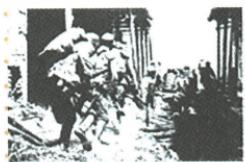
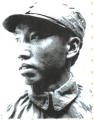
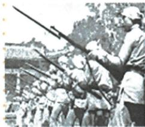

## 错法

台儿庄、左权、回民三图并列就说三者同日都在台儿庄，或全民族便说所有人都无摩擦。不持枪者又被排除。错把代表材料当全景全称记录，贡献形式也被缩小。

## 正解

按图注各识主体，共同抵抗侵略归团结；工人生产、妇女救护、华侨捐物和文艺宣传均提供抗战条件。三图不同例子不证同一地点时间，原汪投敌皖南摩擦仍存在。团结概括主要共同力量，不是抹每项复杂历史。

## 例题

**课内原三图设问（Y18-S12）：根据这三张图片，归纳中国人民取得抗战胜利的原因。**

**原答：全民族团结抗战。**

**原各群体完整表（Y18-S08，表不另计题）：**青年学生投笔从戎；广大妇女参加抗日宣传、救护、战地服务；工人不分昼夜加班生产支援前线；海外华侨和港澳同胞捐款捐物，数万华侨青年回国参战；文艺界成立抗战协会、文艺作品宣传抗战振奋士气；台湾人民反战暴动、游击斗争、抵制奴化教育，七七后大批爱国台胞回祖国大陆抗战；作用使侵略者陷入人民战争的汪洋大海。

**完整解析补写：**看到图一正面军队战斗、图二左权这位共产党领导军队的抗日将领、图三回民武装，先识别参与主体具有不同军队及民族背景，再提共同目标抵抗日本侵略，最后由多方参与归纳全民族团结抗战。不是把三个名称并排抄完便自动有原因：不同力量联合、军事行动与社会供给配合，扩大持续抵抗的基础，才使结论有依据。原群体表进一步证明参与不仅在前线，生产、救护、资金、宣传也有作用；不持枪不等未抗战。三图是不同地点、人物及活动的代表，不能说左权与全部回民武装都参加同一台儿庄战斗；肖像自身不提供牺牲具体日期地点，需原注和正文配合。民族字眼指共同抗侵略的广泛力量，不推出全国每个人每时刻都无分歧，汪投敌和顽固派摩擦仍是同课真实复杂性。

### 来源定位

- Y18-S08：full.md（历史扫描分册151-200），L1270–L1286，侵略策略汪伪皖南党政治回击与各群体贡献完整表；7315c71c-e0f3-499f-a65f-f5d33fed3468_origin.pdf，实际PDF第22、23页。
- Y18-S12：full.md（历史扫描分册151-200），L1310–L1344，台儿庄左权回民三原图及原因原问答；7315c71c-e0f3-499f-a65f-f5d33fed3468_origin.pdf，实际PDF第23页。
