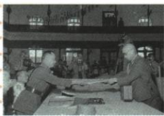

## 错法

照片在9月2段旁便说何应钦密苏里受降，14年加8年成22年，或宣布投降日即全体正式签书。错用排版定史实、忽视动作与时段范围。

## 正解

原图何代表中国接受，南京战区与9月2盟国正式签书另仪式，官方核9月9，8月15是宣布。14年1931起包含1937后的8年全民族，不额外相加，也不否前期局部；原重大事件答完整保而补图场景层次。

## 例题

**课内原图设问（Y19-S08）：上图场景反映的是哪一重大历史事件？**

**原图注：何应钦（左）代表中国接受日军投降书。原答：1945年日本无条件投降，中国抗日战争取得最后胜利。**

**原投降和胜利陈述（Y19-S10）：**1945年8月15日天皇被迫宣布无条件投降，9月2日政府正式签署投降书；14年艰难斗争，特别8年全民族浴血奋战，付巨大牺牲取得最后胜利，台湾也回祖国怀抱。

**完整解析补写：**看到受降文书和原何应钦图注，想到战争结局与中国接受投降，回答原重大事件即可。两日期是宣布与正式签书不同动作，图中何应钦南京受降又是中国战区仪式，不能因为照片与9月2陈述排相邻便把何的场景搬到密苏里号。外交部投降文件区分9月2向同盟国签书和9月9南京中国战区签书，图场景据此作核查补充；补充日期不用替代原答或改变原题条件。14年从1931至1945，8年全民族从1937至1945，是包含关系而非矛盾或相加22年；全民族不否前6年局部抵抗。台湾回归是抗战胜利相关结果，原没给图中当天所有地区都同时完成接收，不自行把全部行动压一日。

**核查依据：**[外交部公布日本投降书](https://www.fmprc.gov.cn/diaoyudao/chn/flfg/gjty/201510/t20151009_8560602.html)，两份文件对应两场签署，直接读相关内容；图注完整保。

### 来源定位

- Y19-S08：full.md（历史扫描分册151-200），L1423–L1437，何应钦原受降图图注及事件原问原答；7315c71c-e0f3-499f-a65f-f5d33fed3468_origin.pdf，实际PDF第26页。
- Y19-S10：full.md（历史扫描分册151-200），L1445–L1448，投降两日期14年8年台湾胜利原文；7315c71c-e0f3-499f-a65f-f5d33fed3468_origin.pdf，实际PDF第26页。
