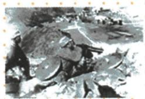

## 讲解

### 是什么

平型关大捷是1937年9月八路军115师在山西取得的对日胜利。原书将其列正面抗战，地位限定为全国抗战爆发后主动对日作战的首个重大胜利，不等全部中国历史第一场抗日行动。

### 怎么来的

淞沪期间侵略扩至山西，中国军利用伏击打击敌军，实际胜利反驳日军不可战胜的宣传，增强抵抗信心。这是从战果到心理政治作用的依据，不能只抄意义而没有为什么。军队所属和战场功能不能一刀切：八路军既深入敌后，也能在特定行动配合正面，原本战分类应结合这种协同看。首胜限定时间、行动性质和胜利等级，1931后已有局部抵抗，所以删掉限定会改变判断。歼敌1000余、毁车100余是不同单位，战果概数不支持自行算死亡率或全部日军损失。神话被打破说明能打败敌人，不说明全战争已经结束。

### 什么时候能用

识别原图用原注、年份、部队和战术；比较首胜先保全国抗战后等范围。照片自身不能证明全部数字，也不能只凭八路军名称改原战场分类。

## 例题

原资料此项未另列匹配独立题。下面使用原表、原图说明或原陈述作辨析材料，不计为新题。

**原平型关完整表（Y18-S01，非独立题）：**淞沪会战期间，日军侵入山西；1937年9月；八路军第一一五师师长林彪；一举歼灭日军1000余人，击毁日军汽车100余辆，缴获一批辎重和武器。地位：全国抗战爆发后中国军队主动对日作战取得的第一个重大胜利。意义：粉碎了日军“不可战胜”的神话。

原图说明明确主要战术是伏击，并将本战归在正面战场抗战。原MD把师号识别为“第一—五”，实际PDF第21页为“第一一五”，正文恢复115师，未改原部队。

**完整分析补写：**先用年份、地点、部队确认事件，再读“首胜”的范围：全国抗战爆发后、中国军队主动对日作战、重大胜利三个限制共同成立，不能只留“第一个”而断1937年前从无人抵抗。伏击是利用敌军行进途中有利时机攻击的战术，不等这场战斗便无法配合正面抵抗。八路军参加这场战斗，说明两个战场和抗日力量能配合，不能按军队党派机械排除原书正面归类。歼敌人数、毁车数量单位不同，不可相加成死亡总数；原以上概数保留，不算精确比例。胜利直接证明日军能被打败，由此增强军民抵抗信心；粉碎神话不是宣告全部侵华日军已被消灭。

## 易错

115师不是15师或第1师；余字、人数与车数分别保。首个重大、台儿庄最大和战争最后胜利不是同一概念。

### 来源定位

- Y18-S01：full.md（历史扫描分册151-200），L1185–L1207，平型关完整表师号时间战果首胜与原伏击图；7315c71c-e0f3-499f-a65f-f5d33fed3468_origin.pdf，实际PDF第21页。
- Y18-S04：full.md（历史扫描分册151-200），L1216–L1245，敌后定义百团特点原设问及两战场原示意图；7315c71c-e0f3-499f-a65f-f5d33fed3468_origin.pdf，实际PDF第22页。
