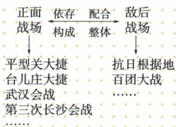

## 讲解

### 是什么

敌后是在敌占区持续抵抗的战场，由共产党领导八路军、新四军等发动群众、建设根据地并作战。正面阻击与敌后攻击交通据点相配合，共同构成中国抗战整体；敌后作用逐渐发展。

### 怎么来的

敌占一地不等该地抵抗消失。深入敌后发动群众、建立根据地，使军队取得持续活动的空间与群众支持；游击行动选择有利时机打击敌军，破坏交通和局部控制，迫其将兵力用于后方。正面抵抗限制敌进攻、敌后牵制增加敌补给驻守负担，两者都影响同一侵略军，因而依存配合。原1940分布三大地域16块，延安为指挥中枢，空间分布与统筹指挥不能合成16块都在一城。原图列正面和敌后事例，并不是各会战因果串联，自动Mermaid必须舍弃。逐渐成为主战场强调发展，不宣一开始已承担全部战争或以后正面无作用。

### 什么时候能用

读图先分两列事例与中间关系词；判某行动须看时段和战场功能，不只看党派军名。根据地数量不能换行政省数，游击战也不能理解为完全无组织群众的个人活动。

## 例题

原资料此项未另列匹配独立题。下面使用原表、原图说明或原陈述作辨析材料，不计为新题。

**原两战场图和根据地材料（Y18-S04、S06，非独立题）：**敌后战场指中国共产党领导的八路军、新四军和其他抗日武装深入敌占区开辟的战场。全国抗战后深入敌后、发动群众、建立根据地；到1940年，在华北、华中、华南创建16块；牵制和抗击大量日军；指挥中枢延安；军民人民游击战争取得神头岭、响堂铺、黄土岭等伏击战胜利。敌后战场逐渐成为中国人民抗日战争的主战场。

**原图逐项读回：**左为正面，列平型关、台儿庄、武汉、第三次长沙会战等；右为敌后，列抗日根据地、百团大战等。中间写“依存、配合、构成、整体”，是在说明两战场共同构成中国抗战整体。原MD自动Mermaid把左侧事例连成平型→台儿庄→武汉→长沙的因果链，与原图并列例子和关系不同，舍弃自动版，保留原图。

**完整分析补写：**正面抵抗阻击敌军进攻，敌后根据地使已被敌占的地区仍存在抵抗力量，攻击敌交通和据点，迫敌分兵保后方；两种空间中的行动从不同方向增加侵略负担，所以互相配合。发动群众能为军队提供支持和行动条件，根据地提供持续活动空间，人民游击战不等孤立部队没有群众。延安是指挥中枢，不是说16块根据地都在延安城内；三大地域是分布范围，不是16个行政省。逐渐说明作用发展，不断言从1937第一天起便已承担所有战斗，也不因后来成为主战场就说正面此后毫无贡献。军队所属党派不能独自决定每一次战斗的战场功能，原平型关归类应连配合作用理解。

### 第19课根据地政治经济土地建设接持续抗战支持

**原建设表政治、土地两项（Y19-S02，非独立题）：**抗日民主政权按照三三制原则实行民主建政；地主减租减息、农民交租交息，调动各阶级抗战积极性。

**系统解释补写：**三三制是抗日根据地政权人员组成原则，共产党员、非党左派进步分子、中间派各占三分之一。让赞成抗日的不同力量进入政权参与公共事务，能扩大团结与支持，不是共产党、国民党、日本人三方各占，也不是划分全国土地或税收。减租减息降低农民生活与负债压力，农民仍交租交息保留地主相应权益，在民族抗战任务下争取两方面积极性；两项须完整读，不能将减写免、将交写完全不用付，也不等此前土地革命打土豪分田地。原没租息具体降低比例，不自编百分数例题。政策目的调动广泛共同抗日，不证明不同阶级利益从此完全一样。

**核查依据：**[党史和文献研究院抗战问答第255问](https://www.dswxyjy.org.cn/n1/2020/0825/c433628-31836390.html)明确三类人员比例，直接读相关全文；外部定义用作讲解补足，不冒充原书已有例题。

**原建设表经济项（Y19-S02，非独立题）：**推行精兵简政，开展大生产运动，减轻人民负担。

**系统解释补写：**精兵简政要精简军队与行政机构中的冗余人员层级、提高基层执行和作战效能，减少有限经济需承担的非生产人员负担；不是取消军队和政府。大生产是增加供给，精兵简政是节约提高效率，两端互补，不用一个词替代另一个。战争和封锁下社会承受力有限，机构过大消耗更多物资，因此适当调整能帮助长期坚持，但必须保留必要作战与治理能力，不能把所有必要开支都削成零。

**核查依据：**[党史和文献研究院抗战问答第287问](https://www.dswxyjy.org.cn/n1/2020/0825/c433628-31836390.html)已读精兵、简政及减轻负担说明；其额外比例和提出人日期不移作本书例题。

## 易错

延安不是16块的共同所在地。主战场不是唯一战场，平型八路军参加正面配合不矛盾；图列举不推出每战由上一战直接导致。

### 来源定位

- Y18-S04：full.md（历史扫描分册151-200），L1216–L1245，敌后定义百团特点原设问及两战场原示意图；7315c71c-e0f3-499f-a65f-f5d33fed3468_origin.pdf，实际PDF第22页。
- Y18-S06：full.md（历史扫描分册151-200），L1254–L1268，抗日根据地建立发展指挥成果与逐渐主战场；7315c71c-e0f3-499f-a65f-f5d33fed3468_origin.pdf，实际PDF第22页。
- Y19-S02：full.md（历史扫描分册151-200），L1371–L1373，党四类贡献全部表现完整表；7315c71c-e0f3-499f-a65f-f5d33fed3468_origin.pdf，实际PDF第24、25页。
