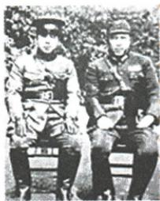

## 讲解

### 判据

图片题先核原说明姓名，再按题问贡献找该人物实际行为；发动与和平解决作用相关但主体不能互换。

### 流程

1.原图张学良杨虎城及生卒是身份信息，不凭军人外貌任意猜。2.张杨1936十二月十二扣蒋、要求停止内战一致抗日，原贡献两层全答。3.党主张和平、周谈判与各方努力为解决步骤，不能改周发动或张杨独自完成所有协商。4.和平结果创造联合条件，序幕和大势不是正式合作已全部建立，基本结束不说每处同日停战。5.生卒不作事变日期，照片不是原所有行为发生时的现场证据，未列心理对话不补。

## 例题

**原西安完整表（Y16-S11）及人物原问答（Y16-S12）：**张学良、杨虎城受统一战线政策感召，要求蒋停止内战联共抗日，蒋仍坚持攘外必先安内。1936年12月12日张杨扣蒋、兵谏、通电要求停止内战一致抗日。共产党从民族利益主张和平解决、联蒋抗日，周恩来参加谈判；各方协商，蒋接受相关条件，和平解决。原意义：揭开内战到联合抗日序幕、扭转时局关键、十年内战基本结束，抗日前提下第二次合作成为大势。

原图说明张学良（1901—2001）、杨虎城（1893—1949）。**原问：**人物为统一战线形成作何贡献？**原答：**发动西安事变，要求停止内战、一致抗日。

**完整解析补写：**先以图片原说明确认人物，不凭两个军人外形猜任何将领；再将张杨发动与共产党促成和平解决分角色。扣蒋是以军事行动迫改变政策的兵谏，和平谈判是随后解决方式，两步相接不矛盾。贡献问保发动、停止内战一致抗日两层，不能写周恩来发动或张杨主持所有后续谈判。意义关键在和平解决为联合抗日创造条件，序幕、大势和基本结束都有范围，不等1936已是两党合作正式建立标志、每处内战当日全停止。提出方针、发动事件、和平解决、正式合作要逐步区分。

## 易错

题问张杨贡献不能只写党方针；发动、被扣、谈判三角色分开，正式节点不得提前。

### 来源定位

- Y16-S11：full.md（历史扫描分册151-200），L1062–L1064，西安事变背景过程结果意义完整表；7315c71c-e0f3-499f-a65f-f5d33fed3468_origin.pdf，实际PDF第19页。
- Y16-S12：full.md（历史扫描分册151-200），L1066–L1082，张杨原图生卒贡献原问答完整；7315c71c-e0f3-499f-a65f-f5d33fed3468_origin.pdf，实际PDF第19页。
