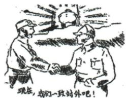
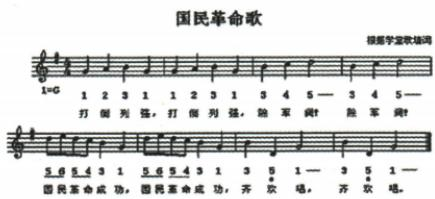
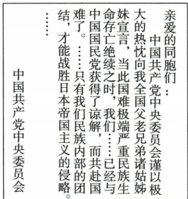
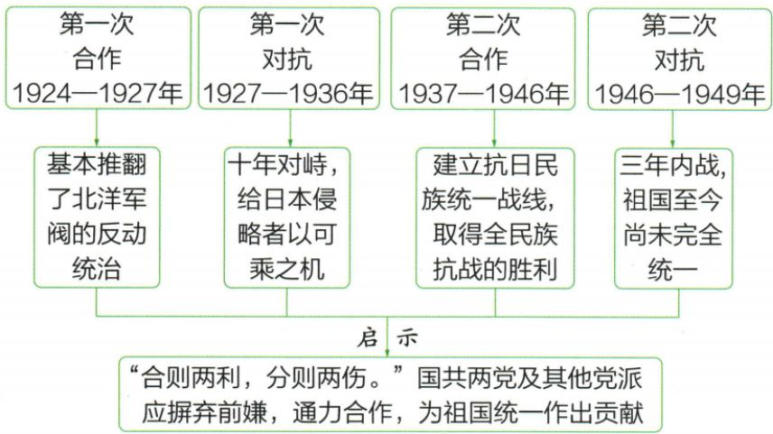

## 讲解

### 判据

材料问成立过程先按行为功能配时间；问两合作按背景任务方式同维，不用政党独立存在与否误分党内外。

### 流程

1.1935宣言方针是方向，1936西安和平创造条件揭序幕，1937九月公开宣言与谈话正式落实，各作用不互换。2.首次1924国民党一大正式，党员个人加入保党独立；第二党外为组织间联合，也不合并。3.背景第一次军阀阶级、第二民族主要，任务第一反列强军阀、第二反日，说明重心不判首次无反帝。4.同社会性质强敌、均推动发展保，第一最终失败也有作用，不能用结果删积极影响。5.提交宣言共产党、公开通讯社国民党、谈话蒋按主体配，名义军改不取消党组织。

## 例题

本条没有另列匹配独立题，使用原陈述、完整表格辨析；陈述不计新题。

**原第二次合作与建立过程（Y17-S05、S09，非独立题）：**全面侵华后两党分别声明抗议、表抗战立场，建立步伐加快。1935年8月八一宣言提出停止内战集中抗日，年底瓦窑堡定统一战线方针；1936年12月西安和平揭序幕、十年内战基本结束；1937年9月，国民党中央通讯社公开发表共产党提交的合作宣言，蒋也谈话，实际上承认党全国合法地位，统一战线正式建立。

**完整分析补写：**危机促共同目标，政策提出给方向，和平处理内战为合作创造条件，公开宣言和谈话把政治合作正式落实，四层按行动功能区分。西安在1936揭序幕而非最后正式标志，七七1937年7月开始全民族抗战也不等9月政治落实是同一天。原实际上承认说明公开政治关系变化，不证明双方所有矛盾、实力和政策全部相同。第二次方式党外，两党保持各自组织并合作；不把红军用国民革命军番号改编误读共产党整个政党取消。原正式联合到后续战争仍有复杂关系，不能保证每项以后政策永远一致。

**原两次合作完整对比（Y17-S08，非独立题）：**

| 维度 | 第一次 | 第二次 |
| --- | --- | --- |
| 背景 | 军阀割据、阶级矛盾尖锐 | 中日民族矛盾上升为主要矛盾 |
| 任务 | 打倒列强、除军阀 | 打败日本帝国主义 |
| 方式 | 党内合作 | 党外合作 |
| 相同 | 半殖民地半封建社会、强敌压力；均推动革命发展 | 同左，但不是每次结果完全一样 |

**完整分析补写：**共同敌人、现实任务变化，影响合作重心和形式。第一党员个人加入国民党且保持共产党独立，第二两党组织间联合；两次都不是共产党取消，不能用独立存在与否粗分。任务第一是反列强军阀，第二突出日本侵略，并非第一次完全无反帝或与日本毫无联系；表在比较主要任务，不给每个参与者所有目标下唯一判断。两次推动发展是影响评价，第一最后失败仍有进步影响，第二也不是从开始就每次行动无挫折。共同社会性质、强敌与不同背景可并存，不能因一个不同维度便否全部相同。

### 第六单元原第2题完整原题原答及取证推理

**单元原第2题（Y6-Q02，原标2023湖北黄孝咸中考）：**1936年，西安事变迫使蒋介石放弃“剿共”方针；1937年7月，中共作出停止推翻国民政府之武装暴动方针，同年9月蒋发表谈话承认党合法地位。这表明（ ）。

A.中国共产党力量的壮大；B.团结抗战是救国的需要；C.国民革命社会基础扩大；D.反抗国民党的力量增强。

**原答案B。完整原解（Y6-Q02-A）：**面临日本侵略，为抵抗外敌，国共两党必须团结。

**补写推理：**看到两方先后调整对彼此的军事政治政策，想到内战对立减少和政治合作推进；日本侵略扩大使共同抗敌迫切，所以由对立走联合说明救国需要。不是只列年份，也不能把这种政策变化转读成反国民党力量在此材料持续增强。原7月为停止暴动方针、9月公开政治关系，两种动作分别保。

**四项完整解析补写：**

- A（错）：材料是双方对彼此政策变化，未给军队党员人数或实力增长数据，不能直接论力量壮大。

- B（对）：双方调整政策由内战走联合，与侵略危机下共同抗敌救国相符合。

- C（错）：国民革命主要指前一合作阶段；1936至1937本题为抗日联合，不能换成1920年代革命社会基础。

- D（错）：停止推翻、承认合法地位指向缓和合作，非本题证明反抗国民党力量增强。

原书考试地区年份和改编标签按原件保留，未另行核定真题身份。

### 第六单元原第3题完整原题原答及取证推理

**单元原第3题（Y6-Q03，原标2023江苏苏州中考改编）：**下图创作于1937年2月，漫画《现在，我们一致对外吧》。解读最准确的是（ ）。

A.抒发对消极抗战的不满；B.表达对团结抗战的支持；C.体现对日寇侵华的谴责；D.蕴含对北伐战争的期待。

**原答案B。完整原解（Y6-Q03-A）：**1936西安和平揭开内战到联合序幕，结合漫画，表达对团结抗战支持。

**补写推理：**先读1937年2月在西安和平后、正式合作公开前，再看两个人伸手相接和一致对外题字，共同强调改变内斗、协同抗敌。背景侵略存在，但画中主要主张是内部联合，最准确需覆盖核心文字行动，而非只取泛泛反日。不能把2月漫画直接当9月正式公开合作宣言已发表的证明，也不能凭人物外貌自定原画未标每人的具体姓名。

**四项完整解析补写：**

- A（错）：原画题字和相接动作强调支持一致对外，不是主要讽刺不抗战的表现；不能凭时局复杂就代画意。

- B（对）：日期在西安后与一致对外题字、共同动作合，核心为团结支持。

- C（错）：抗侵略背景成立，但选最准确需解释联合动作与题字；谴责只是更泛背景，未覆盖该主旨。

- D（错）：北伐属1920年代第一次合作，本画1937抗日时序和对外任务不同。

原书考试地区年份和改编标签按原件保留，未另行核定真题身份。

### 第六单元原第8题完整原题原答及取证推理

**单元原第8题（Y6-Q08）：新民主主义革命时期中国共产党领导中国人民实现民族独立。【推动合作，功照千秋】材料：**

图一可读歌词：“打倒列强，打倒列强，除军阀！除军阀！国民革命成功，国民革命成功，齐欢唱，齐欢唱。”原OCR“险军调”等据原图恢复“除军阀”；谱图保留，不推未考旋律音高。

图二完整可见文字：“亲爱的同胞们：中国共产党中央委员会谨以极大的热忱向我全国父老兄弟诸姑姊妹宣言，当此国难极端严重民族生命存亡绝续之时，我们……已经与中国国民党获得了谅解，而共赴国难了。……只有我们民族内部的团结，才能战胜日本帝国主义的侵略。……中国共产党中央委员会”。图末排版原有省略，未补未显示句。

**原设问：**历史证明国共之间“合则两利”。依据图一、图二，说两次国共合作最大成果分别是什么。

**原答（Y6-Q08-A）：**第一次推动北伐胜利进军，基本推翻北洋军阀统治；第二次取得抗日战争胜利。

**完整推理补写：**先读图一列强军阀任务配第一次合作和北伐，再读图二民族存亡、战胜日本配第二次；以课文实际进程补成果，分别作答不能只写两次都革命成功。图一歌词成功是歌的号召愿景，不足单独证明国民革命最后已全成功，原课13最终失败与北伐积极战果并存；基本推翻不扩所有军阀全部消失。图二团结主张提供合作依据，抗战胜利是后来共同奋斗结果，不从宣言一发表就推日本当天投降。合则两利是原评价，不能推广成任何条件任何分歧下每次合作每项决定必无挫折。

原书考试地区年份和改编标签按原件保留，未另行核定真题身份。

### 第21课原四阶段关系图与启示的任务范围

**原国共关系四阶段图及启示（Y21-S14）：**

**原文字完整转写：**第一次合作1924—1927年：基本推翻北洋军阀反动统治。第一次对抗1927—1936年：十年对峙，给日本侵略者可乘之机。第二次合作1937—1946年：建立抗日民族统一战线，取得全民族抗战胜利。第二次对抗1946—1949年：三年内战，祖国至今尚未完全统一。启示：“合则两利，分则两伤。”国共两党及其他党派应摒弃前嫌、通力合作，为祖国统一贡献。

**完整分析补写：**四栏各自连接相应成果或影响，是同一关系演变的并列阶段，不能用自动图排版推断一个事件直接产生所有后果。合作时共同任务有助于联合力量，1920年代对应反军阀，抗战时期对应抵御日本侵略；对抗消耗国内力量，但日本发动侵略的责任仍在侵略者，不能说内战使侵略正当。原第二合作标1937—1946，这是关系阶段概括，不是把抗日战争终点推迟到1946，也不表示合作期间毫无冲突。原“至今”是原书时点表述，保原字样而不把它当某日即时新闻统计。启示面向联合与统一的价值判断，须由共同任务和力量功能解释，不等任何时候必须取消独立原则、无条件赞同对方所有政策。

## 易错

两次均保各党独立，西安非1937正式；主要背景不等唯一问题，每个主体动作不能交换。

### 来源定位

- Y17-S05：full.md（历史扫描分册151-200），L1131–L1138，第二次合作背景军队来源改编职务正式建立；7315c71c-e0f3-499f-a65f-f5d33fed3468_origin.pdf，实际PDF第20页。
- Y17-S08：full.md（历史扫描分册151-200），L1161–L1163，两次合作背景任务方式同点完整表；7315c71c-e0f3-499f-a65f-f5d33fed3468_origin.pdf，实际PDF第20页。
- Y17-S09：full.md（历史扫描分册151-200），L1165–L1167，提出序幕正式建立三段完整表；7315c71c-e0f3-499f-a65f-f5d33fed3468_origin.pdf，实际PDF第21页。
- Y6-Q02：full.md（历史扫描分册151-200），L1475–L1485，联合救国政策原题四项与原解答；7315c71c-e0f3-499f-a65f-f5d33fed3468_origin.pdf，实际PDF第27页。
- Y6-Q02-A：full.md（历史扫描分册151-200），L1533–L1535，第2题原解答；7315c71c-e0f3-499f-a65f-f5d33fed3468_origin.pdf，实际PDF第27页。
- Y6-Q03：full.md（历史扫描分册151-200），L1487–L1502，一致对外漫画原题图与四项；7315c71c-e0f3-499f-a65f-f5d33fed3468_origin.pdf，实际PDF第27页。
- Y6-Q03-A：full.md（历史扫描分册151-200），L1537–L1539，第3题原解答；7315c71c-e0f3-499f-a65f-f5d33fed3468_origin.pdf，实际PDF第27页。
- Y6-Q08：full.md（历史扫描分册151-200），L1583–L1625，两合作歌谱宣言两原图原设问；7315c71c-e0f3-499f-a65f-f5d33fed3468_origin.pdf，实际PDF第28、29页。
- Y6-Q08-A：full.md（历史扫描分册151-200），L1559–L1559，第8题完整两成果原答；7315c71c-e0f3-499f-a65f-f5d33fed3468_origin.pdf，实际PDF第28页。
- Y21-S14：full.md（历史扫描分册151-200），L1940–L1960，国共关系四阶段原图完整文字和启示；7315c71c-e0f3-499f-a65f-f5d33fed3468_origin.pdf，实际PDF第34页。
