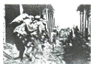
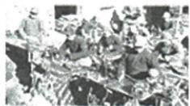

## 讲解

### 判据

原三图不同抗战主体，问胜利原因，流程是先读图注再提共同目的再解释合力；不能把一个图当全部全国情况的证据。

### 流程

1.依原注图一台儿庄正面军队、图二左权抗日将领、图三冀中回民武装，先把每张所示主体分清，肖像不编其当日行动。

2.不同军队背景与民族共同抗日，提取团结与广泛参与，归纳原答全民族团结抗战。

3.联系原群体表，生产资金救护宣传提供持续作战条件，解释团结如何发挥作用，不只重写结论。

4.三图非同地同日台儿庄现场全景，代表性材料不能证明所有人没有分歧；投敌和摩擦仍按原文保留。

## 例题

**课内原三图设问（Y18-S12）：根据这三张图片，归纳中国人民取得抗战胜利的原因。**

**原答：全民族团结抗战。**

**原各群体完整表（Y18-S08，表不另计题）：**青年学生投笔从戎；广大妇女参加抗日宣传、救护、战地服务；工人不分昼夜加班生产支援前线；海外华侨和港澳同胞捐款捐物，数万华侨青年回国参战；文艺界成立抗战协会、文艺作品宣传抗战振奋士气；台湾人民反战暴动、游击斗争、抵制奴化教育，七七后大批爱国台胞回祖国大陆抗战；作用使侵略者陷入人民战争的汪洋大海。

**完整解析补写：**看到图一正面军队战斗、图二左权这位共产党领导军队的抗日将领、图三回民武装，先识别参与主体具有不同军队及民族背景，再提共同目标抵抗日本侵略，最后由多方参与归纳全民族团结抗战。不是把三个名称并排抄完便自动有原因：不同力量联合、军事行动与社会供给配合，扩大持续抵抗的基础，才使结论有依据。原群体表进一步证明参与不仅在前线，生产、救护、资金、宣传也有作用；不持枪不等未抗战。三图是不同地点、人物及活动的代表，不能说左权与全部回民武装都参加同一台儿庄战斗；肖像自身不提供牺牲具体日期地点，需原注和正文配合。民族字眼指共同抗侵略的广泛力量，不推出全国每个人每时刻都无分歧，汪投敌和顽固派摩擦仍是同课真实复杂性。

### 第六单元原第5题完整原题原答及取证推理

**单元原第5题（Y6-Q05，原标2024山东菏泽中考）：**“图说历史—抗日战争”展览的一组图片，主题是（ ）。

A.全民族的抗战；B.正面战场的浴血奋战；C.艰苦卓绝的敌后抗战；D.海外侨胞的输财助战。

**原答案A。完整原解（Y6-Q05-A）：**军队、工人、海外华侨均作贡献，体现全民族主题。

**补写推理：**逐图读主体行动：正规军战斗、工人供给军装、侨胞资金支持，形式不同却都支持抗日；取能同时解释全部图片的共同主题，故选广泛力量的全民族。不是最后一图出现便选侨胞，也不将生产和捐款都硬说现场浴血作战。图注证据足够，原未给每工人党派或每厂位置，不编成只有某一战场供给。

**四项完整解析补写：**

- A（对）：同时覆盖军队前线、工人生产和海外捐助，共同抗日且主体广泛。

- B（错）：只直接覆盖台儿庄战斗，不能把工厂侨胞也当同一正面现场战斗；正面贡献本身不被否定。

- C（错）：图注未将全组定位敌后，台儿庄属正面例，生产捐助又是社会支持，范围不符。

- D（错）：只覆盖第三图，不能概括军队与工人两图，侨胞贡献真实但不为全组主题。

原书考试地区年份和改编标签按原件保留，未另行核定真题身份。

## 易错

不要只列三图名称而不回答原因，也不要将宣传救护和不持枪人排除贡献。原问一个归纳，未问唯一原因不擅加唯一。

### 来源定位

- Y18-S08：full.md（历史扫描分册151-200），L1270–L1286，侵略策略汪伪皖南党政治回击与各群体贡献完整表；7315c71c-e0f3-499f-a65f-f5d33fed3468_origin.pdf，实际PDF第22、23页。
- Y18-S12：full.md（历史扫描分册151-200），L1310–L1344，台儿庄左权回民三原图及原因原问答；7315c71c-e0f3-499f-a65f-f5d33fed3468_origin.pdf，实际PDF第23页。
- Y6-Q05：full.md（历史扫描分册151-200），L1510–L1529，台儿庄被服侨胞三图原题原四项；7315c71c-e0f3-499f-a65f-f5d33fed3468_origin.pdf，实际PDF第27页。
- Y6-Q05-A：full.md（历史扫描分册151-200），L1545–L1547，第5题原解答；7315c71c-e0f3-499f-a65f-f5d33fed3468_origin.pdf，实际PDF第27页。
