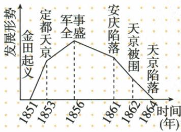

## 讲解

### 是什么

1853年太平天国开始北伐和西征，以推翻清统治、巩固政权。北伐曾逼近天津，最终失败；西征取得重大胜利。原书将1856年前后的整体发展概括为军事全盛，不表示全部战役和各部军队都胜利。

### 怎么来的

定都以后仍面对清政府，需要通过军事行动扩大和保住政权，所以进攻与巩固有共同目的。但不同方向所遇形势和行动结果不能互相代替，原件明确北伐失败、西征胜利。整体阶段判断综合发展，局部战果判断某一路行动：同一个运动可以在一路失败的同时另一路获得胜利，因而“北伐失败”和“总体达到全盛”并不必然矛盾。反过来，整体全盛也不保证随后继续上升；1856年内部事变对组织力量的损害，正说明形势还可能发生转折。

### 什么时候能用

比较战果时分别列北、西两路；问军事发展阶段时用1856。逼近天津不是已攻陷北京，更不是天京定都。原图没有提供实际部队数量，不能把最高点换算成兵力峰值，原未给战役细节也不编具体胜败原因。

## 例题

**原资料（J3-S10，非独立题）：**1853年开始北伐和西征，目的是推翻清朝统治和巩固政权。北伐军曾逼近天津，最终全军覆没；西征战场取得重大胜利。到1856年，太平天国在军事上进入全盛时期。

**完整分析补写：**向北进军与西面作战是不同方向的行动，各有战果；北伐失败不能直接替代整个运动的形势判断，西征胜利也不能倒写成北伐已推翻清政府。原“军事全盛”是整体军事发展阶段的概括，不表示每一支部队、每场战役都胜利。都城的建立、扩大军事活动和巩固政权相互联系，却仍需以各行动结果逐项核对，不能只看一个“全盛”词就认为清朝已灭。

**原图（J3-S08，非独立题）：**1851金田起义，1853定都天京，1856军事全盛，1861安庆陷落，1862天京被围，1864天京陷落。原横轴标时间（年），折线示发展形势，纵向没有兵力、面积或人口数值。

**完整分析补写：**先读各点的原文字，再用上升下降说明发展阶段，不能把线的高度换算成部队数量。1856点写军事全盛，正文同年秋天京事变说明转衰；图没有单独标事变，并不等于正文转折不存在。1862被围与1864陷落两点分开，不能因线在下降就把运动提前判为结束。保留原图而不用自动识别重画，可避免给不存在的纵轴数值及比例制造精确感。

## 易错

北伐全军覆没不推成当时全部太平军已灭；西征胜利不变成北伐成功；军事全盛不同于全国统一，也不同于天京事变后完全没有战斗力。

### 来源定位

- J3-S10：full.md（历史扫描分册101-150），L1741–L1745，1853北伐西征目的不同战果与1856全盛；6484926a-d709-4079-96ba-4a8c4b0a1b00_origin.pdf，实际PDF第28页。
- J3-S08：full.md（历史扫描分册101-150），L1720–L1737，太平天国发展曲线1851到1864；6484926a-d709-4079-96ba-4a8c4b0a1b00_origin.pdf，实际PDF第28页。
- J3-S11：full.md（历史扫描分册101-150），L1747–L1753，1856天京事变内部腐败争权损失转衰；6484926a-d709-4079-96ba-4a8c4b0a1b00_origin.pdf，实际PDF第28页。
