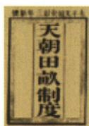
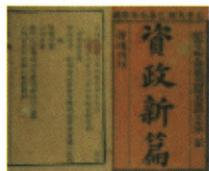

## 讲解

### 是什么

《资政新篇》是天京事变后洪仁玕提出的改革文献，主张向西方学习、改革内政，原链接称其为发展资本主义的方案。目的在于改变不利局面，受到历史条件限制而未能付诸实践，不能把主张方向当成已建成的社会制度。

### 怎么来的

太平天国面临组织和军事危机，提出治理改革是寻找改善自身能力的途径。与此前以平均土地回应农民需要的方案相比，这份文献的突出方向是学习西方并改革内部治理。因此在比较题里，必须抓主张的不同，而不是只见两者都由太平天国提出就认为内容相同。新方案要改变现实还需要执行和支持条件，写成文字并不能自动改变军事力量和政权处境；原“未从根本上改变不利局面”正提示目的、方案、实践、效果四层不能跳接。

### 什么时候能用

材料见向西方学习、改革内政且问太平天国文献，可定位《资政新篇》与作者洪仁玕；见平均分配土地应另定位《天朝田亩制度》。本课按原比较说相对阶段，不自行填作者栏空缺，也不把资本主义方案推成资本主义政权已经成立。

## 例题

**原资料（J3-S12、S15，非独立题）：**为改变不利局面，洪秀全封洪仁玕为干王、总理朝政，并提拔陈玉成、李秀成等青年将领。洪仁玕写成《资政新篇》，提出向西方学习、改革内政等主张；原链接明确这是发展资本主义的方案，但受历史条件限制，未能付诸实践，未从根本上改变军事不利局面。

**完整分析补写：**重组领导是组织上的补救，写改革方案是治理方向上的探索，两者都意在挽救危局，却不能代替实际执行条件和军事结果。向西方学习、改革内政是方案的突出特点，不是把《天朝田亩制度》的平均分地内容换个名字。原“发展资本主义”描述方案方向，不能推成当时太平天国已经建立资本主义社会。作者洪仁玕不同于运动领导者洪秀全，也不同于早期组织者冯云山。

### 八上第一单元匹配原题3

**单元原题3（JU1-Q3；原书标注2023山东济宁中考，未另核真题身份）：**下图所示为太平天国颁布的革命纲领。与前者相比，后者最突出的特点是主张（）。

A.向西方学习、改革内政　B.实行君主专制

C.平均分配土地　D.实现男女平等

**原答案：A。原解题思路（JU1-A3）完整保留：**《资政新篇》提出向西方学习、改革内政等一系列主张，它的最突出的特点是主张学习西方而不是实行君主专制。《天朝田亩制度》规定不分男女，按人口和年龄平均分配土地。太平天国无论是在土地的分配方面还是选官方面都体现了男女平等。

**逐项解析补写：**A正确，实际原页前图为天朝田亩、后图为资政新篇，后者的学习西方改革内政正是所问的新方向。B不合，“实行君主专制”不是原详解指出的后者突出改革主张，不能由天王称号代替文献内容。C不合，平均土地对应前者，题目问后者与前者比较的突出特点，不能把比较对象读反。D不合，原解析的性别说明不是两份文献间最突出的差异；前者分地原本已写不分男女，不能拿共同或另方面表述替代后者特点。

**判断链：**核两图实际书名及前后→前者土地理想、后者学习西方改革→找差异而非共有方面→A。原“分配与选官体现男女平等”按原详解保留，其范围是这些制度面向的表述，不推广为现实社会男女待遇已全方位相同。题问主张不问实践，选A不证明改革已实施；文献图也不提供全书逐条制度证据。

## 易错

洪仁玕不是洪秀全或冯云山；提出新主张不等已实践；学习西方这一方向不同于后来各运动的全部目标，不能只凭同一句学习便认所有文献一样。

### 来源定位

- J3-S12：full.md（历史扫描分册101-150），L1755–L1758，洪仁玕陈玉成李秀成重组与资政方案未实践；6484926a-d709-4079-96ba-4a8c4b0a1b00_origin.pdf，实际PDF第28页。
- J3-S07：full.md（历史扫描分册101-150），L1706–L1718，与以往农民起义相比六方面新特点；6484926a-d709-4079-96ba-4a8c4b0a1b00_origin.pdf，实际PDF第28页。
- J3-S15：full.md（历史扫描分册101-150），L1774–L1776，天朝田亩资政新篇六项目完整比较表；6484926a-d709-4079-96ba-4a8c4b0a1b00_origin.pdf，实际PDF第29页。
- JU1-Q3：full.md（历史扫描分册101-150），L1820–L1831，单元3前后两文献图比较四项；6484926a-d709-4079-96ba-4a8c4b0a1b00_origin.pdf，实际PDF第30页。
- JU1-A3：full.md（历史扫描分册101-150），L1810–L1814，单元3原详解和A答包含分配选官性别说法；6484926a-d709-4079-96ba-4a8c4b0a1b00_origin.pdf，实际PDF第30页。
