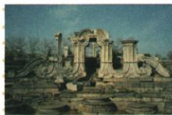

## 讲解

### 是什么

原1860英法进逼北京、抢掠焚圆明园，园为清皇家园林，圆明长春绮春三园，建筑艺术文献丰富。大水法画与遗址只示局部，原清规模最大句的比较口径待用户确认，不当已核实面积排名。

### 怎么来的

抢掠夺文物、焚毁毁建筑与文献，既损中国国家文化权益，又损人类共同文化资料，所以原认识同时讲民族损害与世界文明损失；不是仅经济银数可以衡量。铜版画保存建筑表现，遗址图显示残存状态，两种材料互补但不能一一证明原所有建筑和全部损毁过程。历史启示强调综合实力与保护能力，不能用警句断弱国完全没有外交或任一强国永不被侵略，更不能把暴行归为弱者应得。

### 什么时候能用

认识题用行动对象后果支持评价，先保原三点再解释警句范围。面积、文物数量与全园结构无本课实测材料不编，图不读1860火烧当日现场照；原最大仍待确认非定论。

## 例题

**原资料（J2-S03、S04、S07，非独立题）：**1860年8月英法借换约受阻占天津、进逼北京，咸丰逃承德，弟奕訢留守议和（奕訢简体作奕䜣）；10月联军抢劫北京西北郊圆明园后放火。原园由圆明、长春、绮春三园，综合中西建筑、藏艺术图书文物；原称“清朝规模最大的皇家园林”。焚毁为中国创伤、人类文明可耻一页。

**原规模句的疑点：**原件和原句保留，规模比较口径待核，已交用户确认。官方三园约350公顷与避暑山庄564公顷资料不能支持按占地面积解释该最大句；也不足仅凭面积否定所有其他规模指标，本条不把原最大推广为已核实的面积排名。

**原题（J2-S05）：**对英法联军火烧圆明园的认识。

**原答案三点完整保留：**不仅列强侵华暴行，也中华民族耻辱；不仅对中华文明不可弥补损失，也践踏破坏世界文明；落后就要挨打、弱国无外交，一个民族只有强大才不会被欺凌。

**完整解析补写：**抢掠焚毁既侵国家与群众权益，又毁建筑、艺术和文献这些人类共同文化，故评价从民族损害扩大文明损害。原第三点为历史启示警句，强调提升国家实力与保护权益，不能据此说弱国实际完全没有任何外交，或强国永不受侵扰；更不能将侵略暴行正当化为实力弱便理应受害。两图同指大水法局部，铜版画保存建筑表现，遗址图显示今天所见残存，对照助理解毁损；画不是现场照，两图也不是全三园尺寸和文物存量的精确调查。

## 易错

毁中国文化亦伤人类文明，两评价并存；大水法局部不代全园；抢掠与放火相连不等全部文物都在同一瞬间烧尽，原未供完整清册不算损失件数。

### 来源定位

- J2-S03：full.md（历史扫描分册101-150），L1572–L1577，1860进京奕訢留守与英法抢掠焚园；6484926a-d709-4079-96ba-4a8c4b0a1b00_origin.pdf，实际PDF第25页。
- J2-S04：full.md（历史扫描分册101-150），L1579–L1594，圆明园大水法铜版画遗址与三园文化介绍；6484926a-d709-4079-96ba-4a8c4b0a1b00_origin.pdf，实际PDF第25页。
- J2-S05：full.md（历史扫描分册101-150），L1596–L1600，对焚圆明园认识原设问三点完整答；6484926a-d709-4079-96ba-4a8c4b0a1b00_origin.pdf，实际PDF第26页。
- J2-S07：full.md（历史扫描分册101-150），L1612–L1616，圆明毁损影响与1860北京条约结束战争内容；6484926a-d709-4079-96ba-4a8c4b0a1b00_origin.pdf，实际PDF第26页。
